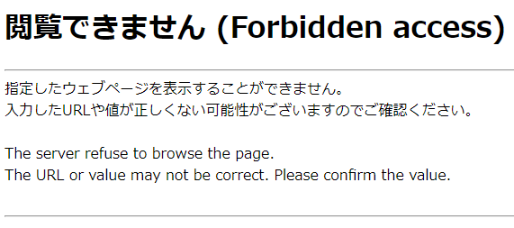
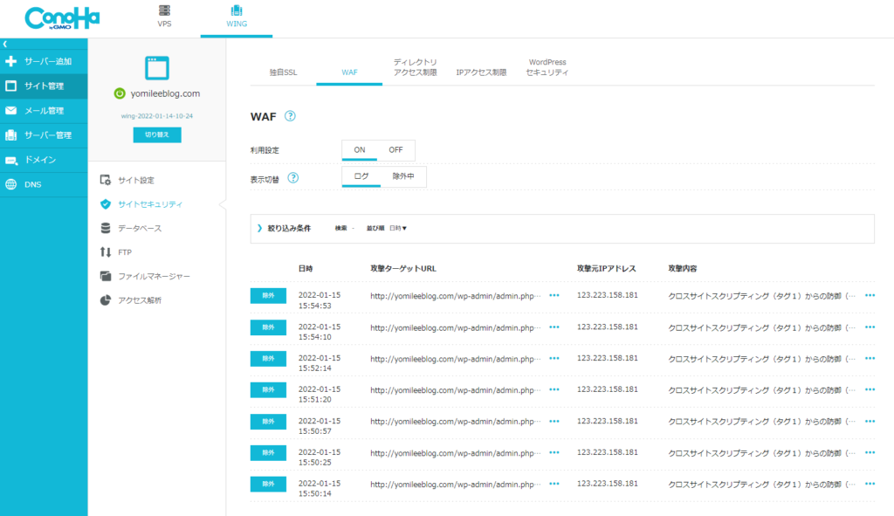
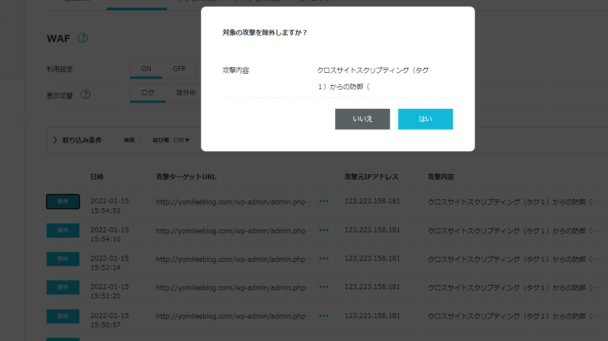
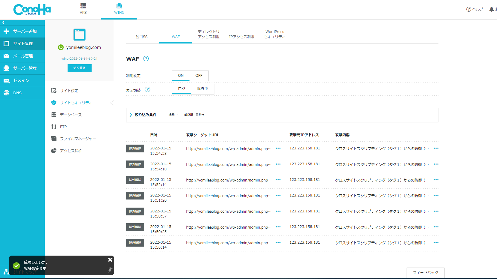

import ProblemBox from '../../../components/ProblemBox.astro';
import ConclusionBox from '../../../components/ConclusionBox.astro';

<ProblemBox>
- WordPressのテーマ設定や`<head>`タグにアドセンスの審査コードを貼り付けて保存しようとすると「閲覧できません（Forbidden）」とエラーが出る
- コードの記述が間違っているのか、サイトが壊れてしまったのか分からず困っている
- セキュリティを維持したまま、安全に審査コードを保存してアドセンス審査を進めたい
</ProblemBox>

ブログの収益化を目指す上で最初の関門となる「Googleアドセンス（Google AdSense）」。

申請にあたって、指定されたJavaScriptの「審査用コード」をWordPressサイトの`<head>`タグ内に貼り付けて保存する必要があります。

しかし、いざ保存ボタンを押すと、<b>「閲覧できません（Forbidden access）」「指定したウェブページを表示することができません」というエラー画面</b>が表示され、設定が保存できないトラブルが頻発しています。

焦ってテーマのコードをいじったりプラグインを削除したりする必要はありません。このエラーの正体は、レンタルサーバーに標準搭載されている<b>「WAF（Webアプリケーションファイアウォール）」の誤検知ブロック</b>です。

今回は、エラーが発生するメカニズムと、ConoHa WINGやエックスサーバー等でWAFのブロックを安全に除外してコードを保存する確実な手順を解説します。

---

## なぜエラーが出るのか？原因はサーバーの「WAF誤検知」

WordPressの設定画面からJavaScript（スクリプトコード）を送信・保存しようとすると、サーバーのセキュリティ機能である<b>WAF（Web Application Firewall）</b>が作動します。

<figure>

<figcaption>SiteGuard Lite等のWAFによって通信が強制遮断されたエラー画面</figcaption>
</figure>

WAFは本来、外部の悪意あるハッカーによる「不正なスクリプト埋め込み（クロスサイトスクリプティング等）」や「サイト乗っ取り」を防ぐための自動防御システムです。

アドセンスの審査コードはJavaScriptを含むため、<b>WAFが「管理画面から危険な不正コードが注入された」と誤認して通信を強制遮断</b>してしまうのが、保存エラーの根本原因です。

---

## 解決手順：サーバーのWAF設定で「該当のログを除外」する

最も安全で確実な解決法は、WAFを完全にOFFにするのではなく、<b>「先ほどブロックされた自分の通信だけを除外（ホワイトリスト登録）する」</b>ことです。

ここでは、利用者の多い「ConoHa WING」を例に手順を解説します（他社サーバーでも基本構造は同じです）。

<figure>

<figcaption>ConoHa WING管理画面＞サイト管理＞サイトセキュリティ＞WAFを開く</figcaption>
</figure>

### 手順 1. レンタルサーバーの管理画面へログイン
ConoHa WINGの場合、「サイト管理」＞「サイトセキュリティ」＞「WAF」タブを開きます。

### 手順 2. ブロックされた日時のログを探す
直前に保存ボタンを押した時間帯のログを確認します。
攻撃元IPアドレス（自分のIP）と、検出された攻撃種別（例：クロスサイトスクリプティング等）が「防御」として記録されています。

<figure>

<figcaption>該当ログの右側にある「除外」ボタンをクリック</figcaption>
</figure>

### 手順 3. 「除外」をクリックしてホワイトリスト化する
該当するログの右側にある<b>「除外」ボタン</b>をクリックします。
画面左下に「除外設定に成功しました」と表示されれば準備完了です。

<figure>

<figcaption>除外解除が成功し、安全な通信として許可された状態</figcaption>
</figure>

### 手順 4. 再度WordPressでコードを保存する
WordPressの管理画面（Cocoon設定やテーマヘッダー編集等）に戻り、改めてGoogleアドセンスの審査コードを貼り付けて「変更をまとめて保存」をクリックします。

今度はWAFによる遮断を受けず、<b>正常に一発で保存が完了</b>します。

---

## 【絶対にやってはいけない注意点】WAFを常時OFFにして放置しない

一部の解説記事では「WAFの利用設定をOFFにして保存する」と紹介されていることがあります。

確かにWAFを一時的に無効化すれば保存はできますが、<b>保存後にWAFをONに戻し忘れると、ブログが外部からの攻撃に対して完全に無防備な状態</b>でインターネットに晒され続けることになります。

セキュリティ事故やサイト改ざんを防ぐためにも、必ず<b>「WAFログから該当の通信のみを個別除外する」</b>か、一時OFFにした場合は<b>「保存完了後、1分以内に必ずWAFをONに戻す」</b>動線を徹底してください。

---

## まとめ

アドセンス審査コードの保存エラーは、サーバーのセキュリティが正常に機能している証拠です。

<ConclusionBox>
- <b>エラーの原因はWAFの誤検知</b>: アドセンスのJavaScriptコードを不正アクセスと誤認して遮断
- <b>解決策はログの除外</b>: サーバー管理画面で直前のブロックログを「除外」するだけで即座に保存可能
- <b>常時OFFは厳禁</b>: サイト乗っ取りリスクを防ぐため、WAF全体を切りっぱなしにしない
- <b>他のスクリプト保存時も同様</b>: アナリティクスやタグマネージャーでエラーが出た際も同じ手順で解決
</ConclusionBox>

正しい手順でWAFを除外し、無事に審査コードを設置してGoogleアドセンス合格への一歩を踏み出してください。
