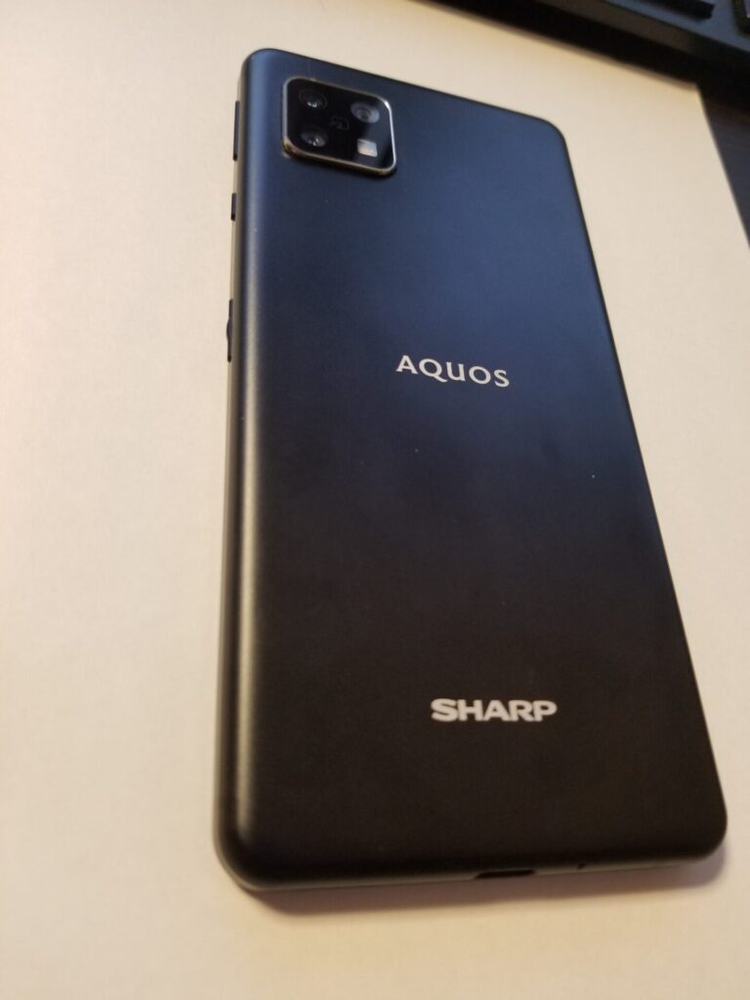
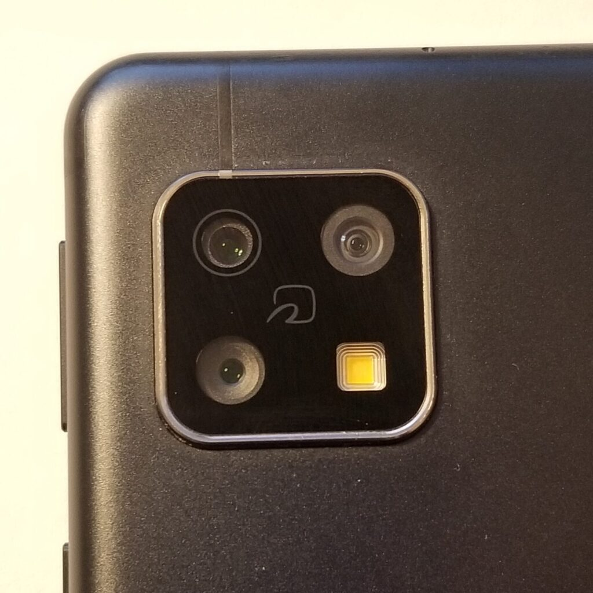

import ProblemBox from '../../../components/ProblemBox.astro';
import ConclusionBox from '../../../components/ConclusionBox.astro';

<ProblemBox>
- 毎月の通信費やスマホ本体代を極力抑えたいけれど、安物買いで失敗したくない
- バッテリー持ちが良く、おサイフケータイや防水に対応した「普段使いに十分な端末」を探している
- AQUOS senseシリーズの実機における動作レスポンスやカメラ性能、リアルなデメリットを知りたい
</ProblemBox>

ハイエンドスマホが15万〜20万円を超える時代において、<b>「普段使いに十分な性能を、圧倒的な低価格で手に入れたい」</b>という需要は年々高まっています。

その代表格として長年ヒットを記録し続けているのが、シャープの国民的ミドルレンジ<b>「AQUOS senseシリーズ」</b>です。

かつてiPhone 8やGalaxyのフラッグシップ機を愛用していた筆者が、固定費削減とコスパ追求のために「AQUOS sense4（SIMフリー版 SH-M15）」を購入。半年以上にわたりメイン機およびサブ機として徹底的に使い倒しました。

結論から言うと、<b>「圧倒的なバッテリー持ちとおサイフケータイ完備で生活用端末としては最高だが、カメラや重いアプリの切り替えには明確なボトルネックがある」</b>という非常に分かりやすい一台でした。

今回は、長期使用で判明したリアルなメリットとデメリット、そして後継機を選ぶ際の基準まで生活改善目線で正直にレビューします。

---

## AQUOS sense4の主要スペック

まずは基本仕様を整理します。日常利用に必要な「日本の生活仕様」がすべて揃っているのが特徴です。

| 項目 | スペック仕様 | 生活目線での評価 |
| :--- | :--- | :--- |
| <b>SoC</b> | Snapdragon 720G | Web閲覧やSNS、動画視聴なら十分スムーズ |
| <b>メモリ / 容量</b> | RAM 4GB / ROM 64GB | アプリの複数起動や写真保存にはやや手狭 |
| <b>ディスプレイ</b> | 5.8インチ IGZO液晶（FHD+） | 高精細かつ圧倒的な省電力性能。焼き付きの心配なし |
| <b>バッテリー</b> | 4,570mAh | <b>1〜2日放置しても余裕で持つ驚異のスタミナ</b> |
| <b>日本仕様機能</b> | おサイフケータイ・防水防塵（IP68）・指紋/顔認証 | 改札通過から雨天利用まで隙のない生活防衛仕様 |
| <b>外部端子</b> | イヤホンジャック・microSDスロット | 有線イヤホン派や容量拡張に嬉しい設計 |

<figure>

<figcaption>マットなアルミボディで質感は良好。持ちやすさと堅牢性を両立している</figcaption>
</figure>

---

## 使って実感した4つの大きなメリット

### 1. 充電の呪縛から解放される「異常な電池持ち」
AQUOS sense4最大の武器は、省電力な<b>IGZO液晶ディスプレイと4,570mAh大容量バッテリーの組み合わせ</b>です。
通勤時にニュースやSNSをチェックし、日中に連絡を取り合っても、夜帰宅した時点でバッテリー残量が60〜70%残っていることも珍しくありません。

「モバイルバッテリーを毎日持ち歩く」「カフェでコンセント席を探す」といった生活のストレスから完全に解放されます。

### 2. 「全部入り」の安心感（FeliCa・防水・イヤホン端子）
SuicaやiD、QUICPayが使える<b>おサイフケータイ</b>はもちろん、突然のゲリラ豪雨でも安心な<b>IPX5/8防水</b>、さらに充電しながら音楽を聴ける<b>3.5mmイヤホンジャック</b>を完備。
日常生活における実用的な道具として、これほど隙のない構成はありません。

### 3. 屋外でも見やすいIGZOディスプレイ
有機ELディスプレイのような派手な鮮やかさはありませんが、直射日光の下でも文字がくっきり読み取れるアウトドアビュー機能を搭載。液晶ならではの「画面焼き付き」の心配がない点も長期運用に向いています。

---

## 【忖度なし】半年使って分かった5つの欠点・落とし穴

teluis憲章に基づき、日々の使用で感じたストレスやボトルネックを正直に開示します。

<figure>

<figcaption>標準・広角・望遠の3眼レンズを搭載しているが、処理速度に課題がある</figcaption>
</figure>

### ① カメラの起動・シャッターレスポンスが遅い
トリプルカメラ（広角・超広角・望遠）を搭載していますが、<b>カメラアプリを起動してから撮影可能になるまで2〜3秒</b>かかります。
さらにシャッターボタンを押してから実際に保存されるまでのタイムラグがあるため、「走り回る子ども」や「ペットの一瞬の仕草」を撮ろうとすると確実にブレるか撮り逃します。

### ② RAM 4GBの限界：アプリ切り替えでタスク落ちが発生する
メモリ（RAM）が4GBと最小限のため、複数のアプリを行き来するとバックグラウンドのアプリが強制終了（タスクキル）されます。
「地図アプリを見ながらメッセージを返信し、再び地図に戻ると再読み込みになる」といった事象が頻発するため、マルチタスクを多用する人には不向きです。

### ③ 夏場の発熱によるスロットリング
気温が高い屋外で位置情報ゲーム（ドラクエウォークやポケモンGOなど）をプレイしていると、本体がかなり熱を持ち、熱暴走を防ぐために動作クロックが極端に落ちます。画面のカクつきが目立つようになります。

### ④ 本体の厚みと重量感
大容量バッテリーを積んでいる代償として、厚みが約8.9mm、重量は約177gあります。最近の薄型軽量モデルに比べるとややズッシリ感があり、片手操作を長時間続けると小指が痛くなりやすい点は注意が必要です。

---

## どんな人におすすめ？向いている人・向かない人

実機を使い倒した結論として、ターゲット層は明確です。

| おすすめできる人（大満足） | おすすめできない人（後悔する可能性大） |
| :--- | :--- |
| ・とにかく充電の手間を減らしたい人 ・SNS・LINE・YouTube・Web検索が中心の人 ・おサイフケータイで買い物を身軽にしたい人 ・親世代や子どもの連絡用端末、サブ機を探している人 | ・子どもの写真や旅行の思い出を高画質・俊敏に撮りたい人 ・3Dアクションゲームを快適に遊びたい人 ・複数のビジネスアプリを高速で切り替えて作業したい人 |

---

## まとめ：道具としての割り切りができれば高コスパな名機

AQUOS sense4は、「万能のハイエンド」ではありませんが、<b>「日々の生活を支える頑丈でタフな道具」</b>としては極めて高い完成度を誇ります。

<ConclusionBox>
- <b>電池持ちは最高峰</b>: 1回の満充電で1〜2日は余裕。充電の不安から解放される
- <b>生活必須機能が網羅</b>: おサイフケータイ・防水・指紋認証で毎日の買い出しが快適
- <b>カメラと重い処理は苦手</b>: 決定的瞬間の撮影やマルチタスクには割り切りが必要
- <b>サブ機・生活防衛に最適</b>: 格安SIMと組み合わせて通信費・本体代を最小化するのに最適
</ConclusionBox>

「スマホに余計な大金は払いたくないけれど、日々の生活を不便にしたくない」という方は、こうした高コスパな生活改善端末を上手に活用してみてください。
