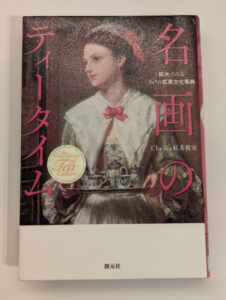

import ProblemBox from '../../../components/ProblemBox.astro';
import ConclusionBox from '../../../components/ConclusionBox.astro';

<ProblemBox>
- 自宅で丁寧に紅茶を淹れるのが好きで、紅茶の歴史やヨーロッパ文化の背景をもっと深く知りたい
- 西洋美術展や画集が好きだが、絵画のどこに注目すればより面白く鑑賞できるのか知りたい
- 忙しい日々の合間に、ページをめくるだけで心が優雅に満たされる上質な教養本を探している
</ProblemBox>

休日の午後、お気に入りのカップにお湯を注ぎ、立ち上る湯気と紅茶の香りを楽しむ時間。

そんな「自宅での丁寧な暮らし」をもっと奥深く、豊かなものにしてくれる素晴らしい書籍に出会いました。それが今回ご紹介する<b>『名画のティータイム: 拡大でみる60の紅茶文化事典』</b>（Cha Tea 紅茶教室 著／創元社）です。

美術館の展示や通常の画集では見落としてしまいがちな、<b>「名画に描かれたテーブルの上の銀器、陶磁器、お菓子、貴族たちの手つき」</b>を大胆にクローズアップし、そこに秘められた歴史と生活様式を紐解く唯一無二の美術・紅茶事典です。

今回は、絵画鑑賞とティータイムをこよなく愛する筆者が、本書の魅力と暮らしへの取り入れ方を詳しくレビューします。

---

## 『名画のティータイム』の書籍概要

<figure>

<figcaption>創元社より刊行。フルカラーの圧倒的なビジュアルと細部拡大が魅力</figcaption>
</figure>

- **書名**: 名画のティータイム: 拡大でみる60の紅茶文化事典
- **著者**: Cha Tea 紅茶教室（日本屈指の紅茶研究・教室主宰）
- **出版社**: 創元社
- **仕様**: A5判・オールカラー・約220ページ

本書の最大の特徴は、18〜20世紀初頭にかけて描かれた60点もの西洋名画を、<b>「紅茶文化」という独自のフィルターを通して鑑賞する</b>点にあります。

---

## 心を掴まれた4つの見どころ・魅力

### 1. 「細部の拡大図」で当時の生活動線が立体的に浮かび上がる
通常の絵画鑑賞では全体の構図や人物の表情ばかりに目が行きますが、本書はテーブルの上の<b>「銀器の彫刻」「レースのテーブルクロス」「ティーカップの持ち方」</b>を顕微鏡のように拡大して見せてくれます。
「当時のお茶会ではこんな手つきでカップを持っていたのか」「このシルバーのポットはどんな役割だったのか」というリアルな生活の息遣いが伝わってきます。

### 2. 貴族の社交から庶民の文化まで「紅茶の歴史」が体系的に学べる
- 王侯貴族のステータスシンボルとして始まった東洋の茶葉への憧れ
- 午後の社交場として洗練されていった「アフタヌーンティー」
- 自宅に親しい友人を招くアットホームなティーパーティ
- 茶葉の残りで未来を占う庶民の「紅茶占い」

教科書的な歴史の年号暗記ではなく、<b>「人々がどのように暮らしを楽しんでいたか」というストーリー</b>を通じて歴史がスッと頭に入ってきます。

### 3. 東洋磁器へのリスペクトと名窯の誕生ドラマ
紅茶文化は、茶器（陶磁器）の進化と切っても切り離せません。
中国や日本の伊万里焼（シノワズリ）への熱烈な憧れから、マイセンやウェッジウッドといったヨーロッパの名窯がいかにして誕生したのかが、絵画の中に描かれたカップやソーサーのディテールから鮮やかに読み解かれます。

### 4. 眺めているだけで自宅のティータイムが格上げされる
オールカラーで美しく印刷された誌面は、ただ眺めているだけで優雅なサロンに招かれたような贅沢な気分に浸れます。
本を読んだ後、いつもの紅茶を淹れてみると、カップの選び方や注ぎ方に自然と丁寧な所作が生まれ、日々のQOLが一段階引き上げられます。

---

## こんな人におすすめ！向いている読者層

| おすすめできる人 | 読後の体験・得られる変化 |
| :--- | :--- |
| <b>紅茶やアフタヌーンティーが好きな人</b> | 茶葉の知識だけでなく、茶器の背景や歴史的教養が身につく |
| <b>西洋絵画や美術館巡りが好きな人</b> | 絵画の「小道具」に隠されたメッセージを読み解く新しい視点を獲得 |
| <b>丁寧な暮らし・おうちカフェを楽しみたい人</b> | 休日の読書タイムが極上のリフレッシュ＆リラクゼーションに変わる |

---

## まとめ

『名画のティータイム』は、<b>「知識としての教養と、日々の暮らしの感性を同時に磨いてくれる至高のビジュアルブック」</b>です。

<ConclusionBox>
- <b>細部クローズアップの妙</b>: 60点の名画から茶器やお菓子のディテールを鮮明に鑑賞
- <b>紅茶文化の歴史を網羅</b>: 貴族のサロンから庶民のティータイムまでの生活様式を体感
- <b>おうち時間の質が向上</b>: ページをめくるだけで日常の疲れを忘れ、優雅な気分に浸れる
- <b>大切な人へのギフトにも最適</b>: アート好きや紅茶好きへのプレゼントとしても喜ばれる一冊
</ConclusionBox>

週末の静かな午後に、温かい紅茶を一杯淹れて、100年前の優雅なティータイムの世界へトリップしてみてはいかがでしょうか。
