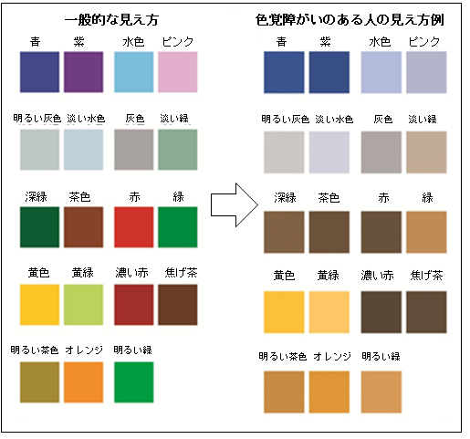

ブログやプレゼン資料を作るとき、文字や図の色使いをなんとなく決めていませんか？  
「赤字で強調したから目立つはず」「きれいに色分けしたから伝わるはず」と思っていても、人によっては見づらかったり、せっかくの強調が伝わっていなかったりする可能性があります。

この記事では、「なぜ見えにくくなるのか」「どうすれば誰もが見やすい配色にできるのか」を、初心者向けにわかりやすくご紹介します。

## カラーユニバーサルデザイン（CUD）とは？

カラーユニバーサルデザイン（CUD）とは、**どのような色覚を持つ人にも正確に情報が伝わるよう配慮されたデザイン**のことです。

人間の目の色の感じ方には個人差があります。すべての人に配慮して「色だけで情報を伝えない」「見分けやすい色の組み合わせを選ぶ」といった工夫を施すことが、カラーユニバーサルデザインの基本です。

## 呼称の移り変わり：「色覚多様性」へ

色を判別しにくい視覚特性を、従来は「色弱」や「色覚異常」と呼んでいました。

しかし、病気や欠陥ではなく「多様な見え方のひとつ」であるという考え方から、**日本遺伝学会**は2017年に遺伝学用語を改訂し、「**色覚多様性**」という呼称を提案しました。現在では、個人の特性を尊重したポジティブな表現として定着しつつあります。

## 男性の20人に1人！実はとても身近な存在

先天的な色覚多様性を持つ日本人の割合は、**男性で約5%（20人に1人）、女性で約0.2%（約500人に1人）**と言われています（参考：[日本眼科学会](https://www.nichigan.or.jp/public/disease/name.html?pdid=33)）。

日本全体では300万人以上存在しており、これは**血液型がAB型の人とほぼ同等の割合**です。学校の1クラスや職場の同じフロアに1人はいる計算になり、決して特別なことではありません。

## どのように見えている？区別がつきにくい色の例

色覚多様性を持つ方は、特定の色の組み合わせを見分けるのが難しい場合があります。

<figure>

<figcaption>

引用：[大阪府 色覚障がいのある人に配慮した色使いのガイドライン](https://www.pref.osaka.lg.jp/o010020/koho/shikikaku/guide1.html)

</figcaption>

</figure>

一般的には「赤と緑」の見分けが難しいイメージが有名ですが、実際には以下のような組み合わせでも混同が起こりやすいとされています。

- **赤 と 緑**
- **オレンジ と 黄緑**
- **深緑 と 茶色**
- **濃い赤 と 焦げ茶・黒**
- **青 と 紫**
- **水色 と ピンク**

例えば、濃い赤色の文字は「黒」に近く見えてしまい、せっかくの重要箇所の強調が気づかれないことがあります。また、緑色の黒板に赤色のチョークで文字を書くと、背景と同化して文字が読みにくくなってしまいます。

## 身近な実践例：東京メトロの工夫（駅ナンバリングと配色の見直し）

カラーユニバーサルデザインが身近なところで活かされている代表例が、**東京メトロ（地下鉄）の案内標識や路線図**です。

地下鉄の路線図は、丸ノ内線（赤）、銀座線（オレンジ）、千代田線（緑）のように「ラインカラー」で色分けされています。しかし、色だけでは見分けがつきにくい人のために、**「アルファベット（路線記号）」と「数字（駅番号）」**が必ずセットで表示されています。

- 丸ノ内線：**M**（M01、M02…）
- 銀座線：**G**（G01、G02…）
- 千代田線：**C**（C01、C02…）

さらに東京メトロでは、**2016年に路線のラインカラーそのものを色覚多様性に配慮した色合いに見直す**取り組みも行われました。似通って見えやすかった路線の色調（明度や鮮やかさ）を調整し、色の違いをよりはっきり認識できるように改善されています。

このように「色そのものを識別しやすく調整する」とともに、「色だけに頼らず文字や記号を組み合わせる」という両面のアプローチによって、色覚多様性を持つ方はもちろん、子どもや外国人観光客にとっても迷わず利用できるデザインが実現されています。

## ブログや資料で今すぐ使える！5つの実践テクニック

日頃のブログ執筆やスライド資料の作成で、すぐに取り入れられる工夫を5つご紹介します。

### 1. 強調色には「暗い赤」ではなく「朱色やオレンジ」を使う
濃い赤色は黒と同化して見落とされやすいため、少し黄みが入った**明るいオレンジや朱色（バーミリオン）**を選ぶと、誰にとっても目立つアクセントになります。

### 2. 色だけでなく「太字・下線・アイコン」を併用する
文字を目立たせたいときは、色を変えるだけでなく、**太字（ボールド）にする**、<u>下線を引く</u>、アイコン（💡、⚠️、📌など）を添えるといった工夫を重ねましょう。白黒で印刷しても重要箇所が一目で分かります。

### 3. グラフは「線の形」や「マーク」で差をつける
グラフで複数の項目を比較する際は、折れ線を「実線」「点線」「破線」で描き分けたり、散布図の点を「●」「▲」「■」のように形状を変えたりします。色以外の情報を持たせることで、一瞬で識別できるようになります。

### 4. 隣り合う色の境目に「境界線（白や黒のフチ）」を入れる
似たような色が隣り合っていると境界がぼやけて見分けにくくなります。色の境目に**細い白や黒の境界線（セパレーションライン）**を1本入れるだけで、色の区別がぐっと明確になります。

### 5. 「カラーユニバーサルデザイン推奨配色セット」を活用する
「自分で見やすい色の組み合わせを考えるのが難しい」という場合は、専門家が研究・作成した配色セットを活用するのがおすすめです。

東京大学の伊藤啓准教授らが公開している[カラーユニバーサルデザイン推奨配色セット](https://jfly.uni-koeln.de/colorset/)は、どのような色覚タイプでも見分けやすいカラーパレットが無料で公開されています。PowerPointなどの配色パレットに登録しておけば、迷うことなく安心な配色を選べます。

## まとめ：誰にとっても「伝わる資料」を作るために

カラーユニバーサルデザインは、「一部の人への配慮」だけにとどまりません。

色に頼りすぎないデザインを意識することは、スマホの画面を暗めにして見ている人、屋外の日差しの中で見ている人、モノクロで資料を印刷した人など、**結果としてすべての読者にとって見やすく伝わりやすい資料**を作ることにつながります。

まずは「強調したい部分に太字やアイコンを足してみる」「赤文字をオレンジに変えてみる」といった簡単なところから、色のバリアフリーを取り入れてみてはいかがでしょうか。
