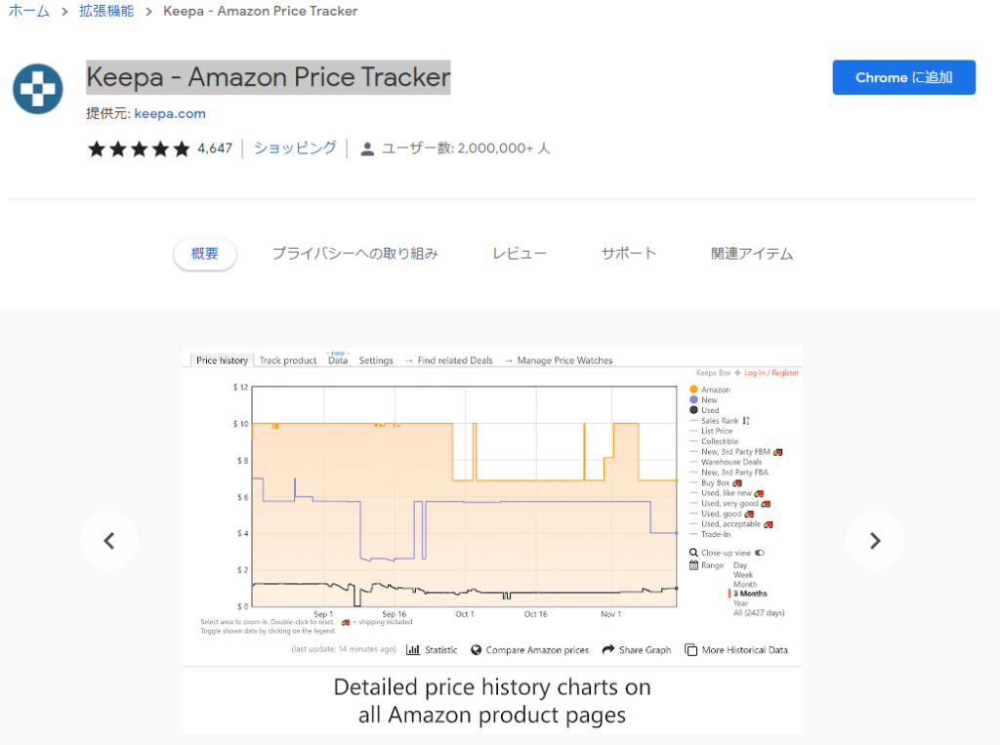
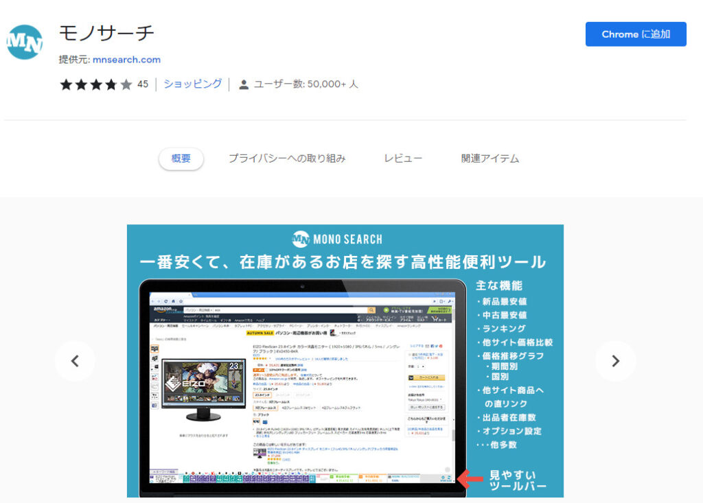

## chrome拡張機能とは

chrome拡張機能とは、Google提供するPC向けブラウザchrome向けに開発されたアプリです。  
インストールすることで、ワンタッチで様々な機能を利用することができます。

私が実際に使用している拡張機能を10つ、ご紹介します。

# おススメ拡張機能

## エンタメ系ツール

### 作業中も動画を視聴　Picture-in-Picture Extension (by Google)

動画をピクチャー・イン・ピクチャーで再生できる拡張機能です。  
Googleが開発しており、信頼して活用することができます。

<figure>

https://youtu.be/LxCw-vvmIiI

<figcaption>

拡張機能の説明動画（chromeウェブストアより）

</figcaption>

</figure>

ピクチャ・イン・ピクチャ(PiP)とは、動画を小さなウィンドウで最前面に常駐させる機能です！  
他の作業をしている際にも動画を常に前面に配置することができます。

インストールは[こちら](https://chrome.google.com/webstore/detail/picture-in-picture-extens/hkgfoiooedgoejojocmhlaklaeopbecg)

### 倍速で効率よく動画視聴　Video Speed Controller

YouTubeなどで当たり前となった倍速再生。  
対応していな動画に対しても、再生速度の変更が可能です。

ショートカットに対応しており、Dキーで再生速度を速めることができます。

<figure>

<figcaption>

chromeストアより

</figcaption>

</figure>

私は、聞かないわけにはいかないけど、そんなに重要でないもの  
例えば、大学の講義動画や会社の会議記録などにもってこいです。  
また、これらには再生速度の変更に対応していないものが多いです。

インストールは[こちら](https://chrome.google.com/webstore/detail/video-speed-controller/nffaoalbilbmmfgbnbgppjihopabppdk)

## メモツール

PDFに変換し保存などの煩わしい作業なしに、ワンタッチでWebページを丸々保存できます。  
赤字ペンで追記したり、マーカーペンでマークしたりするなど、普通のノートのように使えます。

### Evernote Web Clipper

Evernoteは、無料で使用できる最も有名なノートアプリの一つです。

<figure>

<figcaption>

chromeウェブストアより

</figcaption>

</figure>

無料版では60MB/月の制限があるので、ちょっとしたメモに使うとよいでしょう

インストールは[こちら](https://chrome.google.com/webstore/detail/evernote-web-clipper/pioclpoplcdbaefihamjohnefbikjilc)

### OneNote Web Clipper

Microsoftが提供しているメモアプリ「OneNote」の拡張機能です。

<figure>

<figcaption>

chromeウェブストアより

</figcaption>

</figure>

  
OneNoteがいいのは、数式に対応していることです。大学の講義では重宝しました。

インストールは[こちら](https://chrome.google.com/webstore/detail/onenote-web-clipper/gojbdfnpnhogfdgjbigejoaolejmgdhk)

## 翻訳ツール

英語サイトを読むときに便利な翻訳ツールです。私は用途別に2つのツールを使い分けいています。

### 高精度翻訳　DeepL翻訳（ベータ版）

[DeepL翻訳](https://www.deepl.com/ja/translator)は、ドイツの企業で、2017年にサービスを開始した、精度の高い翻訳ツールです。  
ニューラルネットワークを用いて翻訳を行うことで、独特の言い回しなどに対応しています。  
Google翻訳では、日本語として不自然な文書が出来上がってしまうことがありますが、  
DeepL翻訳ではそのようなことはありません。

逆に、日本語で書いた文章を英語や中国語に変換することも可能です。

拡張機能を使用すれば、コピー＆ペーストを使用しなくても簡単に翻訳することができます。

インストールは[こちら](https://chrome.google.com/webstore/detail/deepl-translate-beta-vers/cofdbpoegempjloogbagkncekinflcnj/related)

### ページ丸々翻訳　google翻訳

DeepL翻訳では、ページ全体の翻訳を行うことができません。  
そこで、サブの翻訳ツールとしてGoogle翻訳を使用しています。

## Web屋向けツール

私がBLOGを書く際に使用している拡張機能をご紹介します！

### ColorZilla

サイト上に表示されているコンテンツのカラーコードを読み取ることができます。

インストールは[こちら](https://chrome.google.com/webstore/detail/colorzilla/bhlhnicpbhignbdhedgjhgdocnmhomnp)

## 大学生・研究者向けツール

### Mendeley Web Importer

参考文献を管理することができるMendeleyの拡張機能です。  
Web上にある文献から、著作名、題名、雑誌名、発表年など参考文献を表示するのに必要な情報をワンタッチでインポートできます。  
PDFファイルが見つかれば、同時に保存してくれます。

<figure>

<figcaption>

chromeウェブストアより

</figcaption>

</figure>

インストールは[こちら](https://chrome.google.com/webstore/detail/mendeley-web-importer/dagcmkpagjlhakfdhnbomgmjdpkdklff)

## 価格比較ツール

ネット上では、店舗や時期によって、商品の価格が大きく変動します。  
そこで、価格比較を行える2つの拡張機能を使用しています。

### Keepa - Amazon Price Tracker

Amazonの価格推移を確認することができます。  
Amazonでは、各種セールの度に大きな値引きが行われていますが、元値を高く表記するなどの不正が行われているとの情報もあります。

インストールは[こちら](https://chrome.google.com/webstore/detail/keepa-amazon-price-tracke/neebplgakaahbhdphmkckjjcegoiijjo)

### モノサーチ

Amazonだけでなく、楽天やYahooなどから価格を取得し、比較を行うことができます。

インストールは[こちら](https://chrome.google.com/webstore/detail/monosearch/eadklkgmejdhldgchbmegmljdkchcdbd)

## 拡張機能の導入して快適なPCライフを送ろう！

拡張機能を導入することで、ブラウザを快適に使いこなすことができます。  
１回の操作はでの時間省略は数秒かもしれませんが、塵も積もれば山となる。  
今日から拡張機能を始めましょう！
