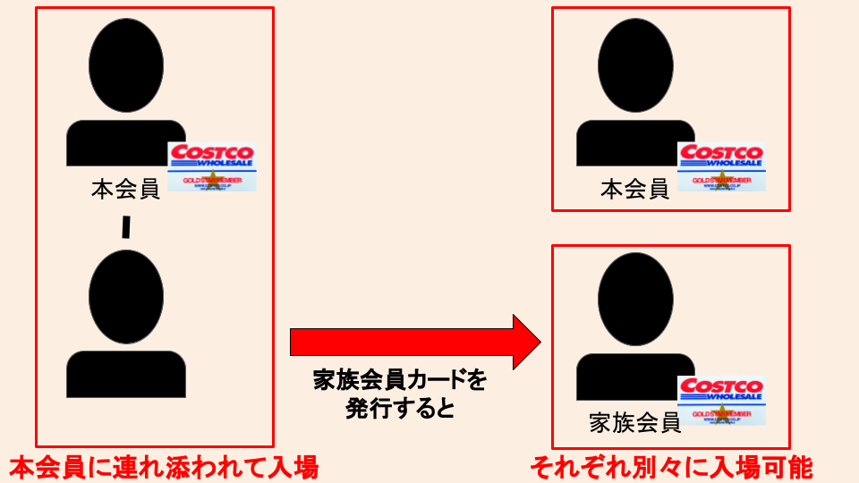
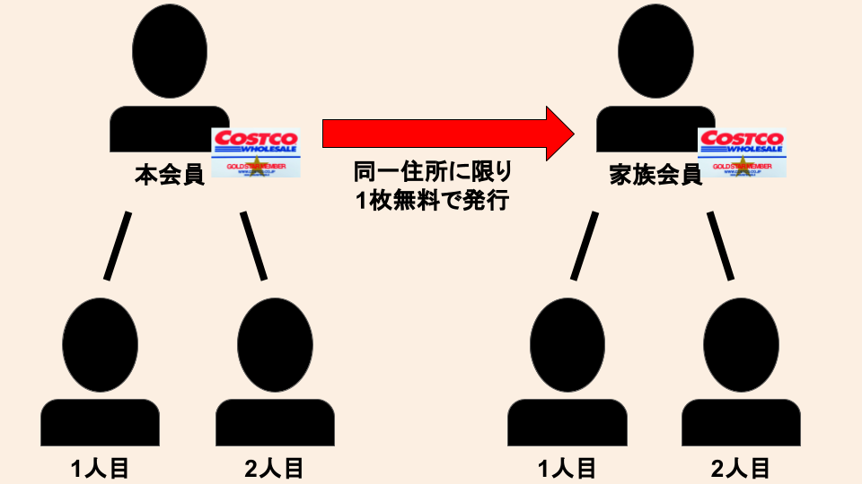

import ProblemBox from '../../../components/ProblemBox.astro';
import ConclusionBox from '../../../components/ConclusionBox.astro';

<ProblemBox>
- コストコの年会費（税込4,840円）を少しでもお得に抑えたい
- 家族や同居人がそれぞれ単独でコストコに買い物へ行けるようにしたい
- 家族カードの発行条件や必要な書類、同伴できる人数のルールを知りたい
</ProblemBox>

大容量の高品質な食材や日用品、家電が卸売価格で手に入る会員制倉庫型スーパー<b>「コストコ（COSTCO）」</b>。

非常に魅力的なスーパーですが、入会にあたってネックになりがちなのが<b>「年会費の高さ」</b>です。一般会員（ゴールドスター）でも年間4,840円（税込）の固定費が発生するため、元を取れるか不安に感じる方も多いのではないでしょうか。

そんな方におすすめなのが、本会員1人につき1枚まで完全無料で作れる<b>「家族会員カード」</b>です。

家族カードを賢く活用すれば、<b>1人あたりの年会費負担を実質2,420円（月額約202円）まで圧縮</b>でき、別々のタイミングでの買い物やグループでのまとめ買いが圧倒的に快適になります。

今回は、実際に家族会員カードを発行して使い倒している筆者が、家族カードのメリット、発行条件、カウンターでの手続きの流れ、そして知っておくべき注意点まで徹底解説します。

---

## コストコ家族カード最大の魅力は「年会費の実質半額化」

コストコでは、本会員（プライマリー会員）が登録すると、<b>追加料金なし（0円）で家族会員カードを1枚発行</b>できます。

| 項目 | 本会員カードのみ | 家族会員カード併用（計2枚） |
| :--- | :--- | :--- |
| <b>合計年会費（ゴールドスター）</b> | 4,840円（税込） | 4,840円（税込・追加料金0円） |
| <b>カード1枚あたりの実質年会費</b> | 4,840円 / 年 | <b>2,420円 / 年（月額 約202円）</b> |
| <b>単独入場できる人数</b> | 1名 | <b>2名（各自別々に利用可能）</b> |
| <b>同伴可能な大人人数</b> | 最大2名（計3名入場） | <b>最大4名（計6名入場）</b> |

家族カードを保有している人は、本会員とまったく同じ権利を持ってコストコを利用できます。実質的に年会費を折半しているような形になり、固定費を大幅に引き下げられるのが最大のメリットです。

---

## 家族会員カードを作る4つのメリット

<figure>

<figcaption>家族カードがあれば本会員の同伴なしで単独入場できる</figcaption>
</figure>

### 1. 本会員がいなくても「単独」で買い物に行ける
コストコの会員証は顔写真付きで厳格に管理されており、原則として<b>カードに印字された本人がその場にいなければ入店も会計もできません</b>。「休日に夫のカードを借りて妻が1人で買い物に行く」といった使い方は不可能です。

しかし家族会員カードを作っておけば、それぞれが自分の会員証を持つことになるため、仕事帰りや空いた時間に<b>いつでも単独で来店・給油（ガスステーション利用）</b>ができるようになります。

### 2. 同伴可能人数が2倍（最大大人6名＋18歳未満）に拡大
コストコでは、会員カード1枚につき<b>18歳以上の同伴者（非会員）を2名まで</b>連れて入店できます（※18歳未満の子どもは何名でも同伴可能）。

家族カードを組み合わせると、以下のように入場可能な人数が一気に広がります。

<figure>

<figcaption>カード2枚をフル活用すれば大人最大6名まで同時入場が可能</figcaption>
</figure>

- <b>本会員カード</b>: 本人 ＋ 同伴者2名（計3名）
- <b>家族会員カード</b>: 家族会員本人 ＋ 同伴者2名（計3名）
- <b>合計</b>: <b>最大大人6名 ＋ 18歳未満の子ども</b>

友人ファミリーや親戚を誘ってコストコパーティーの買い出しに行く場合でも、全員でスムーズに入場できます。

### 3. 公式スマホアプリ（デジタルメンバーシップ）に対応
コストコ公式アプリをダウンロードすれば、家族会員も<b>「デジタルメンバーシップカード（スマホ会員証）」</b>を登録できます。

財布からプラスチックカードを取り出す手間がなくなり、スマホ1台で入店ゲートのチェックやレジでのスキャンが完了するため、日々の買い出し動線が非常にスムーズになります。

### 4. 本会員がエグゼクティブなら家族カードの利用分もリワード還元
上位プランである「エグゼクティブ会員（年会費 税込9,900円）」の場合、家族カードでの購入金額に対しても<b>最大2%のエグゼクティブリワード（ポイント）</b>が加算されます。

普段の買い出しを家族カードで行っても、ポイントの取りこぼしが発生しません（※リワードは本会員のアカウントに一括付与されます）。

---

## 家族会員になれる条件と必要な書類

家族会員の発行条件は非常にシンプルですが、厳格にチェックされるポイントがあります。

### 家族会員の発行要件
- <b>満18歳以上であること</b>（高校生不可）
- <b>本会員と「同一住所」に居住していること</b>

ここでのポイントは、<b>苗字が同じであることや戸籍上の血縁関係は問われない</b>という点です。
住民票の住所が同じであれば、ルームシェア中の友人や、同棲中のカップル、事実婚のパートナーであっても家族会員カードを発行できます。逆に、実の親子であっても別居していて住所が異なる場合は対象外となります。

### 手続きに必要な持ち物
家族会員の登録時には、<b>「同一住所」を確認できる本人確認書類</b>の提示が必須です。

| 持ち物 | 詳細 |
| :--- | :--- |
| <b>本会員の会員証</b> | プラスチックカードまたはアプリ画面 |
| <b>家族会員本人の身分証明書</b> | <b>現住所が記載された公的証明書</b> ・運転免許証 ・マイナンバーカード（個人番号カード） ・各種健康保険証 ・パスポート（所持人記入欄があるもの等） ・住民票の写し（発行後6ヶ月以内） |

※現住所と身分証の記載住所が一致しているか必ず事前に確認しておきましょう。

---

## 家族会員カードの発行手続き（当日の流れ）

家族カードの発行は、全国のコストコ倉庫店内にある<b>「メンバーシップカウンター」</b>で行います。

平日や休日の夕方など、カウンターが空いている時間帯を狙うと待ち時間ゼロでスムーズに発行できます。

<ol>
  <li><b>メンバーシップカウンターへ向かう</b> 本会員と一緒にカウンターのスタッフに「家族カードを追加したい」旨を伝えます。</li>
  <li><b>申込用紙への記入（またはWEB事前登録の照会）</b> 家族会員となる方の氏名、生年月日、電話番号、メールアドレスを記入します。</li>
  <li><b>同一住所の確認</b> 提示した身分証明書をもとに、スタッフが本会員と現住所が一致しているかを確認します。</li>
  <li><b>その場で写真撮影</b> カード裏面に印刷される顔写真をカウンター横のカメラで撮影します。身だしなみを整える時間はほぼないため、あらかじめ準備しておきましょう。</li>
  <li><b>即日カード発行・受け取り</b> 撮影完了後、数分でプラスチックカードが手渡され、その瞬間からすぐに買い物が可能になります。</li>
</ol>

---

## 作る前に知っておくべき4つの注意点・デメリット

生活改善の観点から、発行前に把握しておくべきコストコのリアルな仕様・注意点を開示します。

### ① 会計レジでの「個別会計」は原則不可
同伴者を連れて入店した場合、<b>レジで友人ごと・商品ごとにレシートを分けて支払うことはできません</b>。会計はすべて会員（カード保持者）が一括で行い、退店後に自分たちで割り勘計算をする必要があります。

### ② 使えるクレジットカードは「Mastercard」のみ
コストコのレジおよびガスステーションで使用できるクレジットカードは<b>Mastercardブランドのみ</b>です。VISA、JCB、American Expressは一切使えないため、現金を用意するかMastercardを持参しましょう。

### ③ エグゼクティブ・リワードは本会員に一括付与
エグゼクティブ会員の場合、家族カードでの買い物分もリワードの対象になりますが、付与されたリワードは本会員のカードに統合されます。家族会員側でリワードを使って支払いたい場合は、事前に本会員との間でルールを決めておくのが安心です。

### ④ 大容量買いに伴う「小分け冷凍」と「生活動線」の確保
コストコの食品はどれもメガサイズです。「お得だから」と大量に買い込むと、帰宅後に以下のような手間とコストが発生します。

- 帰宅後すぐに肉やパンを切り分けてラップ・ジップロックで小分けにする作業負荷
- 冷凍庫の容量がパンパンになり、普段の食材が入らなくなるリスク

コストコを無理なく生活改善ツールとして定着させるには、<b>あらかじめ冷凍庫の空きスペースを確保し、保存用容器やラップの消耗コストも織り込んでおくこと</b>が重要です。

---

## まとめ

本会員1名につき1枚完全無料で作れる「コストコ家族会員カード」について解説しました。

<ConclusionBox>
- <b>年会費が実質半額</b>: 1人あたり年間2,420円（月額約202円）でコストコを利用可能
- <b>単独利用が可能</b>: 本会員がいなくても、各自のタイミングでいつでも買い物や給油ができる
- <b>同居であれば誰でもOK</b>: 同一住所の確認書類があれば、苗字が違っても同棲カップルや友人も発行可能
- <b>最大6名まで入場</b>: カード2枚を組み合わせれば大人最大6名＋子どもまで一緒に楽しめる
- <b>事前の冷凍庫整理が鍵</b>: 大容量購入後の小分け作業・生活動線まで考慮して賢く活用しよう
</ConclusionBox>

コストコをすでに利用している方はもちろん、これから入会を検討している同居家族やカップルの方は、ぜひ家族会員カードを発行して、お得で快適なコストコライフをスタートさせてみてください。
