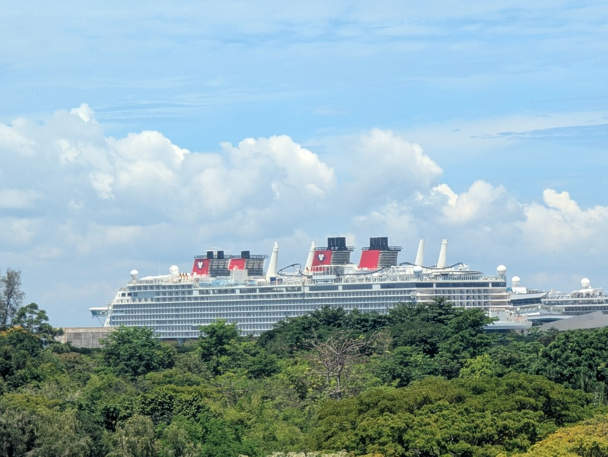
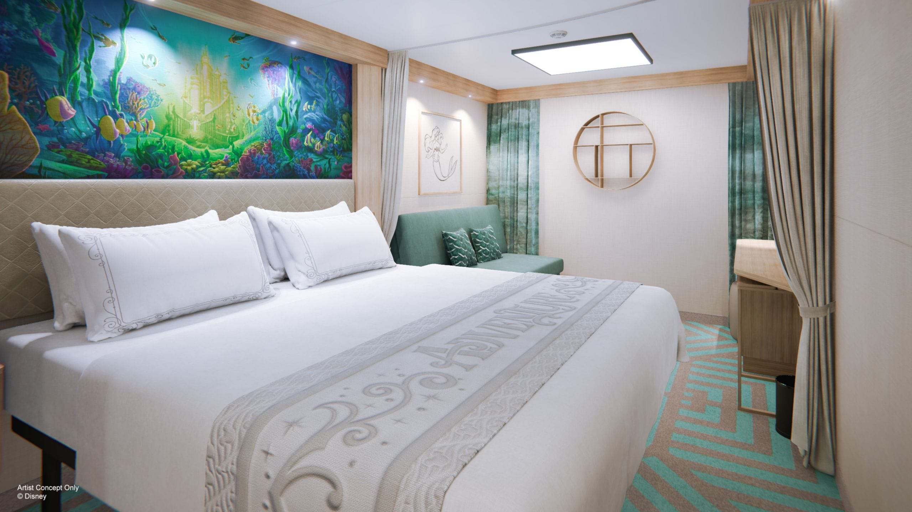
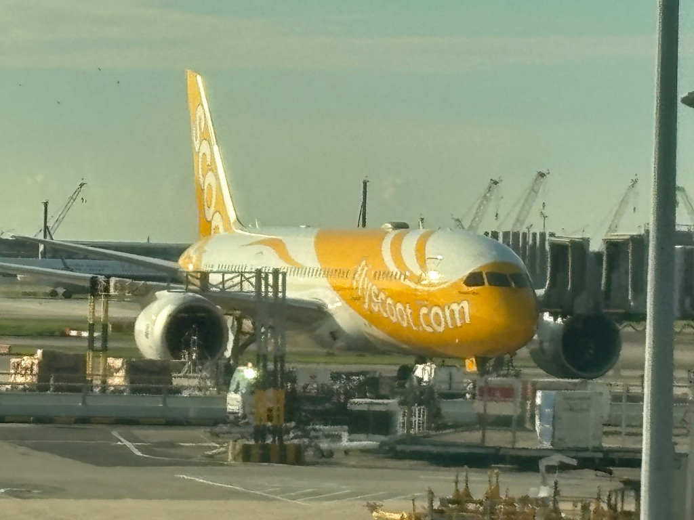

import AdviceBox from '../../../components/AdviceBox.astro';
import ProblemBox from '../../../components/ProblemBox.astro';
import ConclusionBox from '../../../components/ConclusionBox.astro';

2026年、シンガポールを拠点についにアジア初就航を果たしたディズニークルーズ「<b>ディズニー・アドベンチャー（Disney Adventure）</b>」。

「いつかは乗ってみたいけれど、全部合わせたら結局いくらかかるの？」「船内のチップや飲み物、お土産代の相場は？」「LCC利用やシンガポール現地観光も含めたリアルな総額が知りたい！」と気になっている方も多いのではないでしょうか。

<ProblemBox>
  
<b>こんな疑問や不安はありませんか？</b>

  <ul>
    <li>クルーズ代金以外に、船内でどれくらい追加費用が発生するの？</li>
    <li>1泊あたり必須でかかるチップ（Gratuities）の金額はいくら？</li>
    <li>航空券や現地での交通費・観光費・食事代まで含めた「旅費の総額」を把握したい！</li>
  </ul>
</ProblemBox>

そこで今回は、<b>2026年5月中旬</b>に夫婦2名で<b>木曜発の4泊5日プラン</b>に乗船した我が家の<b>実際にかかった費用とすべての内訳（1円単位・1セント単位）</b>を包み隠さず大公開します！✨

  ▲ シンガポールで乗船した最新鋭の超巨大客船「ディズニー・アドベンチャー号」

なお、記事内で適用している旅行当時（2026年5月中旬）の為替レートは以下の通りです。

- <b>米ドル / 円（USD/JPY）：</b> 1米ドル ＝ 約155円（船内のオンボード利用等）
- <b>シンガポールドル / 円（SGD/JPY）：</b> 1シンガポールドル ＝ 約115円（荷物配送「Lugg Me」等）

クルーズ基本料金から航空券、船内のチップやお土産、現地での観光・グルメまでカテゴリー順に詳しくご紹介します。<b>すべての支出を合算した最終的な総額一覧表は記事の最後で発表</b>しますので、ぜひ最後までチェックして旅行計画の参考にしてみてください！

---

## 1. クルーズ基本代金：客室料金と含まれる豪華サービス

クルーズ代金は、ディズニー旅行専門の旅行代理店「<b>ミッキーネット（mickeynet, LLC.）</b>」を通じて予約しました。

ミッキーネットはアメリカ・フロリダに本社（本店）を構え、日本人が運営しているディズニー専門の老舗代理店です。フロリダのウォルト・ディズニー・ワールド（WDW）やクルーズの個人手配において長年絶大な定評と実績があり、予約手続きから質問まで完全日本語で親身に対応してくれるため、海外クルーズが初めての方でも安心して利用できます。

- <b>航路：</b> ディズニー・クルーズライン ディズニー・アドベンチャー 4泊シンガポール航路
- <b>客室カテゴリー：</b> カテゴリー 10B（デラックス・インサイド・ステートルーム）
- <b>利用人数：</b> 大人2名
- <b>支払総額：</b> <b>324,361円</b>（1名あたり約162,180円）

  ▲ 今回宿泊した「デラックス・インサイド・ステートルーム」客室イメージ（出典：<a href="https://disneycruise.disney.go.com/ships/adventure/staterooms-overview/?gallery=staterooms_adventure_inside&imageId=media1-01-Media_DeluxeInside" target="_blank" rel="noopener noreferrer">ディズニー・クルーズライン公式サイト</a>）

### この金額に含まれているもの
ディズニークルーズは基本的に<b>「オールインクルーシブ」</b>に近いスタイルです。本体代金には以下のサービスがすべて含まれています。

1. <b>4泊分の客室宿泊費</b>
2. <b>毎日のフルコース・ディナー（ローテーションダイニング）</b>
3. <b>毎食のブッフェレストラン＆終日利用可能なファストフードステーション</b>
4. <b>プールサイドのソフトドリンク・コーヒー・紅茶・ソフトクリーム（無料・おかわり自由）</b>
5. <b>ウォルト・ディズニー・シアターでの本格ブロードウェイ級ミュージカルショー鑑賞</b>
6. <b>船内各所で開催されるキャラクターグリーティングやデッキパーティー</b>
7. <b>洋上ジェットコースターなどのアトラクション・プール利用</b>

これだけのエンターテインメントとフルコース料理が4泊5日分含まれて1人約16万円というのは、一般的な高級リゾートホテルに宿泊して外食・アクティビティ代を支払うのと比べても非常にリーズナブルです。

※予約時の部屋選びのコツや手続きの流れは、前回の記事「[【予約編】ディズニー・アドベンチャー予約完全ガイド！](/blog/disney-adventure-booking/)」で詳しく解説しています。

---

## 2. 航空券代金：スクート（Scoot）直行便と座席・手荷物オプション

日本〜シンガポール間のフライトは、シンガポール航空グループのLCCである<b>スクート（Scoot）</b>を利用しました。

  ▲ 今回搭乗したスクートの機体（ボーイング787 ドリームライナー）

「LCC＝狭くて疲れる」というイメージを根底から覆してくれるのがスクートの最大の魅力であり偉大なところです。最新鋭のワイドボディ機（ボーイング787 ドリームライナー）を主力機材として採用しているため、一般的な小型機のLCCとは違って機内は天井が高く静粛性も抜群。大手レガシーキャリアの半額以下の圧倒的な安さでありながら、快適性とコストパフォーマンスを最高レベルで両立してくれます。

- <b>旅程：</b>
  - 【往路】羽田（HND）02:20発 → シンガポール（SIN）08:20着
  - 【復路】シンガポール（SIN）17:15発 → 羽田（HND）翌01:05着

### フライト費用の詳細内訳（2名分）

| 項目 | 往路（東京→シンガポール） | 復路（シンガポール→東京） | 合計 |
| :--- | :--- | :--- | :--- |
| <b>航空運賃（2名分）</b> | 38,138円 | 34,138円 | 72,276円 |
| <b>空港使用料・出国税等の諸税</b> | 8,360円 | 16,196円 | 24,556円 |
| <b>受託手荷物オプション（25kg×1枠）</b> | 6,600円 | 6,600円 | 13,200円 |
| <b>座席指定料（2名分）</b> | 5,600円（44A, 44C） | 5,600円（13E, 13F） | 11,200円 |
| <b>支払手数料（Processing Fee）</b> | — | — | 2,849円 |
| <b>合計</b> | <b>58,698円</b> | <b>62,534円</b> | <mark><b>124,081円</b></mark> |

LCCを賢く利用することで、<b>2名往復で約12万4千円（1人あたり約6万2千円）</b>に抑えることができました！

また、往路は羽田深夜発・シンガポール早朝（08:20）着、復路は夕方（17:15）発のダイヤだったため、<b>シンガポールでホテルを取る必要がなく、高額な宿泊費を完全にゼロ</b>にできました。乗船前（木曜早朝〜乗船まで）と下船後（月曜下船後〜夕方まで）の乗船前後にもたっぷり観光時間を確保でき、コスト・時間の両面で非常に効率的でした。

### スクートを快適＆最安で乗る2つの攻略ポイント

1. <b>「Super Seats（スーパーシート）」で足元広々！深夜便でも疲れ知らず</b>  
   座席指定では、通常のエコノミー席よりもシートピッチが広い「<b>Super Seats</b>」を選択しました。  
   <b>身長175cmの男性でも足をゆったり伸ばせる</b>ほどの余裕があり、約7時間の深夜フライトでも窮屈さをまったく感じず快適に過ごせました。到着初日の早朝からフル活動するクルーズ旅において、この座席指定は大正解でした！

2. <b>手荷物枠のシェア裏ワザ！1人が大きめ重量（25kg）を買って2人で分ける</b>  
   スクートの受託手荷物オプションは「荷物1個につき1枠」ではなく、<b>購入した総重量の範囲内であれば複数個の荷物を預けられる「総重量制」</b>になっています。  
   そのため、2人がそれぞれ手荷物オプションを購入するよりも、<b>「1人が大きめの重量枠（25kgなど）を購入し、その枠を2人でシェアして預ける」</b>ほうがトータル料金を大幅に安く抑えられます！

<AdviceBox title="最安航空券を探すならGoogleフライト">
  
シンガポール行きの航空券は、時期やセールによって価格が大きく変動します。できるだけ安く・効率的にチケットを抑えたいなら、<b>Googleフライト</b>の価格追跡機能を活用するのが鉄則です！

  
日程別の最安値チャートや各航空会社の比較がひと目でわかるので、航空券の手配前に必ずチェックしておきましょう。

  

    👉 <b>詳しい使い方や裏ワザはこちら：</b> 
    <a href="/blog/google-flights-guide/" style="font-weight: bold; text-decoration: underline;">【完全攻略】Googleフライトの使い方ガイド！最安値航空券をサクッと見つける神機能＆裏ワザ5選 &raquo;</a>
  

</AdviceBox>

---

## 3. 船内オンボード利用費：チップ・お土産・有料飲食のリアル

ディズニークルーズ船内での買い物や有料ドリンク、チップなどは、すべてルームキー（Key to the World）または公式アプリに登録したクレジットカードで一括管理（オンボードチャージ）されます。

我が家の船内利用合計は <b>$412.26（約63,900円）</b> でした。

内訳を把握しやすいよう、船内利用分を<b>「チップ」「お土産（グッズ・TWG・Bacha含む）」「有料飲食（バー・カフェ・ドリンク）」</b>の3つのカテゴリーに分けて詳しくご紹介します！

### 1. チップ代（Gratuities）
ディズニークルーズでは、ダイニングのメインサーバー、アシスタントサーバー、ヘッドサーバー、ステートルームホスト（客室清掃係）へのチップとして、<b>1名1泊につき$16</b>が自動的に船内アカウントへ計上されます。  
4泊5日の場合、1名あたり <b>$16 × 4泊 ＝ $64</b>。夫婦2名で<b>合計$128.00（約19,840円）</b>が必須費用となります。

### 2. お土産・グッズ代（限定グッズ・TWG・Bacha Coffee）
船内ショップ「World of Disney」での限定カチューシャやアパレル、記念メダル（$6）に加え、アジア航路の目玉である<b>「Bacha Coffee（$54）」</b>と<b>「TWG Tea（$25）」</b>のギフト用アイテムを購入し、合計で <b>$227.94（約35,330円）</b> でした。  
世界的人気ブランドの紅茶やコーヒーを船内で手軽にお土産として調達できるのは、ディズニー・アドベンチャーならではの大きな魅力です。

### 3. 有料飲食代（バー・カフェ・ドリンク）
ディズニークルーズは3食の豪華フルコースやブッフェ、プールサイドのソフトドリンク・ソフトクリームがすべて無料（基本料金込み）です。  
有料飲食が発生するのは、アルコール類や特別なテーマバー（Buccaneer BarやSpellbound Bar）、タピオカドリンク（Bewitching Boba）などを楽しむ場合のみ。2名でバーや特製ドリンクを心ゆくまで満喫しても、<b>$56.32（約8,730円）</b>とわずか約8,700円程度に収まりました！

<AdviceBox title="クレジットカードの請求タイミングについて">
  
船内のオンボード利用分は、乗船中に一定額に達するごとに登録したクレジットカードへ自動で分割請求されます。

  
カード明細には「<b>DCL SHIP ADVENTURE</b>」などの名義で記載されます。下船日の朝にアプリ上で最終利用明細（Folio）が確認できるので、内容に相違がないか必ずチェックしておきましょう。

</AdviceBox>

---

## 4. シンガポール現地滞在費：観光・交通・手荷物配達・お土産・グルメ

クルーズ乗船前（木曜朝）および下船後（月曜午前〜夕方）のシンガポール滞在でかかった費用です。カード明細から細かく集計しました。

内訳を把握しやすいよう、<b>「観光チケット」「交通費」「手荷物配達」「お土産」「飲食」</b>の5つのカテゴリーに整理して全明細をまとめました！

### 現地滞在費の全内訳一覧表

| カテゴリー | 金額（2名分） | 主な利用内容 |
| :--- | :--- | :--- |
| <b>① 観光チケット</b> | <b>25,327円</b> | ガーデンズ・バイ・ザ・ベイ（11,636円）、ハリー・ポッター展（13,691円） |
| <b>② 交通費</b> | <b>5,234円</b> | Grabタクシー（3,176円）、セントーサ・エクスプレス、BUS/MRT |
| <b>③ 手荷物配達</b> | <b>84 SGD</b> （約9,660円） | Lugg Me 往復（行き 28 SGD、帰り 56 SGD） |
| <b>④ お土産</b> | <b>12,175円</b> | 空港チョコ（The Cocoa Trees）、Bacha Coffee、ハリポタお土産 |
| <b>⑤ 飲食・カフェ</b> | <b>6,448円</b> | スタバ（GBB / VivoCity）、フォー、肉まん、カヤトースト等 |
| <b>現地合計</b> | <mark><b>約58,800円</b></mark> |  |

---

### ① 観光チケット（ガーデンズ・バイ・ザ・ベイ＆ハリー・ポッター展）
<b>合計金額： 25,327円（2名分）</b>

乗船前および下船後に楽しんだ観光スポットのチケット内訳です。

- <b>ガーデンズ・バイ・ザ・ベイ（GARDENS BY THE BAY）入場チケット：</b> <b>11,636円</b>（2名分）  
  木曜早朝にチャンギ空港に到着後、荷物をLugg Meで港へ送り、乗船までの時間でシンガポール屈指の人気植物園「ガーデンズ・バイ・ザ・ベイ」へ！巨大温室（フラワードームやクラウドフォレスト）の壮大な植物アートを堪能しました。
- <b>ハリー・ポッター展「Visions of Magic」入場チケット：</b> <b>13,691円</b>（2名分 / Feverにて事前予約）  
  下船後、セントーサ島のリゾート・ワールド・セントーサ（RWS）で開催されていた体験型展示「Harry Potter: Visions of Magic」を満喫しました！

### ② 交通費（Grabタクシー・MRT・モノレール）
<b>合計金額： 5,234円（2名分）</b>

シンガポール滞在中の主な交通費の内訳です。

- <b>Grab（タクシー移動）：</b> <b>3,176円</b>（クルーズ港からセントーサ島への移動等）
- <b>セントーサ・エクスプレス（モノレール）：</b> <b>1,035円</b>（517円＋518円 / 2名分）
- <b>BUS / MRT（地下鉄・路線バス）：</b> <b>1,023円</b>（511円＋512円 / 2名分）  
  シンガポールの交通機関はクレジットカードのタッチ決済でそのまま改札を通れるため、とてもスムーズに移動できました。

### ③ 手荷物配達サービス「Lugg Me」
<b>合計金額： 往復計 84 SGD（約9,660円）</b>

空港〜クルーズ港間でスーツケースを当日配送してもらった利用料金です。

- <b>行き（チャンギ空港 → クルーズセンター）：</b> <b>28 SGD</b>（10kg以上 1個 / 約3,220円）
- <b>帰り（クルーズセンター → チャンギ空港）：</b> <b>56 SGD</b>（お土産等で荷物が増えたため2個分配送 / 約6,440円）  
  早朝の空港到着時だけでなく、下船日の朝もスーツケースを空港へ直送してもらったおかげで、行き帰りともに完全手ぶらでシンガポール市内観光を満喫できました！

### ④ お土産代（空港チョコ・Bacha・展示会グッズ）
<b>合計金額： 12,175円</b>

シンガポール現地（下船後および空港）で購入したお土産代の内訳です。

- <b>THE COCOA TREES（チャンギ空港）：</b> <b>9,172円</b>（定番のマーライオンチョコなど）
- <b>BACHA COFFEE（チャンギ空港T2）：</b> <b>1,623円</b>（ドリップバッグ等の買い足し）
- <b>ハリー・ポッター展 お土産代：</b> <b>1,380円</b>（限定グッズ）

### ⑤ 飲食・カフェ代
<b>合計金額： 6,448円</b>

乗船前後や空港での軽食・カフェ利用の内訳です。

- <b>VivoCity（ショッピングモール）：</b>
  - YUMMY HANOI（ベトナムフォーランチ）：1,507円
  - スターバックス：1,950円
- <b>チャンギ国際空港（第2ターミナル）：</b>
  - CHEF WAI（肉まん・軽食）：962円
  - ヤー・クン・カヤトースト（Ya Kun Kaya Toast）：380円
- <b>乗船前の軽食：</b>
  - ガーデンズ・バイ・ザ・ベイのスターバックス：1,049円
  - 羽田空港出発前：600円

---

## 5. 事前準備・海外旅行保険

- <b>海外旅行保険：</b> 「t@bihoたびほ」（ジェイアイ傷害火災保険）
- <b>保険料：</b> <b>5,060円</b>（夫婦2名分 / リスク細分型プラン）

クルーズ旅行では、万が一の船上での体調不良や寄港地・救護ヘリ等の搬送リスクに備え、治療・救援費用が無制限または手厚く補償される保険への加入が必須です。ネット完結型の保険を選ぶことで、2名で約5,000円と安価に万全の備えができました。

---

## 6. やってよかった節約術＆お金をかけて大正解だったポイント

実際に旅を終えて感じた、<b>「コストパフォーマンスを最大化するリアルな知恵」</b>をまとめました。

### やってよかった節約術
1. <b>スクート（深夜便）の利用でシンガポールのホテル代を完全カット！</b>  
   羽田〜シンガポール間のスクート深夜便を利用したことで、シンガポール現地でホテルを取る必要が一切ありませんでした。宿泊料金が高騰しているシンガポールにおいてホテル代を丸々浮かせられただけでなく、往路は早朝08:20着・復路は夕方17:15発だったため、乗船前（木曜早朝〜昼）と下船後（月曜午前〜夕方）の乗船前後にもしっかり観光時間を確保できました！
2. <b>スクートの手荷物枠シェア術（総重量制の活用）</b>  
   スクートは購入した重量内であれば複数個の荷物を預けられるため、2人で別々に買うのではなく「1人が25kg枠を購入して2人でシェア」。手荷物追加料金を最小限に抑えられました。
3. <b>クルーズ基本料金内の食事を徹底活用</b>  
   アドベンチャー号は無料ダイニングのクオリティが非常に高く、毎晩の豪華なフルコースやプールサイドのスナック・ソフトクリームだけで胃袋も心も大満足できます。有料レストランを無理に予約しなくても十二分に満喫可能です。
4. <b>公共交通機関（MRT・バス）のタッチ決済を活用</b>  
   シンガポールのMRTは初乗り約100円前後と非常に安価です。荷物がない移動時はMRTを活用し、長距離や急ぎの移動のみGrabを使うことで交通費を5,000円台に抑えられました。

### お金をかけて大正解だったポイント
1. <b>荷物配送サービス「Lugg Me」の往復利用</b>  
   到着初日の手ぶら観光はもちろん、下船後もスーツケースを空港へ送ったことで、市内観光やショッピングを身軽に遊び尽くせました。往復約9,600円以上の価値がある最高のサービスでした。
2. <b>船内での「Bacha Coffee」「TWG」体験</b>  
   シンガポール発祥・アジア航路ならではのシグネチャー体験として、船内サロンでのティータイムは絶対に外せません。旅の思い出として最高の投資になりました。
3. <b>Grab（配車アプリ）の活用：空港〜マリーナベイ間はGrabがおすすめ！</b>  
   チャンギ空港とマリーナベイ（ガーデンズ・バイ・ザ・ベイやクルーズセンター）の間は、Grabの利用が断然おすすめです！電車（MRT）だと乗り換えや荷物の移動に時間がかかりますが、Grabなら約20〜30分で快適に直行できます。乗船前の貴重な時間や体力を温存するためにも、ここはケチらずGrabを使うのが大正解でした。
4. <b>スクートの「Super Seats（スーパーシート）」指定</b>  
   深夜便でしっかり睡眠を取れるかどうかは旅の満足度を左右します。足元が格段に広く、身長175cmでもゆったり足を伸ばせたおかげで、約7時間の深夜フライトでも疲れ知らずで旅行を満喫できました。

---

## 7. 【総額発表】ディズニー・アドベンチャー4泊5日の全費用まとめ

それでは、ここまでご紹介してきたすべての項目を合算した<b>「旅行総額」</b>を発表します！

今回の旅行（夫婦2名・2026年5月中旬・4泊5日クルーズ＋シンガポール乗船前後観光）にかかった費用の総額一覧は以下の通りです。

| 費用カテゴリー | 金額（2名分） | 1名あたり換算 | 主な内容 |
| :--- | :--- | :--- | :--- |
| <b>① クルーズ本体代金</b> | <b>324,361円</b> | 約162,180円 | カテゴリー10B（4泊5日客室代・全食事・ショー等込） |
| <b>② 航空券（スクート）</b> | <b>124,081円</b> | 約62,040円 | 羽田〜シンガポール往復（座席指定＋受託手荷物25kg込） |
| <b>③ 船内利用（オンボード）</b> | <b>$412.26</b> （約63,900円） | 約31,950円 | チップ（$128）、お土産（TWG・Bacha含む $227.94）、有料飲食（バー等 $56.32） |
| <b>④ 現地滞在諸費</b> | <b>約58,800円</b> | 約29,400円 | 観光（約2.5万）、お土産（約1.2万）、手荷物配達（約1.0万）、飲食（約0.6万）、交通費（約0.5万） |
| <b>⑤ 事前準備・海外保険</b> | <b>5,060円</b> | 2,530円 | t@bihoたびほ（海外旅行保険 2名分） |
| <b>合計総額</b> | <mark><b>約576,200円</b></mark> | <mark><b>約288,100円</b></mark> | <b>航空券・クルーズ・往復手ぶら観光・お土産まで全て込み！</b> |

※船内オンボード（米ドル）は「1米ドル＝約155円」、現地手荷物配送「Lugg Me」（往復計84 SGD）は「1シンガポールドル＝約115円」で換算しています。

<ConclusionBox>
  
<b>ディズニー・アドベンチャー 4泊5日の総額まとめ</b>

  <ul>
    <li><b>総額費用（2名分）：</b> <mark><b>約57万6,200円（1名あたり約28万8,100円）</b></mark></li>
    <li><b>内訳：</b> クルーズ本体 約32.4万円 ＋ 航空券 約12.4万円 ＋ 船内オンボード 約6.4万円 ＋ 現地滞在諸費 約5.9万円 ＋ 保険 約0.5万円</li>
    <li><b>総評：</b> アメリカ本土航路（1人50万〜80万円以上）と比べて半額近くの予算で、最新鋭のディズニー豪華客船とディズニーの魔法を心ゆくまで堪能できます！</li>
  </ul>
</ConclusionBox>

「ディズニークルーズ＝超高嶺の花で手が出ない」と思われがちですが、シンガポール発のディズニー・アドベンチャーであれば、<b>LCC航空券の工夫や賢い事前手配によって、1人30万円以下の予算でも十分に夢の船旅を実現できます</b>。

フロリダやカリフォルニアへ行く場合と比べても、移動時間・時差・費用のすべてのハードルが大幅に下がったディズニー・アドベンチャー。  
ぜひみなさんも、シンガポールから出航するディズニー・アドベンチャーで、人生最高の航海へ旅立ってみてくださいね！🛳️✨

---

### 関連記事
- [【予約編】ディズニー・アドベンチャー予約完全ガイド！シンガポールから夢の航海へ](/blog/disney-adventure-booking/)
- [【完全攻略】Googleフライトの使い方ガイド！最安値航空券をサクッと見つける神機能＆裏ワザ5選](/blog/google-flights-guide/)
