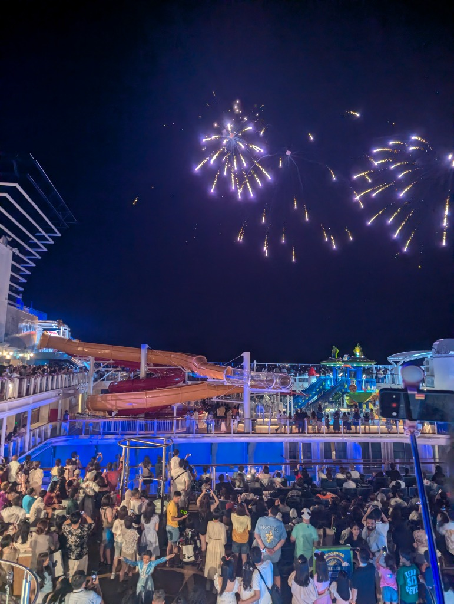
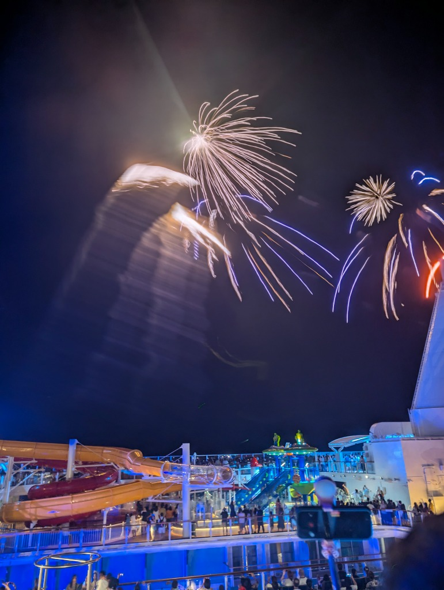
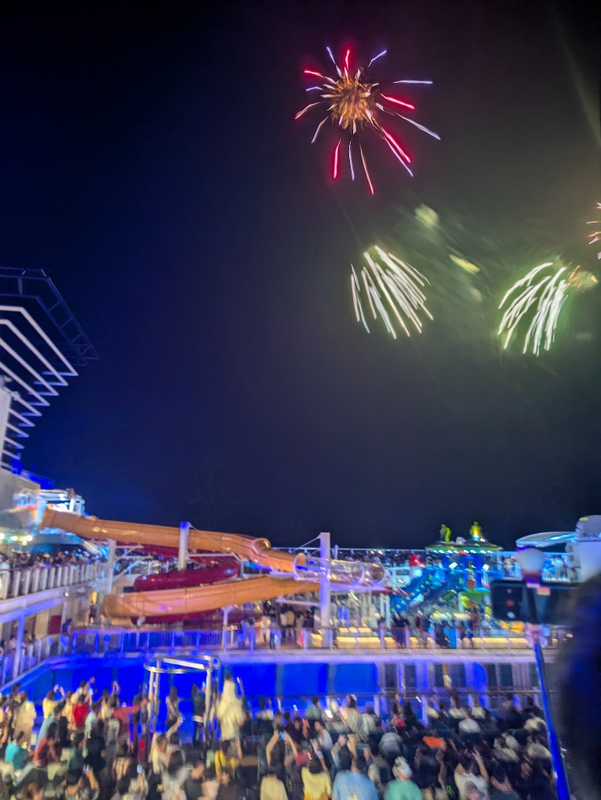
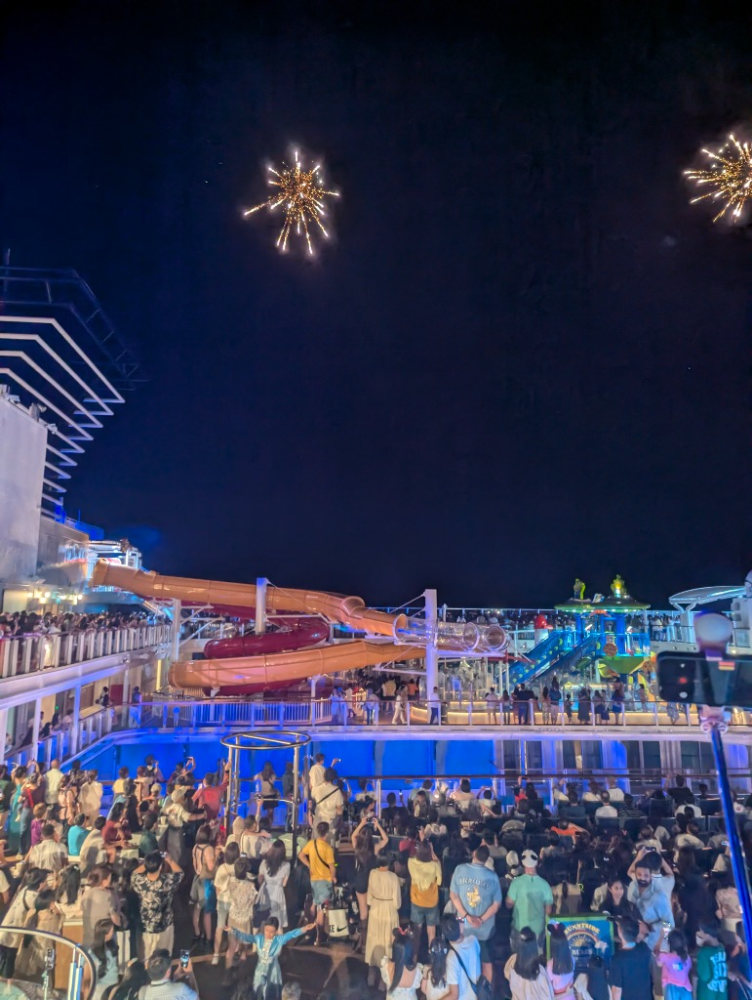
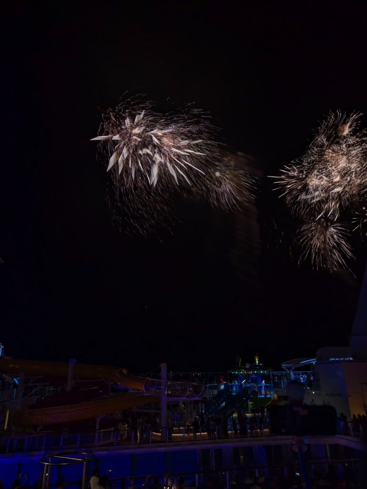

import AdviceBox from '../../../components/AdviceBox.astro';
import ProblemBox from '../../../components/ProblemBox.astro';
import ConclusionBox from '../../../components/ConclusionBox.astro';

2026年にアジア・シンガポール発着で待望の就航を果たしたディズニークルーズ「<b>ディズニー・アドベンチャー（Disney Adventure）</b>」。

船上での滞在中、絶対に外せない最大級のハイライトといえば、夜空と海をドラマチックに彩る<b>「洋上花火（Fireworks at Sea）」</b>です。漆黒の夜の海の上、ディズニーの感動的な音楽とともに打ち上がる大迫力の花火は、一生忘れられない一生モノの思い出になります。

しかし、この花火を最高のポジションで楽しむためには、ディズニークルーズ特有の<b>「ディナー時間の壁」</b>を計算に入れておかなければなりません。

<ProblemBox>
  
<b>こんな不安や疑問を抱えていませんか？</b>

  <ul>
    <li>ディナー時間が後半（セカンドシーティング）だけど、花火の開始時間に間に合う？</li>
    <li>コース料理を最後まで食べてからデッキに向かったら、良い場所はすでに埋まってる？</li>
    <li>せっかくの無料フルコースをパスして、プールサイドの食事で済ませても満足できる？</li>
  </ul>
</ProblemBox>

結論からお伝えすると、もしあなたのディナー時間が<b>「後半（セカンドシーティング）」</b>に割り当てられているなら、<b>花火の夜だけはあえて豪華なコースディナーをスキップし、デッキのハンバーガーなどのクイックサービスで済ませるのが圧倒的正解</b>です！

今回は、実際に夫婦でディズニー・アドベンチャーに乗船し、コースディナーを避けて特等席から花火を大満喫した我が家のリアルな体験談と、失敗しない鑑賞戦略を詳しく解説します。

<figure>

<figcaption>▲ 多くのゲストで賑わうプールデッキと、夜空に咲き誇る圧巻の洋上花火</figcaption>
</figure>

---

## 1. なぜディナー後半組は花火の場所取りに負けてしまうのか？

ディズニークルーズの夕食は、毎晩異なるテーマレストランを巡る<b>「ローテーションダイニング」</b>形式をとっており、乗船客はあらかじめ以下の2つの時間帯（シーティング）のいずれかに振り分けられます。

- <b>メインシーティング（前半ディナー）：</b> 17:45〜18:00頃スタート
- <b>セカンドシーティング（後半ディナー）：</b> 20:15〜20:30頃スタート

洋上花火が打ち上がる夜のデッキパーティーは、通常<b>22:00〜22:15頃</b>から始まり、パーティーのクライマックス（22:30前後）に花火が一斉に打ち上がります。

<figure>

<figcaption>▲ スライダーやプールデッキ周辺は、花火が始まると一面が人だかりで埋め尽くされます</figcaption>
</figure>

### コース料理を食べ終えた直後には、すでにデッキは満員

セカンドシーティング（20:30開始）の場合、前菜からメイン、デザートまでの本格的なコース料理をゆったり楽しんでいると、食事が終わるのは<b>21:45〜22:00頃</b>になります。

そこからレストランを出て、エレベーターで上層階のプールデッキ（Deck 11など）へ移動すると、<b>すでにデッキの手すり沿いや見晴らしの良い最前列エリアは何重もの人垣で埋め尽くされている</b>のです。

花火は高い夜空に打ち上がりますが、巨大な客船のファンネル（煙突）やウォータースライダーのタワー、大型スクリーンの骨組みなどがあるため、<b>「どの位置に立つか」で視界の抜け感と迫力がまったく違います</b>。ギリギリに到着して後方の人の頭やスマートフォンの隙間から見上げる羽目になると、せっかくの感動が半減してしまいます。

---

## 2. 我が家の決断！あえてコースをパスして「ハンバーガー」を選んだ理由

「ディズニークルーズの代金には毎晩の豪華フルコースが含まれているのに、それをスキップするのはもったいないのでは？」と思うかもしれません。

しかし、私たちは<b>「花火のベストポジションを勝ち取ること」</b>を最優先にし、花火当日の夜はあえてローテーションダイニングをお休みしました。

<figure>

<figcaption>▲ 視界を遮るものがない特等席から見上げた、鮮やかな打ち上げ花火</figcaption>
</figure>

### プールサイドのハンバーガーが想像以上に美味しい！

ディズニークルーズの素晴らしいところは、コースレストランに行かなくても、<b>プールデッキにあるクイックサービス（軽食スタンド）がすべて無料（クルーズ基本料金込み）で利用できる点</b>です。

- 注文が入ってから焼き上げるジューシーな<b>ビーフハンバーガー＆チーズバーガー</b>
- 揚げたてアツアツのフレンチフライ（ポテト）
- 焼きたての本格ピザやホットドッグ
- 自由に注げるソフトドリンクバー＆セルフのソフトクリームマシン

ディナーの予約時間に縛られることなく、自分の好きなタイミングでデッキへ行き、出来立てのハンバーガーとポテトをテイクアウト。心地よい夜風が吹くデッキのテーブルで、海を眺めながら食べるハンバーガーは最高のアメリカンバケーション気分を味わえます！

<AdviceBox>
  
<b>コースディナーをお休みする時のスマートなマナー</b>

  
ディズニークルーズでは、航海中ずっと同じサーバー（給仕係）チームが自分たちのテーブルを担当してくれます。もしコースディナーに行かないと決めた場合は、前日の夕食時や当日の昼間に<b>「今夜は花火の場所取りをしたいので、ディナーはお休みします（We will skip dinner tonight for fireworks.）」</b>と一言伝えておきましょう。サーバーさんが席で待って心配することを防げますし、お互い気持ちよく過ごせます。

</AdviceBox>

---

## 3. 【体験記】余裕の場所取りから観た花火の感動

早めにハンバーガーを食べ終えた我が家は、花火開始の<b>約1時間〜45分前</b>からプールデッキのベストスポットを確保しました。

この時間帯であれば、まだセカンドシーティングの人たちはレストランで食事中。デッキにはほとんど人がおらず、視界を遮るものが一切ない絶好の場所を自由に選ぶことができました。

<figure>

<figcaption>▲ 視界いっぱいに広がる閃光。海の上だからこそ味わえる特別なスケール感</figcaption>
</figure>

ドリンクバーで温かいコーヒーやソーダを片手に、のんびりと夜風を感じながら待つ時間は、焦りやストレスが一切ありません。

そしてショーがスタート！おなじみのディズニーの名曲がデッキの大音響スピーカーから鳴り響き、カウントダウンとともに夜空へ花火が打ち上がった瞬間、デッキ全体が大きな歓声に包まれました。

<figure>

<figcaption>▲ 暗闇の海上に浮かぶディズニー豪華客船から打ち上がる花火は、まさに息をのむ美しさ</figcaption>
</figure>

目の前の広い夜空いっぱいに広がる光のシャワーと、お腹にズドンと響く炸裂音。何にも邪魔されず、目の前に広がるディズニーの魔法を全身で浴びることができ、「あのときコースディナーをパスして本当に大正解だった！」と心から実感しました。

---

## 4. ディナー前半・後半の立ち回り比較まとめ

これからディズニー・アドベンチャーに乗船される方に向けて、シーティング別の立ち回り戦略を整理しました。

| シーティング | 食事スタイル | メリット | 注意点・デメリット |
| :--- | :--- | :--- | :--- |
| <b>前半（メイン）</b> 17:45〜 | 通常通りコースディナー | 食事をゆっくり食べ終えてから、余裕を持ってデッキへ移動できる | 17時台の夕食なのでお腹が空いていないことがある。夕方のイベントと時間が被りやすい |
| <b>後半（セカンド） 作戦A</b> | コースを途中で切り上げる | フルコースのメイン料理までは味わえる | 時間を常に気にする必要があり落ち着かない。デザートを諦めて慌ただしく走ることになる |
| <b>後半（セカンド） 作戦B（おすすめ！）</b> | クイックサービス（ハンバーガー等） | <b>時間に完全なゆとりができ、1時間前から特等席をキープ可能。カジュアルで気楽</b> | その日のコースディナー1食分を食べ逃す（ただし他日程で全レストランは回れます） |

4泊5日のクルーズであれば、毎晩異なるレストラン（全3〜4箇所）をローテーションするため、花火以外の夜にじっくりコース料理を味わうチャンスが十分にあります。

一生に一度の思い出になる洋上花火。場所取りで後悔したくないなら、ぜひ<b>「あえてコースを外してハンバーガー作戦」</b>を選択肢に入れてみてください！

---

## 5. まとめ：時間に追われない選択が、最高の思い出を作る

<ConclusionBox>
  
<b>ディズニー・アドベンチャー花火鑑賞の極意まとめ</b>

  <ul>
    <li>セカンドシーティング（後半ディナー）組は、コース完食後にデッキへ向かうと場所取りに出遅れる</li>
    <li>プールサイドのハンバーガーやピザは無料＆アツアツで大満足のクオリティ</li>
    <li>ディナーをパスする場合は、担当サーバーさんに事前に一言伝えておくのがスマート</li>
    <li>45分〜1時間前にデッキへ行けば、視界抜群の特等席で大迫力の洋上花火を独占できる！</li>
  </ul>
</ConclusionBox>

豪華なフルコースもディズニークルーズの醍醐味ですが、それ以上に「大迫力の花火を一番良い場所で、心穏やかに観る体験」には代えがたい価値があります。

旅行中は「全部を完璧にこなそう」とせず、優先順位を決めて柔軟に楽しむことこそが、クルーズ旅を満喫する最大の秘訣です。これから乗船される方は、ぜひ当日のスケジュールと照らし合わせながら、最高の一夜を計画してみてくださいね！🛳️✨

---

### ディズニー・アドベンチャー関連ガイド記事

当ブログでは、アジア初就航のディズニー・アドベンチャーに関するお役立ち実体験レポートを連載しています。ぜひあわせて参考にしてみてください！

- [【予約編】ディズニー・アドベンチャー予約完全ガイド！シンガポールから夢の航海へ](/blog/disney-adventure-booking/)
- [【費用公開】ディズニー・アドベンチャー総額いくらかかった？2人で4泊5日クルーズの実費内訳と節約・満喫のリアル](/blog/disney-adventure-cost/)
