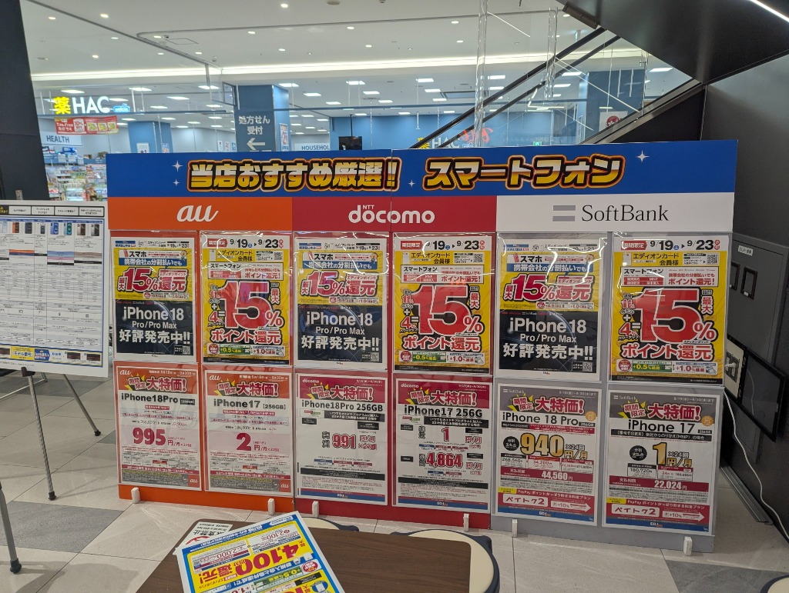
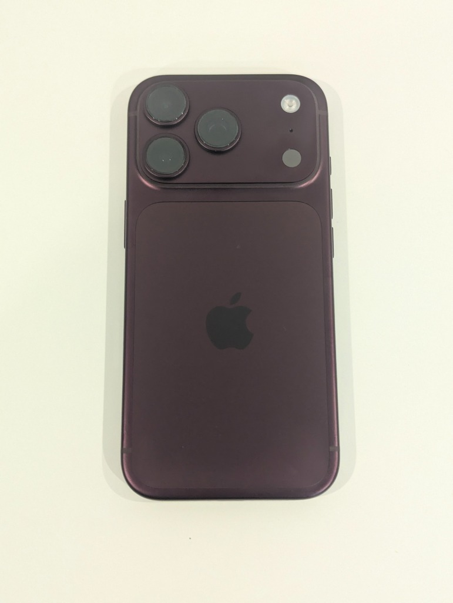
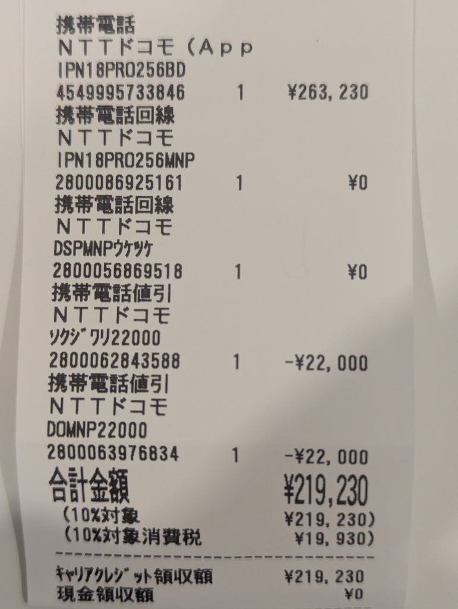
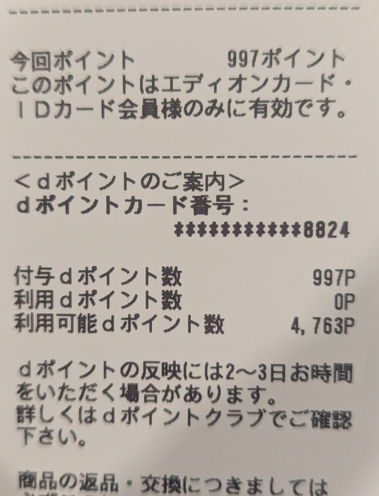

import ProblemBox from '../../../components/ProblemBox.astro';
import AdviceBox from '../../../components/AdviceBox.astro';
import ConclusionBox from '../../../components/ConclusionBox.astro';

2026年9月、待望のフラッグシップスマートフォン「<b>iPhone 18 Pro</b>」がついに発売されました。

しかし、円安や高性能化の影響もあり、最新Proモデルの本体価格は25万円を大きく超える超高級デバイスとなっています。「使ってみたいけれど一括20万円以上を出すのは厳しい」「最新スペックを2年周期で賢く乗り換えたい」と考えている方も多いのではないでしょうか。

そんな中、<b>エディオン横浜店</b>のスマートフォン特設コーナーにて、docomoの「いつでもカエドキプログラム」を適用した<b>実質月額991円</b>という衝撃的な特価キャンペーンを発見し、実際にMNPで契約してきました！

<ProblemBox>
  
<b>最新iPhone 18 Proのレンタル購入で、こんな疑問や不安はありませんか？</b>

  <ul>
    <li><b>店頭キャンペーンの実態：</b> エディオン横浜で展開されているdocomo施策の正確な内訳は？</li>
    <li><b>レシートの内訳：</b> 定価26万円からどうやって実質月額991円まで下がっているのか？</li>
    <li><b>回線の維持費：</b> 実用向けの「ahamo」と、維持重視の「ドコモ mini（4GB）」はどっちを選ぶべき？</li>
    <li><b>2年後のトータル総額：</b> 最安維持で2年後に返却した場合、最終支払額はいくらになるのか？</li>
  </ul>
</ProblemBox>

この記事では、実際に契約した際の<b>生々しいレシート画像</b>をもとに、値引きや残価設定のリアルな内訳を完全公開！さらに、最安で維持した際の<b>2年返却時のリアルなトータル総額</b>を分かりやすく解説します！

---

## 1. エディオン横浜店のiPhone 18 Pro店頭キャンペーン速報

2026年9月後半、エディオン横浜店のスマートフォン売り場には、大手3キャリア（docomo・au・SoftBank）の最新iPhone 18 Pro / iPhone 17に関する特大POPがずらりと並んでいました。

<figure>

<figcaption>エディオン横浜店で展開されていたdocomo・au・SoftBankのiPhone 18 ProキャンペーンPOP</figcaption>
</figure>

店頭の案内板を確認すると、各社ともに2年返却（残価設定型プログラム）を前提とした激しい価格競争が繰り広げられていました。

| キャリア | 対象モデル | 適用プログラム | 月額支払い額 | 2年後返却時の端末実質負担 |
| :--- | :--- | :--- | :--- | :--- |
| <b>docomo</b> | <b>iPhone 18 Pro (256GB)</b> | <b>いつでもカエドキプログラム</b> | <b>実質 991円/月 × 23回</b> | <b>22,793円</b> |
| <b>au</b> | iPhone 18 Pro | スマホトクするプログラム | 実質 995円/月 × 23回 | 22,885円 |
| <b>SoftBank</b> | iPhone 18 Pro | 新トクするサポート | 実質 940円/月 × 24回 | 22,560円〜44,560円 |

docomoは、大容量の<b>256GBモデル</b>でありながら、月額1,000円を切る<b>991円/月</b>という非常に魅力的な価格設定を打ち出しています。

さらに、エディオンカード会員限定で「<b>携帯会社の分割払いでも最大15%エディオンポイント還元</b>」という強烈な独自施策も同時開催されており、見逃せない好条件となっていました。

---

## 2. 【実機＆生レシート公開】総額44,000円引き！実質991円の契約内訳

実際にエディオン横浜店で契約・入手した<b>iPhone 18 Pro（256GB）の実機</b>がこちらです！

<figure>

<figcaption>入手したiPhone 18 Pro実機：洗練された背面デザインと刷新されたカメラモジュール</figcaption>
</figure>

深みのある高級感あふれるカラーリングと、洗練された新形状のカメラモジュールが所有感を満たしてくれます。

そして、この端末を契約した際の<b>実際のレシート</b>がこちらです。

<figure>

<figcaption>実際の購入レシート：即時値引とMNP値引のダブル適用で総額44,000円引き</figcaption>
</figure>

定価263,230円から、店頭即時値引（2.2万円）とMNP値引（2.2万円）の<b>計44,000円が引かれ、分割対象額は219,230円</b>になりました。
ここに「いつでもカエドキプログラム」が適用され、24回目の残価（約19.6万円）が据え置かれます。
その結果、残りの22,793円を23回で割ることで、<b>月々わずか991円（2年間の総端末負担22,793円）</b>という驚異的な安さが実現しています！

### エディオンカード当日入会で計15%（約3万円相当）ポイント還元！

ポイント付与のレシートを確認すると、POPの「最大15%還元」のリアルな仕組みが分かります。

<figure>

<figcaption>ポイント付与レシート：当日は計1%が付与され、残り14%は後日付与</figcaption>
</figure>

店頭POPの「最大15%還元」に対し、レシート上の当日付与は1%（計1,994P）となっています。
これは<b>私が当日エディオンカードに新規入会したため、残りの14%（約2.8万P）が後日付与</b>となる仕組みです。
即時付与と後日付与を合わせれば、合計で約3万円相当の特大ポイントがしっかり還元されます！

---

## 3. 回線の選び方：実用ならahamo、維持のみならドコモ mini 4Gへ

端末代金が月額991円と格安でも、毎月の通信回線費が高額になっては意味がありません。
今回のdocomo契約において、回線の選び方は<b>「実用性」か「最安維持」か</b>の2択に絞られます。

### ① メイン機としてバリバリ使うなら「ahamo」一択
外でも快適にネットやSNS、動画を使いたいなら、オンライン専用プラン「<b>ahamo（アハモ）</b>」が最適です。
- <b>月額料金</b>：<b>2,970円（税込）</b>
- <b>データ容量</b>：たっぷり30GB（5分以内の国内通話無料付き）
- <b>特徴</b>：複雑な固定回線セット割や家族割が一切不要。シンプルに単体で安く高速通信が使えるため、メイン回線としてiPhone 18 Proをフル活用したい人には最もバランスが良い選択肢です。

### ② とにかく安く回線を維持するなら「ドコモ mini（4GB）」
「サブ機として使いたい」「自宅にWi-Fiがあるから外ではほとんどギガを使わない」という場合は、小容量プラン「<b>ドコモ mini（4GB）</b>」がベストです。
- <b>基本月額料金</b>：2,750円（税込）
- <b>セット割引適用後</b>：<b>月額880円（税込）</b>
  - ドコモ光 / home 5G セット割：▲1,210円
  - dカードお支払割（GOLD/PLATINUM等）：▲550円（※一般カードは▲220円）
  - ドコモでんきセット割：▲110円
  - <b>最大割引合計：▲1,870円/月</b>

セット割をフル活用すれば、ドコモの高速通信回線と手厚い店舗サポートがありながら<b>月額880円</b>という破格の維持費を実現できます。

---

## 4. 【徹底シミュレーション】2年後返却時のトータル総額計算（最安値）

「結局、一番安く維持して2年後に返却したら総額いくら払うの？」という疑問にお答えし、<b>最安パターン（ドコモ mini 4GB維持）</b>に絞ってトータルコストを分かりやすく整理しました。

### 【最安運用】ドコモ mini（4GB・最大割引）で2年維持した場合

| 費用項目 | 金額（税込・ポイント換算） | 計算内訳・詳細 |
| :--- | :--- | :--- |
| <b>端末代金（実質負担）</b> | <b>22,793円</b> | いつでもカエドキプログラム（991円 × 23回） |
| <b>回線維持費</b> | <b>20,240円</b> | ドコモ mini 4GB（割引後 880円 × 23ヶ月） |
| <b>契約事務手数料</b> | <b>4,950円</b> | 店頭契約の初期費用（※現在は一律4,950円、初月利用料と合算請求） |
| <b>2年後返却の支払総額</b> | <b>47,983円</b> | <b>月額換算 約2,086円！</b>（実際に支払う現金・クレジット総額） |
| <b>ポイント還元合計（15%）</b> | <b>▲約29,896円相当</b> | キャンペーンによるポイント還元総額 |
| <b>実質トータル負担額</b> | <b>実質 約18,087円！！</b> | <b>月額換算 実質 約786円！！</b>（ポイント相殺後） |

<AdviceBox>
  
<b>契約事務手数料は店頭レジでは払わない？</b>

  
現在、docomoの店頭契約事務手数料は一律<b>4,950円（税込）</b>となっています。この費用は契約当日にエディオンのレジで支払うのではなく、翌月に請求される「docomoの初回利用料金」と合算で引き落とされます（レシートの現金領収額が0円になっているのはこのためです）。

</AdviceBox>

端末代・回線費・初期費用のすべてを合わせても支払総額は<b>47,983円（月あたり約2,086円）</b>。
さらにポイント還元（計15%＝約29,896円相当）を差し引くと、定価26万円を超える最新iPhone 18 Proが<b>月々実質700円台（総額1.8万円台）</b>で2年間使えてしまう計算になります！

---

## 5. 契約前に知っておくべき3つの注意点

非常にお得な施策ですが、残価設定型のプログラムには注意すべきルールが存在します。後から想定外の出費が発生しないよう、以下の3点を確認しておきましょう。

### ① 返却時の端末状態（傷・故障時のペナルティ）
端末を返却する際、docomoによる査定が行われます。
- <b>良品判定</b>：追加費用なしで残価全額免除
- <b>故障・破損判定（画面割れ、カメラレンズ傷、激しい打痕など）</b>：<b>故障時利用料（最大22,000円）</b>の支払いが必要になる場合があります。

高額なペナルティを防ぐためにも、購入直後から耐衝撃ケースとガラスフィルムを装着し、丁寧に使用することを強くおすすめします。

### ② 返却スケジュールの管理（23か月目の申請）
「いつでもカエドキプログラム」で最もお得になるのは<b>契約から23か月目</b>です。
返却手続きを忘れて24か月目を迎えてしまうと、最終回の残価支払い（再分割）がスタートしてしまいます。スマホのカレンダーやリマインダーに「契約後22〜23か月目」の返却通知を必ずセットしておきましょう。

### ③ 店頭の頭金と独自オプションの確認
家電量販店によっては、店頭独自の「頭金」や有料オプション（補償パック、セキュリティアプリ等）への加入が条件付けられている場合があります。
見積もり時に「頭金が0円になっているか」「不要な月額オプションが付けられていないか（初月解約可能か）」を販売スタッフに必ず確認してください。

---

## 6. まとめ

エディオン横浜店で実施されているdocomoのiPhone 18 Pro（256GB）実質991円キャンペーンは、定価26万円超のフラッグシップ機を最もリスク低く・安価に手に入れられる絶好の機会です。

<ConclusionBox>
  
<b>エディオン横浜×docomo iPhone 18 Proの総括まとめ</b>

  <ul>
    <li><b>端末値引き：</b> 定価263,230円から即時値引＋MNP値引で計44,000円引き（分割対象219,230円）</li>
    <li><b>端末実質負担：</b> いつでもカエドキプログラム適用で月額991円×23回（実質負担22,793円）</li>
    <li><b>ドコモ mini（4GB）活用：</b> セット割引適用で月額880円、23ヶ月の回線費は20,240円</li>
    <li><b>2年返却の支払総額：</b> 端末代＋回線費＋手数料（4,950円）込みで<b>47,983円（月額換算 約2,086円）</b></li>
    <li><b>ポイント還元と実質総額：</b> ポイント還元（計15%・約3万円相当）により、<b>実質負担は驚異の約1.8万円台（月額約700円台）</b>へ！</li>
  </ul>
</ConclusionBox>

「最新iPhoneの高性能カメラやProMotionディスプレイを試したいけれど、20万円以上の大金を一括で出すのはためらう」という方は、ぜひ量販店の値引き施策と「ドコモ mini」を組み合わせた賢い運用を検討してみてください！
