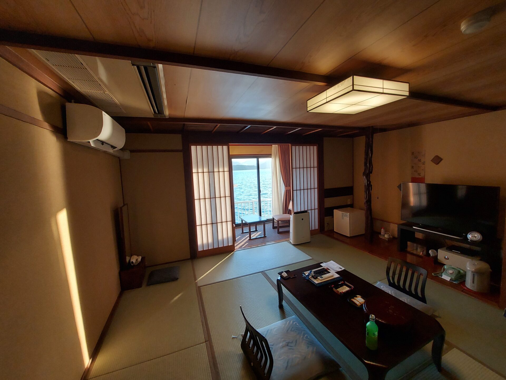
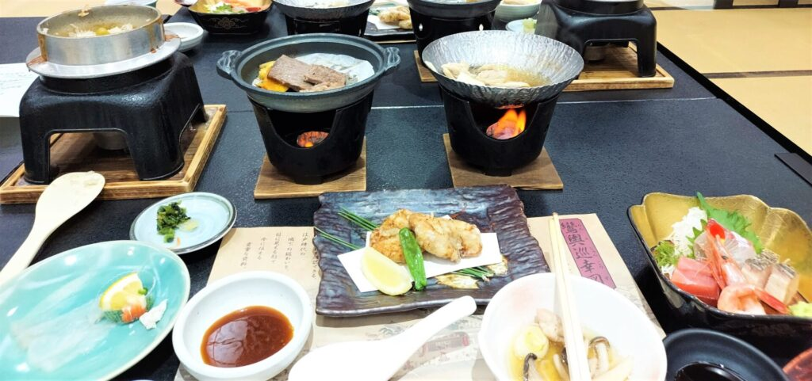

import ProblemBox from '../../../components/ProblemBox.astro';
import ConclusionBox from '../../../components/ConclusionBox.astro';

<ProblemBox>
- 山口・萩温泉郷で、海の景色や美味しい海鮮料理を堪能できる温泉宿を探している
- 「夕景の宿 海のゆりかご 萩小町」のお部屋おまかせプランのコスパやリアルな満足度を知りたい
- 萩観光での荷物預かり（手ぶら観光サービス）や駅からの送迎動線、温泉の設備を事前に把握したい
</ProblemBox>

日本海に突き出た笠山（かさやま）の岬の突端に佇む、山口県萩温泉郷の絶景旅館<b>「夕景の宿 海のゆりかご 萩小町」</b>。

目の前一面に広がる雄大な日本海のパノラマビューと、波の音を聞きながら浸かる天然温泉露天風呂、そして山口県ならではの海の幸をふんだんに盛り込んだ会席料理が人気の老舗温泉宿です。

今回は、最もリーズナブルな「お部屋おまかせプラン」を利用して実際に宿泊。客室の清潔感やアメニティ、海にせり出した露天風呂の開放感、豪華な夕朝食、そして便利な「手ぶら観光サービス」まで生活動線目線で徹底レビューします。

---

## 萩観光を身軽にする「手ぶら観光サービス」が超便利

萩市に到着したら、まず活用したいのが市内主要旅館と連携した<b>「手ぶら観光サービス」</b>です。

東萩駅または萩・明倫学舎の観光案内所に立ち寄り、対象の旅館名を伝えて荷物を預けるだけで、<b>宿泊先の旅館まで無料で荷物を当日配送</b>してくれます（※萩小町も無料配送の対象）。

重いキャリーケースを引きずりながら城下町を歩く必要がなく、到着直後から身軽に観光へ直行できる素晴らしい仕組みです。

---

## チェックインとお部屋おまかせ客室のリアル

観光を終えた後、東萩駅から無料送迎車で約8分。海沿いの静かな岬に佇む萩小町に到着しました。

館内は船や海をモチーフにした風情ある和風の造り。ロビーからは日本海を一望でき、波の音が心地よく響きます。

<figure>

<figcaption>畳の香りが心地よい清潔感あふれる和室。海側の窓からは広大な日本海が広がる</figcaption>
</figure>

今回予約した「お部屋おまかせプラン」でしたが、案内されたのは窓いっぱいにオーシャンビューが広がる広々とした和室。
洗面台やトイレなどの水回りも清潔にメンテナンスされており、波の音をBGMに畳の上で足を伸ばしてのんびりと寛ぐことができました。

---

## 海と一体化する天然温泉「波打ち際の露天風呂」

萩小町最大の自慢は、海に突き出た立地を活かした<b>オーシャンビューの大浴場と露天風呂</b>です。

露天風呂の湯船に身を沈めると、視線の先には遮るもののない水平線が広がります。
夕方には空と海が茜色に染まる幻想的な夕景を、夜には漆黒の海に浮かぶ漁火（いさりび）と満天の星空を眺めながらの湯浴みは、日頃のストレスや旅の疲れを一瞬で忘れさせてくれる極上のリラックス体験です。

---

## 日本海の海の幸を堪能する豪華会席料理

温泉で温まった後は、個室食事処で楽しむ夕食会席です。

<figure>

<figcaption>日本海の地魚のお造りやアワビの踊り焼きが並ぶ贅沢な御膳</figcaption>
</figure>

- **日本海の新鮮なお造り**: 地元萩の漁港で揚がった鮮度抜群の白身魚やイカ
- **アワビの踊り焼き**: 目の前で香ばしく焼き上げるふっくら柔らかい鮑
- **和牛陶板焼き＆季節の炊き込みご飯**: 滋味あふれる山口の食材をバランスよく堪能

一品一品が丁寧に味付けされており、ボリュームも大満足。朝食も色鮮やかな小鉢が並ぶ健康的な和定食で、朝からしっかりエネルギーをチャージできます。

---

## 【宿泊アドバイス】知っておくべき注意点

### 1. 周辺にコンビニ等はないため買い出しは事前推奨
岬の突端というロケーションゆえ、旅館の徒歩圏内にはコンビニや売店がありません。夜のおつまみや飲み物は、チェックイン前（送迎バスに乗る前）に東萩駅周辺で購入しておくのが賢い動線です。

### 2. 荒天時は波の音がやや大きくなる
海に極めて近い立地のため、海が荒れている日は波の音が窓越しに響くことがあります。音に敏感な方は耳栓を用意しておくと安心です。

---

## まとめ

夕景の宿 海のゆりかご 萩小町は、<b>「圧倒的なオーシャンビューと新鮮な海鮮料理で、心身を芯からリフレッシュできる癒やしの温泉宿」</b>です。

<ConclusionBox>
- <b>手ぶら観光で移動が快適</b>: 駅で荷物を預けて手ぶらで萩観光を楽しめる
- <b>波打ち際の絶景露天風呂</b>: 日本海と水平線を一望できる唯一無二の開放感
- <b>おまかせプランでも高コスパ</b>: 料理・客室・眺望ともに期待以上の満足度
- <b>事前の買い出しが吉</b>: 静かな岬の立地を楽しむため、必要な小物は駅前で調達
</ConclusionBox>

萩の歴史散策とセットで、海を望む贅沢な温泉時間をぜひ体験してみてください。
