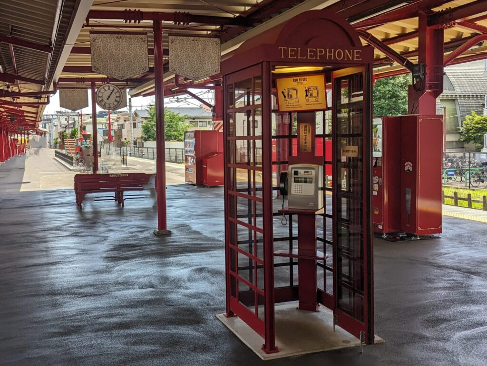
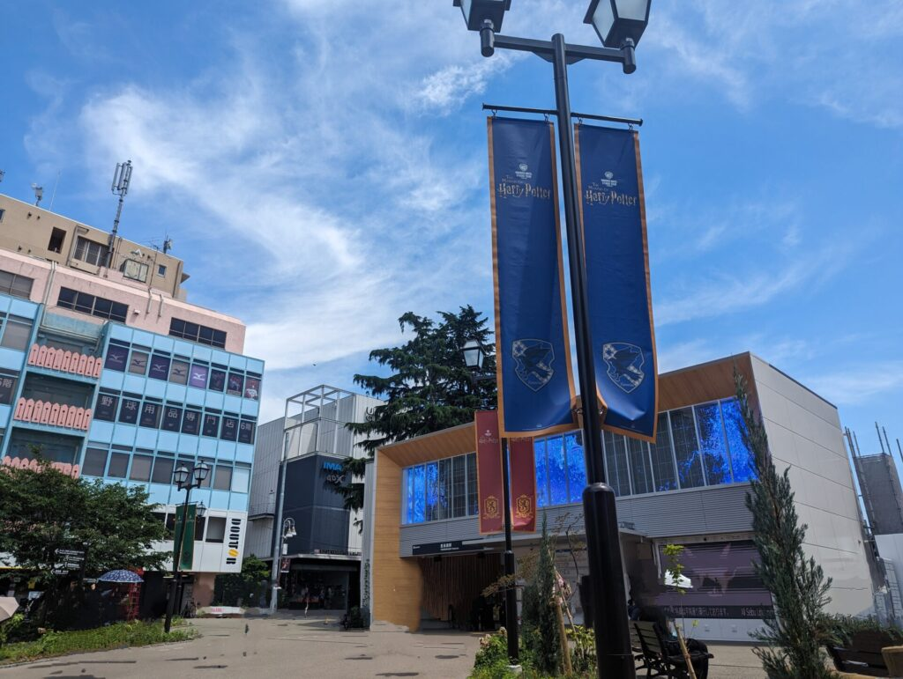

import ProblemBox from '../../../components/ProblemBox.astro';
import ConclusionBox from '../../../components/ConclusionBox.astro';

<ProblemBox>
- 「ワーナー ブラザース スタジオツアー東京」へ行く前に、最寄り駅の豊島園駅の見どころを知りたい
- ホグズミード駅風にリニューアルされたホームで、絶対に撮影しておくべきフォトスポットを把握したい
- 西武線のハリポタラッピング電車の運行状況や、池袋駅からのアクセス動線を知りたい
</ProblemBox>

東京・としまえん跡地に誕生した世界最大級の屋内型体験施設<b>「ワーナー ブラザース スタジオツアー東京 – メイキング・オブ・ハリー・ポッター」</b>。

連日多くのハリポタファンで賑わう中、施設本編と同じくらい熱い注目を集めているのが、玄関口となる<b>西武豊島線「豊島園駅」の全面リニューアル</b>です。

開園に合わせて駅全体が映画に登場する<b>「ホグズミード駅」</b>をイメージした英国風のデザインに大改装され、電車を降りた瞬間から魔法界へ足を踏み入れたかのような圧倒的な没入感を味わえます。

今回は、現地を実際に訪れて撮影した写真とともに、ホームの隠れ演出、絶好のフォトスポット、そして池袋駅からのアクセス動線まで徹底解説します。

---

## ホームに降り立った瞬間から「ホグズミード駅」！

豊島園駅の改札内ホームは、イギリスの歴史的な鉄道駅や映画のセットを忠実に再現したクラシカルな世界観で統一されています。

<figure>

<figcaption>赤を基調とした柱やアンティーク調の街灯が並ぶ美しいプラットホーム</figcaption>
</figure>

### ① 魔法省へつながる「ロンドンの赤い電話ボックス」
ホーム上でひときわ目を引くのが、英国レトロな<b>「真っ赤な電話ボックス」</b>です。

<figure>

<figcaption>中に入って受話器を持った記念撮影ができる大人気フォトスポット</figcaption>
</figure>

映画『ハリー・ポッターと不死鳥の騎士団』で、ハリーがアーサー・ウィーズリーと一緒にロンドンの「魔法省」へ潜入する際に使った来客用エントランスの電話ボックスを再現。実際に扉を開けて中に入り、受話器を持って写真を撮ることができます。

### ② 壁から飛び出す「魔法列車モニュメント」
ホーム奥のレンガ壁には、蒸気機関車の先頭車両がダイナミックに飛び出してきたかのようなモニュメントが鎮座しています。

<figure>

<figcaption>煙を吹き出しそうな迫力満点の機関車レプリカ</figcaption>
</figure>

ホグワーツ特急の重厚な金属の質感やヘッドライトが精巧に作り込まれており、旅のスタートを最高に盛り上げてくれます。

### ③ 逆回転する「魔法の時計」
ホーム中央に設置された時計をよく見ると、<b>針が反時計回り（逆回転）に動いている</b>という粋なギミックが施されています。時間を巻き戻して過去の魔法界へトリップするような遊び心にあふれた演出です。

---

## 駅前広場とスタジオツアーへのアクセス動線

改札を抜けると、緑豊かで開放的な駅前広場が広がっています。

<figure>

<figcaption>ベンチや木々が整備され、スタジオツアーエントランスへとスムーズに繋がる</figcaption>
</figure>

駅舎の外観もシックな木目調にリニューアルされており、駅前広場からスタジオツアー東京のエントランスまでは<b>徒歩約2分</b>のフラットな遊歩道で一直線にアクセスできます。

---

## 西武鉄道「スタジオツアー東京 表現電車（ラッピングトレイン）」

西武池袋線・豊島線では、主要キャラクター（ハリー、ロン、ハーマイオニー）や映画の名シーンが描かれたフルラッピング電車が運行されています。

<figure>

<figcaption>池袋〜豊島園間を中心に運行されている特別仕様のラッピング車両</figcaption>
</figure>

池袋駅の1・2番線ホームも、映画でおなじみの「キングス・クロス駅9と3/4番線」をモチーフにしたレンガ調デザインに改装されており、<b>池袋駅から電車に乗る瞬間からすでに旅が始まっている</b>という見事な演出動線になっています。

---

## 【来場アドバイス】混雑を避けて撮影するコツ

### 1. スタジオツアー予約時間の「30分〜45分前」に駅へ到着する
ツアーの入場開始直前は改札やホームが大変混雑します。少し早めの電車で豊島園駅に到着しておけば、電話ボックスや機関車モニュメントの前で並ばずにゆっくりと記念撮影を楽しめます。

### 2. 西武線公式アプリで「ラッピング電車の位置」を確認
西武鉄道の公式アプリ「西武線アプリ」を使えば、ラッピング電車の現在走行位置をリアルタイムで確認できます。乗車を狙いたい方は事前にチェックしておくと確実です。

---

## まとめ

西武線・豊島園駅は、<b>「スタジオツアー東京へ行くなら素通り厳禁の、完成された魔法空間」</b>です。

<ConclusionBox>
- <b>ホグズミード駅を完全再現</b>: 赤い梁とアンティーク街灯が彩るホームは必見
- <b>電話ボックスと機関車で記念撮影</b>: 入場時間より30分早めに着いて撮影を満喫
- <b>逆回転する時計に注目</b>: 散りばめられた魔法の隠れギミックを探してみよう
- <b>池袋駅からの移動もエンタメ</b>: キングスクロス風ホームやラッピング電車で気分を高める
</ConclusionBox>

スタジオツアー東京を訪れる際は、ぜひ電車の移動や駅の空間そのものも余すことなく楽しんでみてください。
