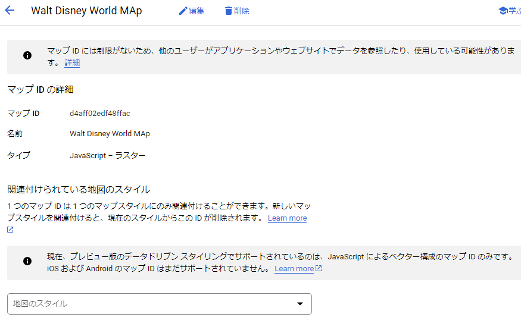
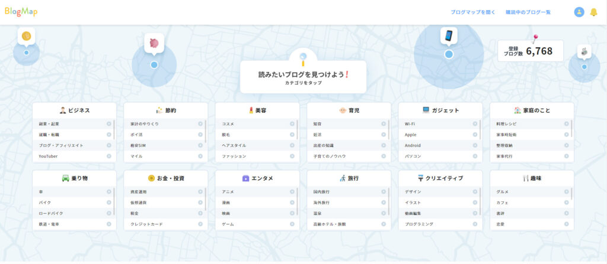

BlogMapとは、2021年に[ヒトデ](https://twitter.com/hitodeblog)さん、[ワロリンス](https://twitter.com/warorince)さん、[ひつじ](https://twitter.com/hituji_1234)さんによって  
開設された**ブログ交換サイト**です。利用は無料！  
  
そんなBlogMapの特徴を、noteとの比較を交えながら、ご紹介します。  
BlogMapを理解して、ブログのアクセス流入に繋げましょう！

## BlogMapとは

ヒトデさんによれば、"**読みたい個人ブログを探せるサービス**" だそうです。  
google検索に埋もれた面白いブログを発掘するために立ち上げたそうでう。

ブログの登録数は、6,800サイトを超えています（2022年2月現在）。  
サービス開始から2か月弱ですが、すごい登録者数ですね！

ヒトデさんによる、BlogMapの紹介はこちら  
[https://hitodeblog.com/blog-map](https://hitodeblog.com/blog-map)

## BlogMapのいいところ

ブログマップのいいところを3つご紹介します。

### フォロワーさんに更新通知を送れる

BlogMapでは、気に入ったブログの更新通知を受け取ることができます。

アイコンの右下より通知の登録、解除ができます。

### カテゴリからの流入が期待できる

自分のブログを3つのカテゴリに登録できます。

カテゴリの種類は100を越えます。

カテゴリは、新着順、購読者数順、いいね数順 の順に表示されるので、  
新規参入者にも十分にチャンスがあります。

テーマ選びがポイントです！

### おすすめ記事を掲載できる

PROFILE欄におすすめ記事を記載することができます。  
3つしか登録できませんが、アイキャッチも表示してくれるので、クリック率は高いと思います。

私の感覚ですが、1日3件程度の流入がある気がします。

## noteとの比較

私がblog集客ツールとして使用しているnoteとの比較をしてきます。

### noteは記事、BlogMapはヒト

**note**はタイムラインに、**更新した記事**が表示されるのに対し、  
**BlogMap**はカテゴリに、**ブログの情報のみ**が表示されます。

### noteは双方向、BlogMapは片方向

noteは発信者が投稿し、受信者が投稿に対しスキ・コメントをします。

BlogMapでは、投稿が存在しません。  
受信者ができるアクションは、ブログの更新通知を受信することとプロフィールにいいねをすることです。  
交友はブログで！と割り切った設計です。

### BlogMapは更新の手間がない

noteは記事を紹介したければ、紹介文を書き、サムネイルを作って、投稿と作業が多いです。

BlogMapは一度登録してしまえば、必要な作業はありません。

## まとめ　BlogMapは手間ナシ費用ナシの有用な集客ツール

以上、BlogMapについてnoteと比較しながら特徴をお伝えしました。

BlogMapは一度登録してしまえば、手間がかからないので、ぜひ登録することをお勧めします。

私のブログのサイトはこちら。いいね・更新通知お願いします。  
[https://blogmap.jp/details/7540](https://blogmap.jp/details/7540)  
  
ブログマップはこちら  
[https://blogmap.jp/](https://blogmap.jp/)
