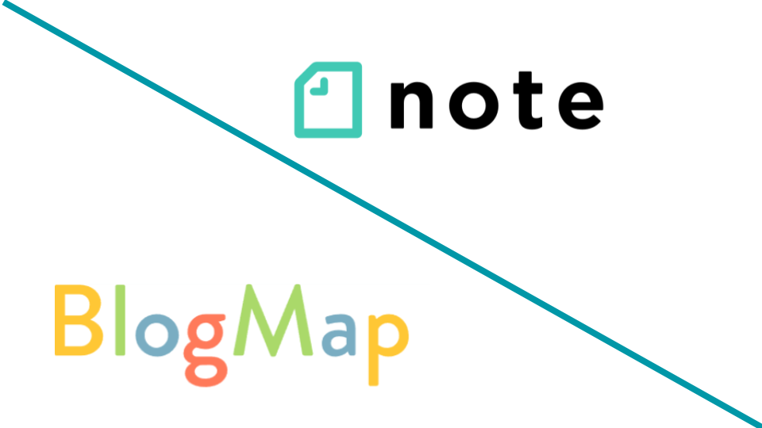

import ProblemBox from '../../../components/ProblemBox.astro';
import ConclusionBox from '../../../components/ConclusionBox.astro';

<ProblemBox>
- ブログを開設したばかりでGoogle検索からのアクセスがほぼゼロ、誰にも読まれない
- noteやSNSの更新に追われず、放置でも読者が集まる集客ルートを作りたい
- 個人ブログ発掘プラットフォーム「BlogMap」の仕組みや、noteとの違いを知りたい
</ProblemBox>

個人ブログを立ち上げた初心者が最初に直面するのが、<b>「Google検索から全くアクセスが来ない魔の数ヶ月間」</b>です。

SEOで検索順位がつくまでには半年以上の時間がかかるため、初期のアクセスゼロに耐えかねて挫折してしまうブロガーが後を絶ちません。

そんな個人の悩みを解決すべく、有名ブロガーのヒトデさん・ワロリンスさん・ひつじさんらが立ち上げたのが、<b>個人ブログの検索・発掘ポータル「BlogMap（ブログマップ）」</b>です。

完全無料で登録でき、登録しておくだけで純粋な読者やブロガー仲間からの定期的なアクセスと更新通知を受け取れるようになります。

今回は、BlogMapの仕組みとメリット、noteとの使い分け、そして効果的な初期集客の生活動線を徹底解説します。

---

## BlogMap（ブログマップ）とは？個人ブログを救うポータル

BlogMapは、<b>「大手企業のメディアに埋もれがちな、面白い個人ブログを探せるサービス」</b>です。

従来のブログランキングのような「毎日バナーを自作自演でクリックして順位を競う」仕組みとは異なり、読者が<b>「カテゴリ」「いいね数」「購読者数」</b>から純粋に読みたいブログをスマートに探せる設計になっています。

| 比較項目 | 一般的なブログランキング | note（ノート） | BlogMap（ブログマップ） |
| :--- | :--- | :--- | :--- |
| <b>主役</b> | バナーのクリック数 | <b>単一の「記事・テキスト」</b> | <b>ブログという「メディア・人」</b> |
| <b>更新の手間</b> | 記事ごとにバナー設置 | 毎回記事を投稿・作成 | <b>完全自動（RSSで自動更新通知）</b> |
| <b>コミュニケーション</b> | コメントやランキング競い | スキやフォローのSNS的交流 | <b>片方向（読者登録といいねのみ）</b> |
| <b>初期ドメイン効果</b> | 低い | noteドメインへの依存 | <b>自サイトへの直接流入と被リンク</b> |

---

## 個人ブロガーがBlogMapに登録すべき3つのメリット

<figure>

<figcaption>自サイトの紹介文やおすすめ記事3本を視覚的にアピール可能</figcaption>
</figure>

### 1. 「RSS自動連携」で完全放置でも更新通知が届く
noteやX（旧Twitter）で集客しようとすると、記事を書いた後に毎回宣伝投稿や要約文を作成する手間が発生します。
BlogMapは<b>サイトのRSSフィードを登録するだけ</b>で、記事を公開すれば自動的に読者のタイムラインへ更新通知が飛びます。日々の執筆動線を一切邪魔しません。

### 2. カテゴリ別の露出で「立ち上げ初期」からアクセスが入る
100以上の細かいジャンル（旅行、ガジェット、ライフスタイル等）から最大3つを選択して登録できます。
新着順・購読順・いいね順でソートできるため、<b>ドメインパワーが弱い開設初日のブログであっても、興味のある読者の目に触れるチャンス</b>が平等に用意されています。

### 3. 良質なナチュラル被リンクの獲得
BlogMapからのリンクは自サイトへの導線となるため、開設初期のインデックス促進やSEOの基盤作りにもプラスに働きます。

---

## noteとBlogMapの使い分け戦略

ブログ運営者の中には「noteも使っているけれど、どう役割分担すればいいの？」と悩む方も多いです。

<figure>

<figcaption>コンテンツ単体で魅せるnoteと、メディア全体を紹介するBlogMap</figcaption>
</figure>

- **noteの役割**: 「特定のノウハウやエッセイ」を単体で届け、SNS的にフォロワーと交流する場
- **BlogMapの役割**: 「自分の城（独自ドメインブログ）」の看板を掲げ、継続的な読者をストックする玄関口

交流やコメント対応に疲れてしまう方にとっても、BlogMapは<b>「更新通知といいね」という割り切った片方向の設計</b>になっているため、人間関係のノイズなく気楽に運用を続けられます。

---

## まとめ

BlogMapは、<b>「費用ゼロ・追加の手間ゼロで、大切な自サイトの読者窓口を広げられる必須の集客ツール」</b>です。

<ConclusionBox>
- <b>完全無料・登録は数分</b>: 独自ドメインブログを持つなら登録しない理由がない
- <b>手間のかからない自動更新</b>: RSS連携で記事を書くだけで読者に通知
- <b>noteと賢く併用</b>: 記事単発のnote、メディア全体のBlogMapとして住み分ける
- <b>初期の過疎期を脱出</b>: SEOだけに依存せず、個人ブログを探す良質な読者と繋がる
</ConclusionBox>

まだ登録していないブロガーの方は、ぜひプロフィールとおすすめ記事を設定して、新しい読者との出会いを楽しんでみてください。
