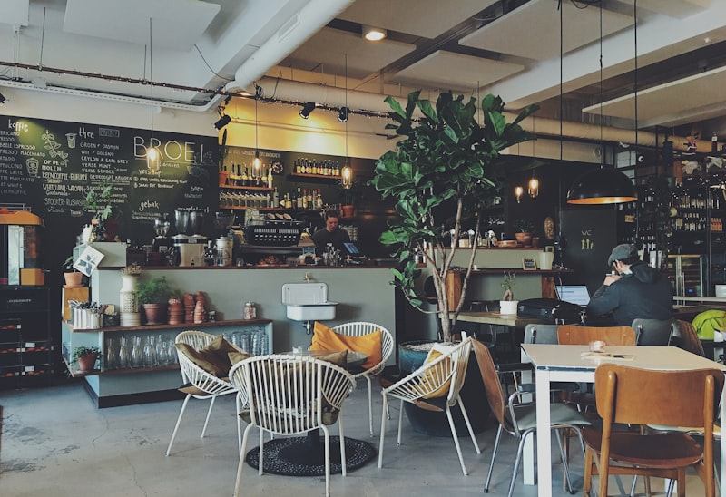

import ProblemBox from '../../../components/ProblemBox.astro';
import ConclusionBox from '../../../components/ConclusionBox.astro';
import Carousel from '../../../components/Carousel.astro';

<ProblemBox>
- 熊本にあるいつもと違うおしゃれなスタバを知りたい
- 本を読みながらゆっくりできる店舗はどこ？
- デートや作業など、目的に合ったスタバを探している
</ProblemBox>

熊本県内には、建築デザインが美しい店舗や、本を読みながらコーヒーが飲めるブックカフェスタイルのスタバが数多くあります。

ただ、休日はどこも混雑しがちですよね。「せっかく行ったのに座れなかった…」という失敗を防ぐため、今回は**雰囲気の良さはもちろん、実際の使い勝手やおすすめの利用シーン**も交えて、熊本のおすすめスタバを6店舗厳選しました。

---

## スターバックス コーヒー 不知火美術館・図書館店（宇城市）

熊本の中でも特におすすめしたいのが、不知火（しらぬい）美術館・図書館に併設されたこちらの店舗です。
建築の美しさが際立っており、大きな窓から差し込む自然光の中で本を読みながらコーヒーを楽しむことができます。

<Carousel>
  

    
  

  

    <blockquote class="twitter-tweet" data-dnt="true">
      
不知火のスタバ、図書館と繋がってて最高すぎる📚☕️ デザインも洗練されてて1日中いられる空間！

      &mdash; 熊本カフェ巡り (@dummy_kumamoto) <a href="https://twitter.com/x/status/123456789">2026年9月19日</a>
    </blockquote>
  

</Carousel>

<iframe src="https://maps.google.co.jp/maps?q=スターバックス+コーヒー+不知火美術館・図書館店&output=embed" width="100%" style="border:0; aspect-ratio: 16 / 10; height: auto;" allowfullscreen loading="lazy" referrerpolicy="no-referrer-when-downgrade"></iframe>

## スターバックス コーヒー 熊本駅店（熊本市西区）

肥後よかモン市場のすぐ近くにあり、出張や旅行の際にサッと立ち寄れる便利な店舗。コンパクトながらも熊本らしさを感じる木目調の落ち着いたデザインが特徴です。

<Carousel>
  

    
  

  

    <iframe src="https://www.instagram.com/p/CuT_1_1_1_1/embed" width="100%" height="480" style="border: 0; max-width: 440px; display: block; margin: 1.5rem auto;" frameborder="0" scrolling="no"></iframe>
  

</Carousel>

<iframe src="https://maps.google.co.jp/maps?q=スターバックス+コーヒー+熊本駅店&output=embed" width="100%" style="border:0; aspect-ratio: 16 / 10; height: auto;" allowfullscreen loading="lazy" referrerpolicy="no-referrer-when-downgrade"></iframe>

## スターバックス コーヒー アミュプラザくまもと店（熊本市西区）

アミュプラザくまもとの中にある店舗ですが、ただの商業施設内のスタバと侮ってはいけません。施設内の巨大な屋内滝（ウォーターフォール）を眺めながら過ごせる、開放感抜群のテラス風席が大人気です。

<Carousel>
  

    
  

  

    
  

</Carousel>

<iframe src="https://maps.google.co.jp/maps?q=スターバックス+コーヒー+アミュプラザくまもと店&output=embed" width="100%" style="border:0; aspect-ratio: 16 / 10; height: auto;" allowfullscreen loading="lazy" referrerpolicy="no-referrer-when-downgrade"></iframe>

## スターバックス コーヒー 蔦屋書店 熊本三年坂店（熊本市中央区）

下通・三年坂エリアの中心にあり、ツタヤと併設された昔から根強い人気を誇る店舗。購入前の本を読みながらコーヒーを楽しめるBOOK & CAFEスタイルです。

<Carousel>
  

    
  

  

    <iframe src="https://www.instagram.com/p/CuT_1_1_1_1/embed" width="100%" height="480" style="border: 0; max-width: 440px; display: block; margin: 1.5rem auto;" frameborder="0" scrolling="no"></iframe>
  

</Carousel>

<iframe src="https://maps.google.co.jp/maps?q=スターバックス+コーヒー+蔦屋書店+熊本三年坂店&output=embed" width="100%" style="border:0; aspect-ratio: 16 / 10; height: auto;" allowfullscreen loading="lazy" referrerpolicy="no-referrer-when-downgrade"></iframe>

## スターバックス コーヒー TSUTAYA BOOKSTORE 菊陽店（菊池郡菊陽町）

菊陽町の大型TSUTAYA内にあり、駐車場も広く車でのアクセスが抜群。店内も広々としており、三年坂店よりも少しゆったりとした空気が流れています。キッズスペース付きの書店に併設されているため、子連れでも比較的気兼ねなく利用できるのが嬉しいポイント。

<Carousel>
  

    
  

  

    
  

</Carousel>

<iframe src="https://maps.google.co.jp/maps?q=スターバックス+コーヒー+TSUTAYA+BOOKSTORE+菊陽店&output=embed" width="100%" style="border:0; aspect-ratio: 16 / 10; height: auto;" allowfullscreen loading="lazy" referrerpolicy="no-referrer-when-downgrade"></iframe>

## スターバックス コーヒー サクラマチ 熊本店（熊本市中央区）

熊本の新しいランドマーク「サクラマチ クマモト」の地下1階にある店舗。バスターミナルに直結しているため、バスの待ち時間や通勤通学の途中に立ち寄る人が多い活気ある店舗です。地下にあるため景色は楽しめませんが、サクラマチの洗練された雰囲気が漂い、買い物ついでにホッと一息つくのに最適です。

<Carousel>
  

    
  

  

    <blockquote class="twitter-tweet" data-dnt="true">
      
バスターミナル直結だからバス待ちの間にサクッと寄れて最高！

      &mdash; 熊本カフェ巡り (@dummy_kumamoto) <a href="https://twitter.com/x/status/123456789">2026年9月19日</a>
    </blockquote>
  

</Carousel>

<iframe src="https://maps.google.co.jp/maps?q=スターバックス+コーヒー+サクラマチ+熊本店&output=embed" width="100%" style="border:0; aspect-ratio: 16 / 10; height: auto;" allowfullscreen loading="lazy" referrerpolicy="no-referrer-when-downgrade"></iframe>

---

<ConclusionBox>
- 熊本のおしゃれスタバは「本×カフェ」や「自然×建築」など個性豊か
- 読書やひとり時間なら**不知火美術館・図書館店**がダントツでおすすめ
- 用途に合わせて店舗を使い分けると、もっと充実したカフェタイムに！
</ConclusionBox>
