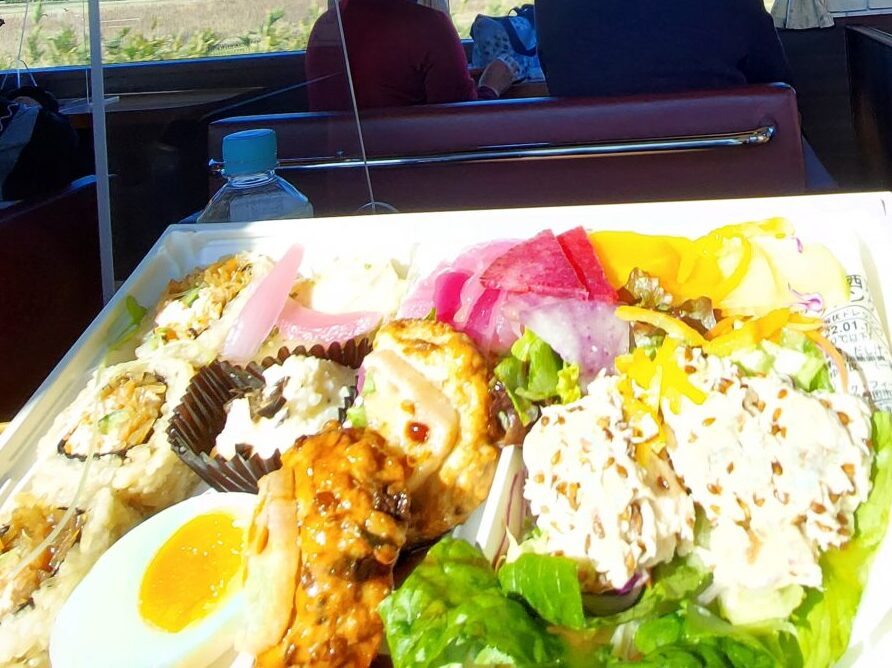

## 山口県の観光列車　○○のはなしとは

○○のはなしとはJR西日本が運転する**観光列車**です。  
山口県の日本海側を通る山陰本線を毎週末走行しています。  
沿線の**萩**、**長門**、**下関**の頭文字をとって"**はなし**"と命名されたそうです。

乗車券(新下関～東萩：2,180円)+座席指定席(530円)で乗ることができるお得な観光列車です。  
快速列車の(グリーン車ではなく)普通車なので、青春18きっぷを乗車券として乗ることができます。

2022年1月現在、コロナの影響で沿線の方々が乗車してのおもてなしは中止されています。

## 10:00 大丸下関でお弁当購入

○○のはなしでは、事前に予約することで、車内へお弁当を配達してくれます。  
2

老舗料亭の仕出し弁当がいただけるようですが、2,600円、貧乏大学生には高い、、、

そこで、大丸下関の地下にあるお惣菜コーナーでお弁当を調達してきました！

なんとか弁当と華やか根菜サラダ弁当です。  
それぞれ1,000円程度だったと思います。

大丸下関の営業開始は、10:00  
○○のはなしの発車時刻は、10:20  
10分でお弁当を選び、駅へ急ぐ！

## 10:20 下関駅から乗車

大丸下関のから歩くこと5分下関駅に到着！

下関駅では、ふく提灯がお出迎え  
大丸まで行く自信がない方は中国地方のスーパーゆめマートが改札すぐにあります。

時間もないのでホームに急ぐと、そこには

今回乗車する"○○のはなし"です。  
繊細な装飾が美しいですね

出発も近いので撮影はほどほどに車内へ

## 車内の様子

## 11:02 ビュースポット1 小串の海岸線

下関を出て、山陰線を北上するとまず初めのビュースポットに到着

<figure>

<figcaption>

停車位置目標がチラ見えしてます。

</figcaption>

</figure>

西側に海岸があります。帰りのコースでは夕方頃通過するので、夕景がきれいに見えるらしいです。  
よく晴れた日に対馬が見えるとか見えないとか

## 11:13 ビュースポット2 二見夫婦岩

## 12:11 ビュースポット3 長門市 只の浜海岸

最後のビュースポットです。  
右手奥には、青海島が見えます。

## 萩市に入る

萩市街に入ると指月山がお出迎え。  
指月山には、かつて萩城がありました。

## 12:47 萩駅で下車

終点の一つ手前の萩駅で下車しました。  
萩駅では、観光協会の方々が出迎えてくださりました。

萩駅は歴史的な駅舎が残るノスタルジックな駅です。  
駅舎は国の登録有形文化財に登録されています。

昔使われた改札が残っています。

## 車両の外観

車両は赤青緑のグラデーション

青い部分の装飾がてもきれいです。

