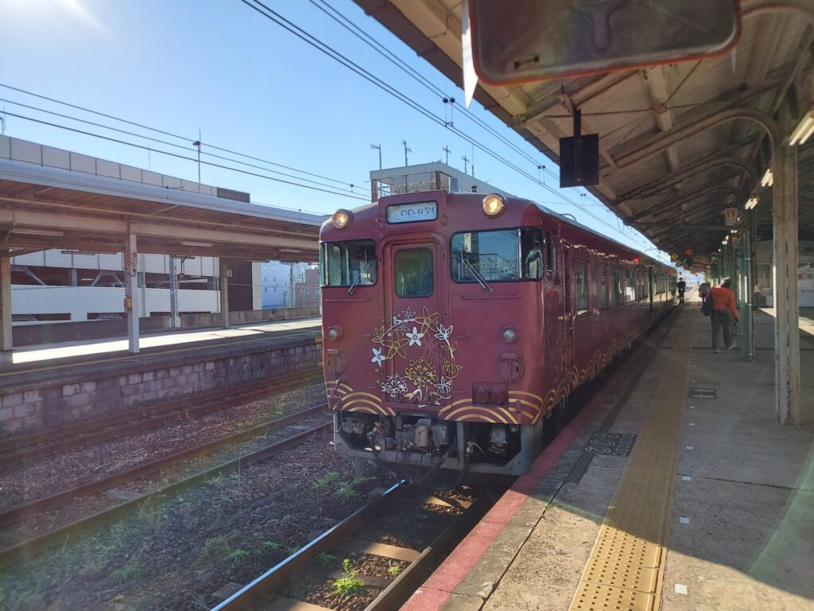
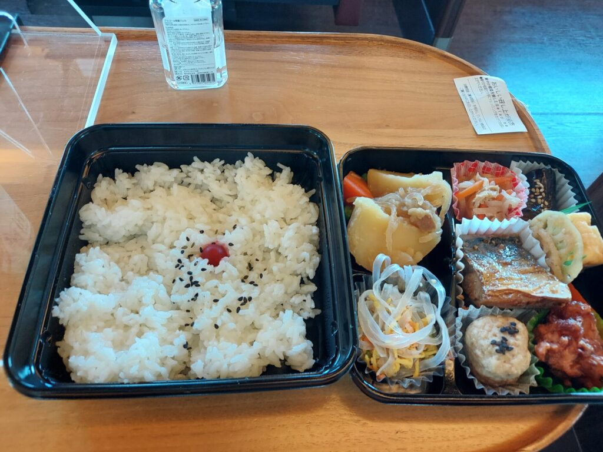
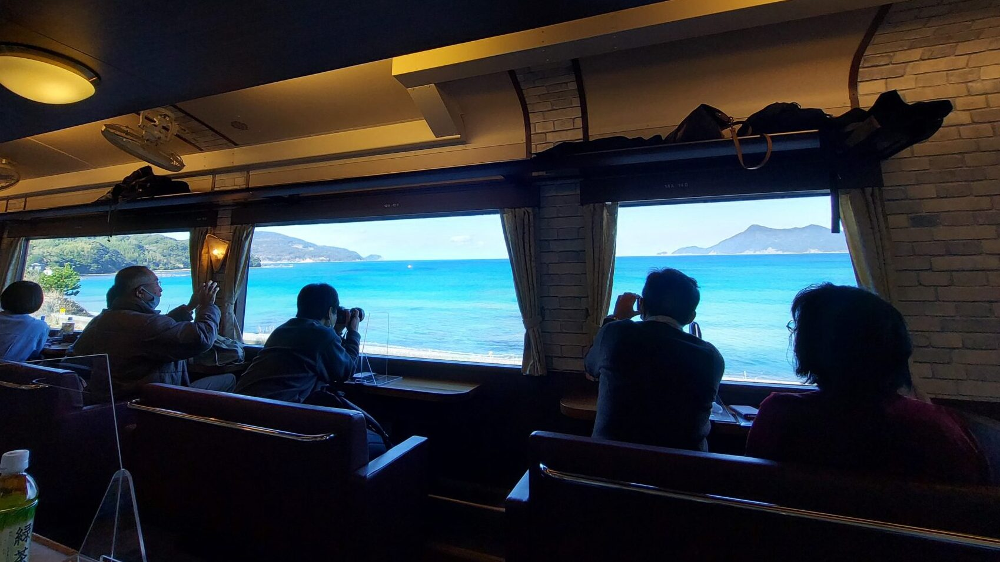

import ProblemBox from '../../../components/ProblemBox.astro';
import ConclusionBox from '../../../components/ConclusionBox.astro';

<ProblemBox>
- 山口県を走る観光列車「〇〇のはなし」の乗り心地や車窓からの景色を知りたい
- 高額な観光特急ではなく、リーズナブルな指定席料金で気軽に乗れる観光列車を探している
- 下関から東萩までの所要時間、車内のお弁当・食事の手配動線や予約のコツを把握したい
</ProblemBox>

美しいコバルトブルーの日本海と、明治維新ゆかりの歴史名所が連続する山口県・山陰本線。

ここを週末に駆け抜けるJR西日本の人気観光列車が<b>「〇〇のはなし（まるまるのはなし）」</b>です。

「萩（<b>は</b>ぎ）」「長門（<b>な</b>がと）」「下関（<b>し</b>ものせき）」の頭文字を結んだこの列車、最大の驚きは<b>「快速列車のため、普通運賃＋わずかな指定席料金だけで乗れる圧倒的なコストパフォーマンス」</b>にあります。さらに青春18きっぷでも乗車可能です。

今回は、下関駅から東萩駅までの約3時間半の旅路を実際に乗車し、和洋のレトロモダンな車内空間、息をのむ日本海の絶景ビュー、そして駅ナカでの賢いお弁当調達テクニックまで徹底レポートします。

---

## 「〇〇のはなし」の運行概要とお得な料金システム

一般的な観光列車は特急料金や高額なツアー代金が必要ですが、「〇〇のはなし」は<b>快速列車（普通車指定席）</b>として運行されています。

| 項目 | 内容・仕様 |
| :--- | :--- |
| <b>運行区間</b> | 新下関・下関 〜 東萩（山陰本線経由） |
| <b>運行日</b> | 土曜・日曜・祝日を中心に1日1往復 |
| <b>所要時間</b> | 下関 10:21発 → 東萩 13:38着（約3時間17分） |
| <b>必要料金</b> | <b>乗車券（2,310円） ＋ 指定席券（530円〜840円）</b> |
| <b>特別企画乗車券</b> | <b>「青春18きっぷ」＋指定席券でそのまま乗車可能！</b> |

わずか数百円の追加投資で、贅沢な専用シートと日本海の絶景を3時間以上も独占できる、鉄道旅行における最高の生活改善体験です。

---

## 和と洋が織りなすレトロモダンな2両編成

外観は、日本海の美しい海と夕日をイメージした鮮やかなグラデーションデザイン。車内は1号車と2号車でまったく異なる世界観が広がっています。

<figure>

<figcaption>ハイカラな洋風デザインが目を引く2号車。大きな側窓から海を望む</figcaption>
</figure>

- **1号車（和風空間）**: 萩の町並みや歴史をイメージした落ち着いた畳調のボックス席
- **2号車（洋風空間）**: 西洋文化を取り入れた下関のハイカラな港町を彷彿とさせるシックなソファシート

全席がゆったりとした配置になっており、海側の窓に向かって少し角度がつけられた座席や、天井の装飾ランプなど、細部まで旅情を盛り上げる意匠が凝らされています。

---

## 【駅前生活動線】デパ地下でお弁当をスマート調達

車内では事前予約制の豪華会席弁当も用意されていますが、2,000円〜3,000円と少々お高め。
そこでおすすめなのが、<b>下関駅直結「大丸下関店」のデパ地下で好きなお弁当をテイクアウトする動線</b>です。

<figure>

<figcaption>駅前のデパ地下で1,000円前後のこだわり弁当をサクッと購入</figcaption>
</figure>

大丸の地下食品フロアは10:00オープン。列車の下関発は10:21発なので、<b>開店直後に2〜3分でお弁当と飲み物を選び、改札へ向かえば発車10分前に余裕で着席</b>できます。
地元の新鮮な食材が詰まった彩り弁当を、車窓の海を眺めながら味わうひとときは格別です。

---

## 車窓ハイライト：日本海の青と奇岩が広がるビューポイント

列車が長門市から萩へと向かう区間では、線路が海岸線ギリギリを走ります。

<figure>

<figcaption>絶景ポイントでは列車が速度を落として徐行運転してくれる粋なサービスも</figcaption>
</figure>

特に景色の美しい海岸線スポットでは、<b>車掌さんの案内アナウンスとともに列車が一時停車または徐行運転</b>を実施。乗客全員が窓に張り付いて写真撮影を楽しむことができます。

---

## 【予約の注意点】海側座席を確実に抑えるコツ

### 1. 席番号「A席」または海向きの指定席を狙う
山陰本線の下関→萩方面では、進行方向左手（A席側）が日本海側になります。1ヶ月前の10:00（10時打ち）にJR西日本の「e5489」やみどりの窓口で海側席を指名買いするのが鉄則です。

### 2. 本数が1日1往復のみ
朝の下関発、午後の萩発の1往復しかないため、前後の宿泊先や観光スポットの滞在時間とスケジュールを綿密に組み立てておきましょう。

---

## まとめ

観光列車「〇〇のはなし」は、<b>「圧倒的な低予算で、非日常の優雅な鉄道旅と日本海のパノラマを満喫できる神列車」</b>です。

<ConclusionBox>
- <b>普通指定席料金で乗れる</b>: 特急不要、青春18きっぷでも利用可能な破格のコスパ
- <b>和洋2つのレトロ空間</b>: どこに座っても歴史情緒あふれる空間美を楽しめる
- <b>駅前デパ地下でお弁当調達</b>: 大丸下関店を賢く利用して美味しいランチ旅に
- <b>海側座席の確保が必須</b>: 1ヶ月前の予約開始日に日本海側の指定席を押さえよう
</ConclusionBox>

山口県を旅するなら、単なる移動手段としてではなく、最高の思い出作りのアクティビティとしてぜひ乗車してみてください。
