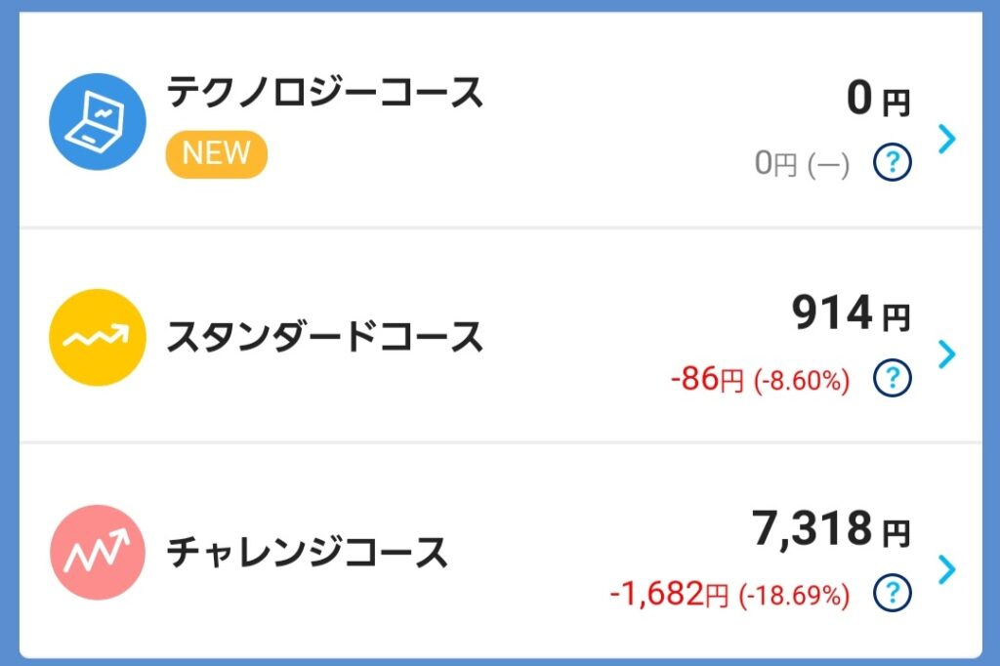

import ProblemBox from '../../../components/ProblemBox.astro';
import ConclusionBox from '../../../components/ConclusionBox.astro';

<ProblemBox>
- 普段の買い物で貯まったPayPayポイントを、使わずに効率よく増やしたい
- 証券口座を開設するのはハードルが高いが、手軽に少額で株式投資の体験をしてみたい
- テクノロジーコースやスタンダードコースなど、どのコースを選べば安全に増やせるのか知りたい
</ProblemBox>

街の買い物やネット通販で日常的に貯まる「PayPayポイント」。

そのまま買い物で消費してしまうのも良いですが、<b>「PayPayポイント運用」を使えば、面倒な証券口座の開設や本人確認なしで、1ポイントから本格的な米国株投資の擬似体験</b>ができます。

実際にユーザー数は1,500万人を超え、日本で最も身近な資産運用ツールの一つとして定着しています。

今回は、PayPayポイント運用の仕組みや主要コースの比較、テクノロジーコース（QQQ）の特徴、そしてスプレッド手数料を抑えて賢くポイントを育てる生活防衛のコツを徹底解説します。

---

## PayPayポイント運用とは？証券口座不要の擬似投資

PayPayポイント運用は、PayPay証券が提供する<b>「ポイント運用サービス」</b>です。

現金を入金するのではなく、手持ちのPayPayポイントをチャージして運用に回すため、<b>「元手がポイントだから損をしても懐が痛まない」</b>という気軽さがあります。

| 項目 | 一般的な株式投資（証券口座） | PayPayポイント運用 |
| :--- | :--- | :--- |
| <b>口座開設・本人確認</b> | マイナンバー提出や審査が必要 | <b>一切不要（PayPayアプリ内ですぐ開始）</b> |
| <b>投資対象</b> | 株式・投資信託など現金で購入 | <b>米国の代表的なETF（上場投資信託）</b> |
| <b>最低投資額</b> | 100円〜数万円 | <b>1ポイント（1円相当）から可能</b> |
| <b>引き出し（利確）</b> | 数日後に銀行口座へ出金 | <b>即座にPayPayポイントとして残高に戻る</b> |

いつでも手数料なしでPayPayポイント残高へ引き出せるため、生活費の足しにしたい時にすぐ戻せる柔軟性が魅力です。

---

## どのコースを選ぶべき？主要コースの徹底比較

PayPayポイント運用では、投資スタイルに合わせて複数のコースが用意されています。

| コース名 | 連動する指標・ETF | 特徴・リスクリターン | おすすめな人 |
| :--- | :--- | :--- | :--- |
| <b>スタンダードコース</b> | S&P500（米国大型株500社） | 米国経済全体に広く分散投資。安定性と成長性のバランス型 | <b>迷ったらこれ。着実にポイントを増やしたい初心者</b> |
| <b>テクノロジーコース</b> | NASDAQ100（QQQ） | Apple、Microsoft、NVIDIAなど大手ハイテク企業中心 | <b>長期的な株価成長を狙いたい人</b> |
| <b>チャレンジコース</b> | S&P500の3倍レバレッジ（SPXL） | 日々の値動きが3倍に増幅される超ハイリスク型 | 短期の値上がり益を狙いたい上級者 |
| <b>ゴールドコース</b> | 金（ゴールド）価格連動ETF | 株安やインフレ時に強い安全資産 | 資産の守りを固めたい人 |

初心者が手堅くポイントを増やしたいのであれば、<b>「スタンダードコース」または「テクノロジーコース」の2択</b>で間違いありません。

---

## テクノロジーコースが連動する「QQQ（NASDAQ100）」の強みと注意点

テクノロジーコースは、米国のナスダック市場を代表するハイテク・成長企業100社で構成されるETF<b>「QQQ（Invesco QQQ Trust）」</b>に連動します。

<figure>

<figcaption>アプリ画面からリアルタイムに損益と推移を確認可能</figcaption>
</figure>

### QQQを構成するトップ企業の圧倒的成長力
QQQの上位銘柄には、世界をリードするメガテック企業がズラリと並びます。

- **Apple**: iPhone、Mac、各種サービスエコシステム
- **Microsoft**: クラウド（Azure）、Windows、AI（Copilot）
- **NVIDIA**: 生成AI向けGPUの世界シェア独占
- **Amazon**: クラウド（AWS）と圧倒的EC網
- **Alphabet（Google）**: 検索エンジン、YouTube、クラウド

過去10〜15年の長期チャートを見ても、QQQはS&P500を上回る圧倒的な成長率を記録してきました。

### 短期的な値動きの激しさに注意
ハイテク株比率が極めて高いため、<b>米国の金利上昇局面や景気後退期には、S&P500よりも深く急落するリスク</b>があります。
数日から数週間のスイングトレード（短期売買）で利益を狙おうとすると、個別決算のショックでマイナスを被りやすい点には注意が必要です。

---

## 【生活改善アドバイザー直伝】賢くポイント運用を続ける3つの鉄則

### ① 100ポイント以上の追加で「スプレッド手数料（1%）」に注意
PayPayポイント運用では、<b>1回あたり100ポイント以上を追加する際に1%の手数料（スプレッド）</b>が発生します（99ポイント以下の追加は無料）。
少し手間ですが、<b>「99ポイント以下に小分けして追加する」</b>ことで、手数料を完全ゼロに抑えて運用効率を最大化できます。

### ② 「自動追加機能」でポイントの貯金箱を作る
PayPay決済で付与されたポイントを自動的に運用へ回す「自動追加」を設定しておけば、意識せずとも勝手にポイントが積み立てられていきます。買い物で端数ポイントを無駄遣いするのを防ぐ生活防衛策として非常に有効です。

### ③ 短期の一喜一憂を避け、数年単位で放置する
ポイント運用は「失っても生活に支障のないポイント」だからこそ、相場急落時にも慌てて売却（引き出し）せず、どっしり構えて長期ホールドできるのが最大の強みです。

---

## まとめ

PayPayポイント運用は、<b>「リスクゼロで本格的な投資の感覚を身につけられる最良の生活改善ツール」</b>です。

<ConclusionBox>
- <b>面倒な手続きなし</b>: 1ポイントからアプリ内ですぐに始められる
- <b>王道はスタンダードかテクノロジー</b>: S&P500かNASDAQ100連動を選べば大崩れしにくい
- <b>99ポイント以下なら手数料無料</b>: 小分け追加でコストを最小限に抑える
- <b>放置が最大の武器</b>: 自動追加を活用し、数年後のちょっとしたご褒美として育てる
</ConclusionBox>

普段の支払いで貯まったポイントをただ眠らせている方は、ぜひ少額からポイント運用を試して、複利のチカラを体感してみてください。
