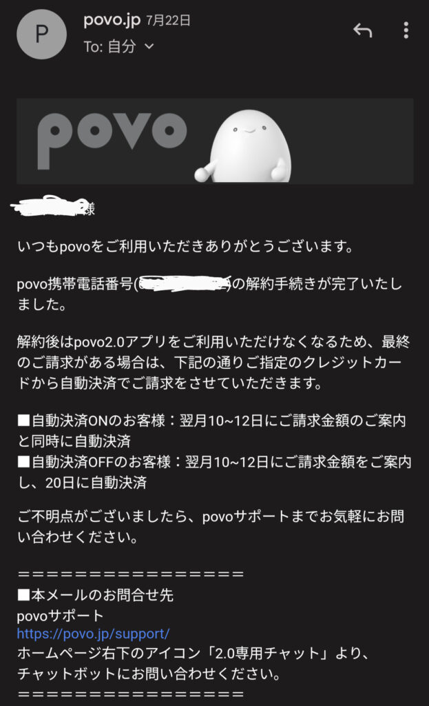
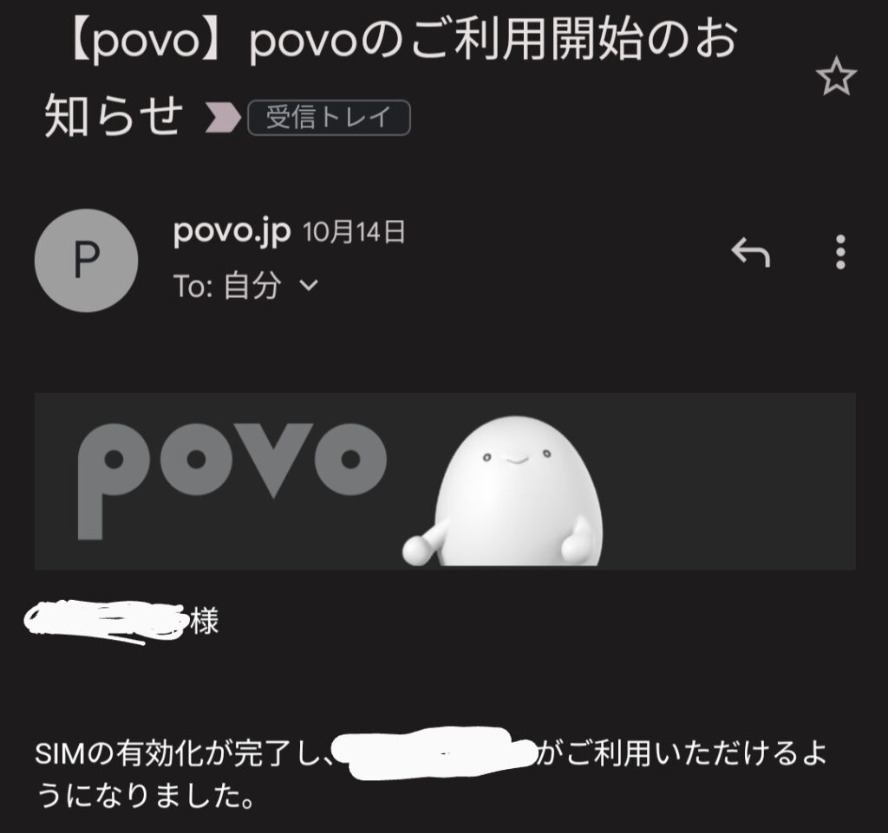

auが運営する格安通信サービスのpovo。月額基本料金0円で利用でき、必要なときに必要なだけデータを購入することができ非常に人気のサービスです。

維持費がかからずに電話番号を保持することができるので重宝しています。

### 公式によると半年で強制解約

povoのホームページにはこのように書かれています。

```
180日間以上有料トッピングの購入等がない場合、利用停止、契約解除となる場合があります。
```

### 私が強制解約を受けた状況

私が一度もトッピングを購入せずに、契約解除された状況を時系列で示します。

2021/09/30 申込  
2021/10/02 利用開始  
2022/05/19 利用停止予告  
2022/06/02 利用停止  
2022/07/21 契約解除

利用開始から7ヶ月を過ぎた頃に解約予告がされ、8ヶ月で利用停止、9ヶ月半で契約解除となりました。



<script async src="https://pagead2.googlesyndication.com/pagead/js/adsbygoogle.js?client=ca-pub-8011635154814608" crossorigin="anonymous"></script>

<script>(adsbygoogle = window.adsbygoogle || []).push({});</script>

### 強制解約されても、再契約できる？

強制解約されても再び契約することができます！

私は10/14にGooglePixel7Proを購入した際についてきたプロモーションコードを利用して、povo2.0を再び契約することができますした。



どうやら、強制解約だけではブラックリストに載ることはないようです。

## まとめ

**・8ヶ月使わないと利用停止、強制解約される  
・強制解約されても、また契約することができる**

## Povoに関するその他の記事はこちら

https://yomileeblog.com/povo2-open/175/
