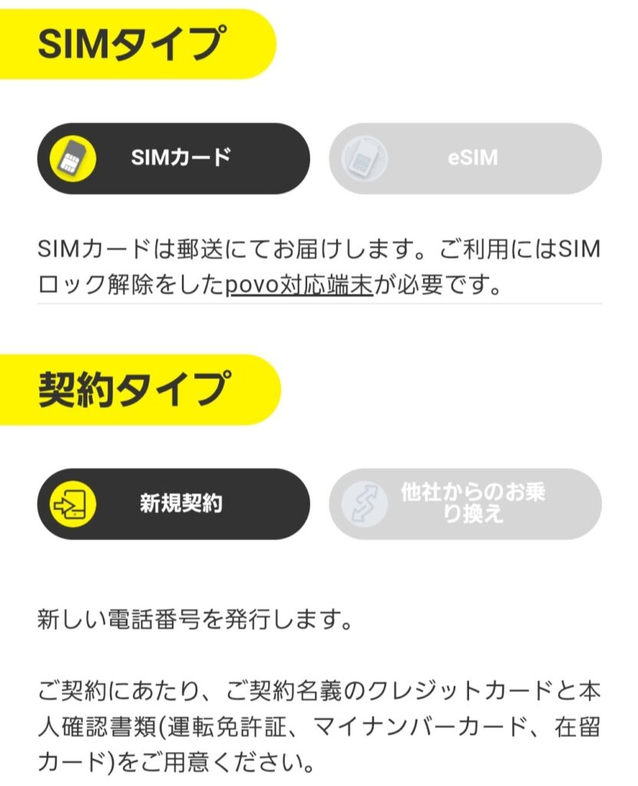
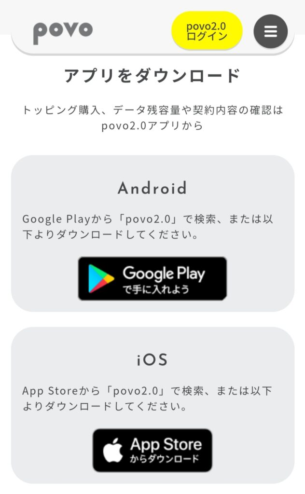
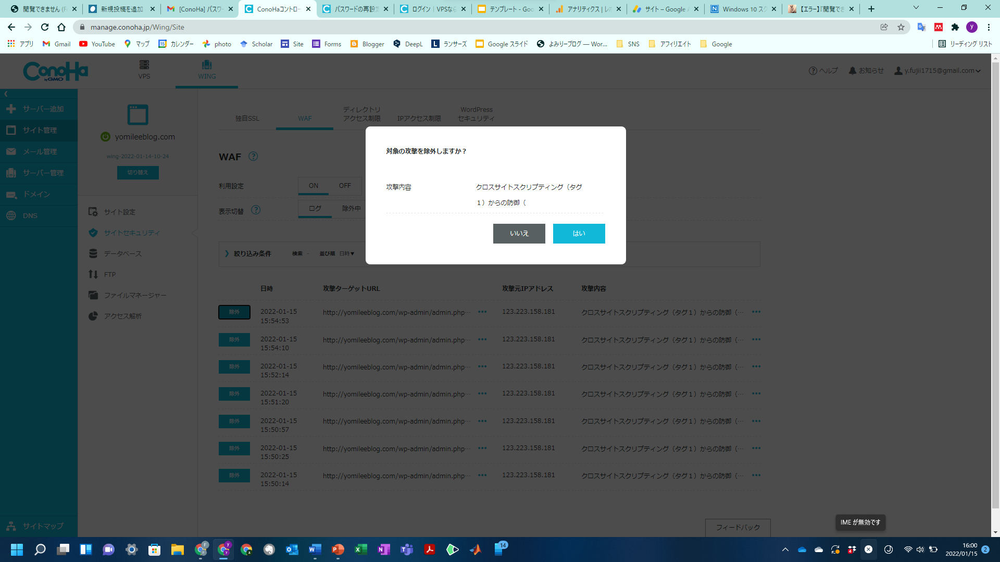
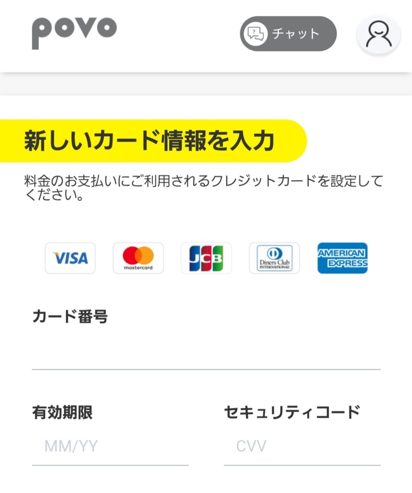
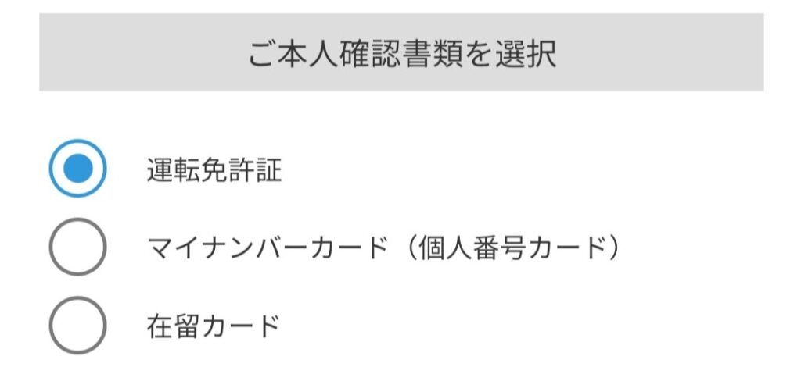
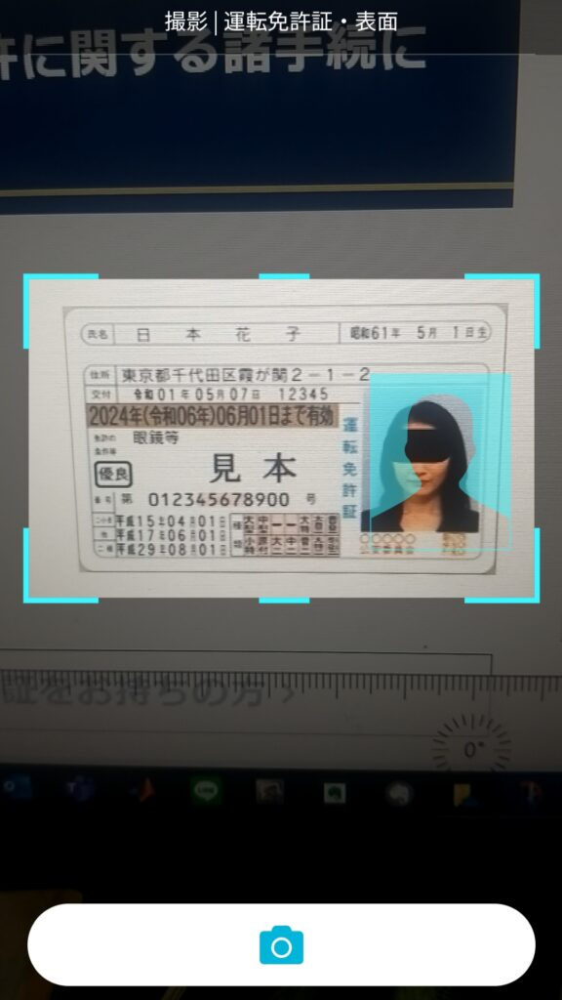

import ProblemBox from '../../../components/ProblemBox.astro';
import AdviceBox from '../../../components/AdviceBox.astro';
import ConclusionBox from '../../../components/ConclusionBox.astro';

月額基本料金0円で利用でき、必要な分だけデータをトッピングできるKDDIの通信プラン「<b>povo2.0</b>」。

サブ回線、デュアルSIMでのバックアップ、通話専用やSMS認証用として絶大な人気を誇りますが、契約はすべて<b>オンライン完結（店舗サポートなし）</b>のため、「申し込みで失敗しないか不安」「手続きの流れを事前に知っておきたい」という方も多いのではないでしょうか。

<ProblemBox>
  
<b>povo2.0の申し込みで、こんな疑問や不安はありませんか？</b>

  <ul>
    <li><b>事前準備：</b> 申し込む前に用意しておくべき書類や支払方法は？</li>
    <li><b>SIMタイプの迷い：</b> 「物理SIM」と「eSIM」はどっちを選ぶのが正解？</li>
    <li><b>本人確認（eKYC）：</b> スマホでの顔写真撮影や本人確認でエラーにならないコツは？</li>
    <li><b>開通までの日数：</b> 申し込み完了から実際に使えるようになるまでどれくらいかかる？</li>
  </ul>
</ProblemBox>

この記事では、実際にpovo2.0を契約した体験をもとに、<b>事前準備からアプリでの申し込み手順、本人確認のポイント、開通までの全ステップ</b>を画像付きで分かりやすく解説します！

---

## 1. povo2.0とは？契約する3つのメリット

povo2.0は、auを展開するKDDIが提供するオンライン専用の料金プランです。一般的な格安SIMやキャリアプランとは大きく異なり、以下の特徴を持っています。

1. <b>基本料0円で回線を維持できる</b>  
   月額固定費が一切かからず、使いたいときだけ「データ追加（トッピング）」を購入するプリペイド感覚の新しいスタイルです。
2. <b>安心のau高品質ネットワーク</b>  
   MVNO（格安SIM）のような回線混雑時の極端な速度低下が少なく、auの自社回線（4G/5G）を快適に利用できます。
3. <b>eSIM対応で即日開通が可能</b>  
   対応端末なら、SIMカードの到着を待たずに申し込みから最短数十分〜即日で利用開始できます。

私自身、メイン回線の通信障害対策や旅行時の大容量通信、SMS認証用として契約しましたが、<b>「使わない月は0円」で持てるサブ回線としてこれ以上ない選択肢</b>だと実感しています。

---

## 2. 申し込み前の事前準備（用意する4つのもの）

povo2.0の申し込みはスマホの専用アプリで行います。途中で手続きが止まらないよう、以下の4点を手元に準備しておきましょう。

| 準備するもの | 詳細・注意点 |
| :--- | :--- |
| <b>本人確認書類</b> | 運転免許証、マイナンバーカード、在留カードのいずれか1点 |
| <b>クレジットカード</b> | 契約者本人名義のカード（※口座振替やデビットカードは原則不可） |
| <b>連絡用メールアドレス</b> | 認証コード（PINコード）を受信できるアドレス（GmailやiCloud等） |
| <b>対応端末</b> | SIMロック解除済みのスマホ、またはSIMフリー端末 |

<AdviceBox title="支払いはクレジットカードのみ対応">
  
povo2.0の支払方法は<b>クレジットカード決済のみ</b>です。銀行口座からの引き落としには対応していませんのでご注意ください。

  
また、本人確認書類の住所と、入力する現住所が完全に一致している必要があります。引っ越し等で住所変更がまだの方は、事前に書類の更新を済ませておきましょう。

</AdviceBox>

---

## 3. 【SIM選び】物理SIM vs eSIM どっちを選ぶべき？

申し込み時に必ず選択するのが「<b>SIMカード（物理SIM）</b>」か「<b>eSIM</b>」かです。

### おすすめの選び方
* <b>eSIMが向いている人：</b>
  * 申し込み当日に今すぐ使い始めたい方
  * iPhone（XS/XR以降）やPixelなど、eSIM対応端末をお使いの方
  * すでに他社の物理SIMが入っており、1台のスマホで「デュアルSIM運用」したい方
* <b>物理SIMが向いている人：</b>
  * eSIM非対応のスマートフォンをお使いの方
  * 複数のスマホやモバイルルーターにSIMを差し替えて使いたい方
  * プロファイルのダウンロード設定が不安な方

<AdviceBox title="デュアルSIM運用の相性はeSIMが抜群！">
  
例えば「主回線はドコモや楽天モバイルの物理SIM」＋「副回線はpovo2.0のeSIM」という組み合わせにすれば、SIMカードスロットを塞がずに万が一の通信障害対策が月額0円で実現します。

</AdviceBox>

---

## 4. 【画像付き】povo2.0の申し込み手順（全ステップ）

事前準備ができたら、専用アプリから申し込みを進めましょう。手順は大きく分けて5ステップです。

### ステップ1：povo2.0専用アプリのインストール

povo2.0の申し込みはWebブラウザではなく<b>「povo2.0」専用アプリ</b>から行います。

App Store（iPhone）または Google Play（Android）で「povo2.0」と検索してインストールします。

### ステップ2：メールアドレス登録（アカウント作成）

アプリを起動したら、連絡先となるメールアドレスを入力します。

1. 入力したアドレス宛に<b>6桁の認証コード（PINコード）</b>が記載されたメールが届きます。
2. アプリ画面にその6桁コードを入力するとログイン（アカウント開設）が完了します。
※povo2.0は固定パスワード制ではなく、ログインのたびにメールに認証コードが送られるワンタイムコード方式を採用しているためセキュリティも安心です。

### ステップ3：SIMタイプと契約形態の選択

* <b>契約形態：</b> 「新規契約」または「他社からのお乗り換え（MNP）」を選択
* <b>SIMタイプ：</b> 「SIMカード」または「eSIM」を選択

### ステップ4：クレジットカード情報の入力

利用料金（トッピング購入代金や通話料など）を引き落とすクレジットカード情報を登録します。

契約者本人名義のカード番号、有効期限、セキュリティコードを入力します。

### ステップ5：eKYC（オンライン本人確認）

画面の案内に従い、スマホのカメラを使って本人確認書類と本人の顔写真を撮影・照合します（eKYC）。

<AdviceBox title="本人確認（eKYC）で審査落ちしないためのコツ">
  <ul>
    <li><b>光の反射を防ぐ：</b> 免許証やマイナンバーカードの文字・顔写真が白飛びしないよう、照明の角度に注意する</li>
    <li><b>厚み撮影の角度：</b> 書類を斜めに傾けて厚みを撮影するステップでは、指で文字が隠れないように端を持つ</li>
    <li><b>部屋の明るさ：</b> 顔写真の撮影時は逆光を避け、顔全体がはっきり映る明るい部屋で行う</li>
  </ul>
</AdviceBox>

### ステップ6：個人情報の入力・申し込み完了

本人確認書類の読み取りによって、氏名や生年月日、住所が自動入力されます。

入力内容に間違いがないか最終確認し、「申し込む」をタップすれば手続きはすべて完了です！

---

## 5. 審査時間とSIM到着までのスケジュール

申し込み完了後、KDDI側で本人確認の審査が行われます。

* <b>eSIMの場合：</b>
  審査は最短数十分〜数時間程度で完了します。審査完了メールが届いたら、アプリからeSIMプロファイルをダウンロードするだけですぐに使えます。
* <b>物理SIMカードの場合：</b>
  審査完了後、ヤマト運輸の宅急便コンパクト等でSIMカードが発送されます。  
  私の場合は<b>申込日の2日後</b>に自宅へ到着しました。

---

## 6. 次のステップ：開通手続きとAPN設定

SIMカードが届いた後（またはeSIM発行後）は、端末に回線を開通させる設定を行います。

特にAndroid端末では<b>「APN（アクセスポイント）の手動設定」</b>や<b>「MCC・MNCの入力」</b>が必要になるケースがあり、設定を誤ると圏外のまま繋がらない原因になります。

詳しい開通手順やつまずきやすいポイントは、以下の実践ガイドを参考にしてください。

👉 <b>関連記事：</b> [【繋がらないを解決】povo2.0のAPN設定・MCC/MNC一覧と開通できない時の原因別チェックリスト](/blog/povo2-open/)

また、開通後は180日間の未購入による強制解約ルールにも注意が必要です。

👉 <b>関連記事：</b> [【体験談】povo2.0無課金でいつまで使える？強制解約されたら再契約できる？](/blog/povo-re/)

---

## まとめ：オンラインで完結！30分で簡単に申し込める

<ConclusionBox>
  
<b>povo2.0 申し込みのまとめ</b>

  <ul>
    <li><b>事前準備：</b> 本人確認書類（免許証等）と本人名義のクレジットカードを手元に用意！</li>
    <li><b>SIM選び：</b> 今すぐ使いたい・デュアルSIMなら「eSIM」、差し替えて使うなら「物理SIM」</li>
    <li><b>手続き：</b> 専用アプリから撮影・入力するだけで、約15〜30分程度でスムーズに完了</li>
    <li><b>開通後：</b> SIM到着後は開通手続きとAPN設定を行えば即座に利用可能！</li>
  </ul>
</ConclusionBox>

povo2.0は店舗へ足を運ぶ必要がなく、自宅にいながらスマホ1台で手軽に契約できます。維持費0円でいざという時のバックアップ回線としても大変重宝しますので、ぜひ気軽に申し込んでみてください！

---

### povo2.0 関連記事
* [【繋がらないを解決】povo2.0のAPN設定・MCC/MNC一覧と開通できない時の原因別チェックリスト](/blog/povo2-open/)
* [【体験談】povo2.0無課金でいつまで使える？強制解約されたら再契約できる？](/blog/povo-re/)