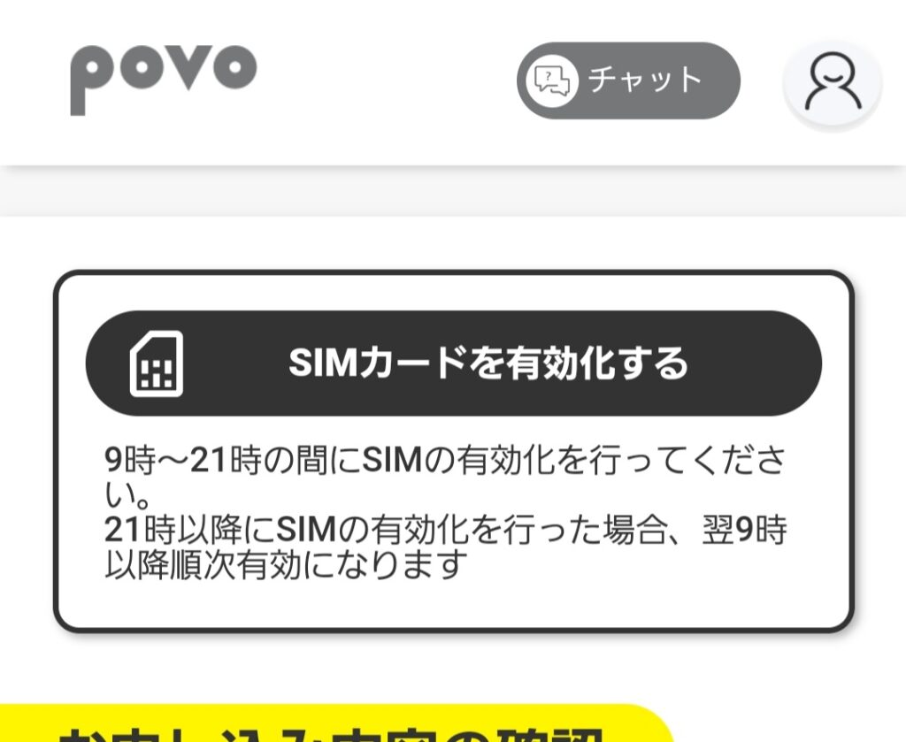
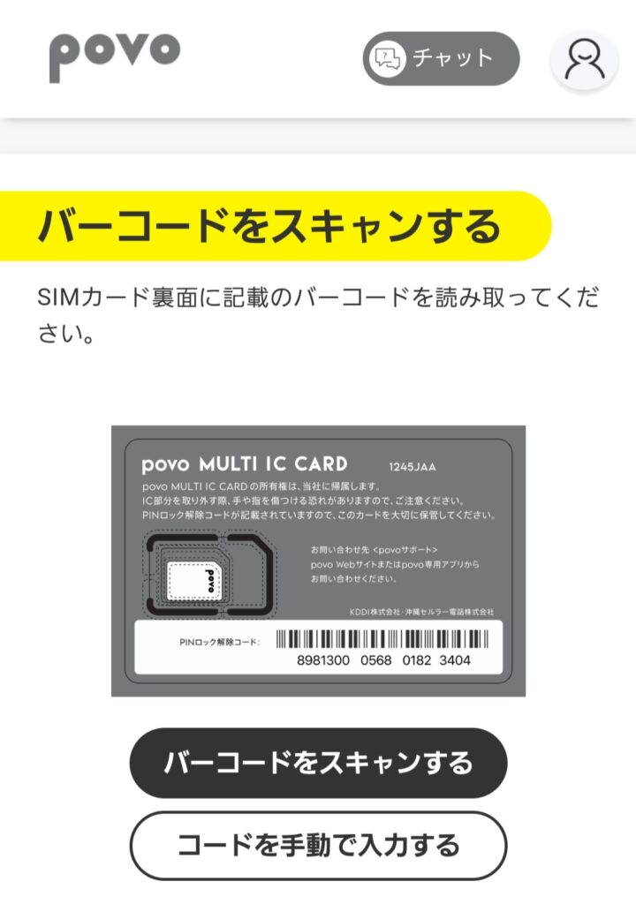
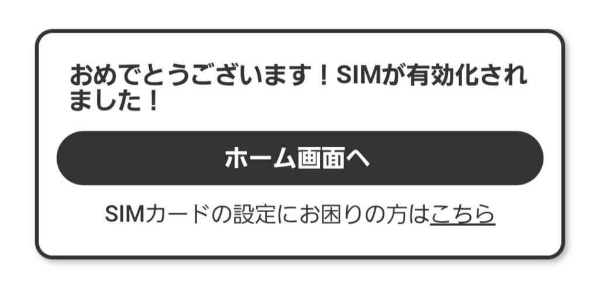

import ProblemBox from '../../../components/ProblemBox.astro';
import AdviceBox from '../../../components/AdviceBox.astro';
import ConclusionBox from '../../../components/ConclusionBox.astro';

基本料金0円から使えるKDDIのオンライン専用プラン「**povo2.0**」。サブ回線やデュアルSIM用として大人気ですが、いざ契約してSIMを挿したときに**「アンテナが立たない」「圏外のまま繋がらない」「APN設定でMCC・MNCって何を入れるの？」**と戸惑う方が非常に多くいらっしゃいます。

<ProblemBox>
  <p><b>povo2.0の開通・設定で、こんなトラブルに直面していませんか？</b></p>
  <ul>
    <li><b>設定値の疑問：</b> AndroidでAPNを手動追加しようとしたら、MCCやMNCの入力を求められて進まない</li>
    <li><b>圏外・繋がらない：</b> SIMカードを挿入・eSIMを設定したのにアンテナピクトが「×」や圏外のまま</li>
    <li><b>テザリング不可：</b> スマホ単体ではネットが見られるのに、PCやタブレットへのテザリングだけが繋がらない</li>
    <li><b>iPhoneの不具合：</b> iPhoneなのに自動設定されず、モバイルデータ通信が使えない</li>
  </ul>
</ProblemBox>

この記事では、<b>今まさにネットが繋がらなくて困っている方に向けて、コピペで使えるAPN設定値（MCC/MNC含む）の一覧表と、原因別のトラブルシューティング手順</b>を分かりやすく解説します！

---

## 1. 【コピペ用】povo2.0 APN設定値の一覧表（Android手動設定用）

Android端末でAPN設定画面を開き、以下の通りに入力してください。太字の項目以外はすべて「**未設定（空欄）**」のままで問題ありません。

| 設定項目 | 入力値 | 補足・ポイント |
| :--- | :--- | :--- |
| **名前** | `povo2.0` | 任意の名前でOK（識別用） |
| **APN** | `povo.jp` | **半角小文字・必須**（スペースが入らないよう注意） |
| **ユーザー名** | （未設定 / 空欄） | 入力不要 |
| **パスワード** | （未設定 / 空欄） | 入力不要 |
| **認証タイプ** | 未設定（または CHAP） | 繋がらない場合は「CHAP」を試す |
| **APNタイプ** | `default,supl,dun` | **テザリングを使うなら dun 必須**（後述） |
| **APNプロトコル** | `IPv4/IPv6` | `IPv4` のみだと繋がらない場合あり |
| **APNローミングプロトコル** | `IPv4/IPv6` | 海外ローミング時用 |
| **MCC** | `440` | **日本を表す国番号**（SIM認識時は自動入力） |
| **MNC** | `51` | **KDDIを表す事業者コード**（SIM認識時は自動入力） |
| **ベアラー** | 未指定 | そのままでOK |

<AdviceBox title="MCC（440）とMNC（51）で混乱する原因">
  <p>通常、SIMカードを挿した状態であればMCCとMNCは自動で「440」と「51」が入力されます。</p>
  <p>しかし、<b>「SIMカードを挿す前にAPNを作成しようとした場合」</b>や、<b>海外版スマホ・一部のSIMフリースマホ</b>では自動判定されず、空欄になって手動入力を求められます。その場合は焦らず <b>MCC: 440 / MNC: 51</b> を手動で入力すれば大丈夫です。</p>
</AdviceBox>

---

## 2. 【OS別】APN設定の手順

### Android端末の場合の手順

1. 「**設定**」アプリを開く
2. 「**ネットワークとインターネット**」（または「モバイルネットワーク」「接続」）をタップ
3. 「**SIM**」から povo2.0 の回線を選択
4. 画面下部の「**アクセスポイント名（APN）**」をタップ
5. 右上の「**＋**」ボタン（または「追加」）をタップ
6. 上記の一覧表どおりに各項目を入力する
7. **【超重要】** 右上のメニューアイコン（︙）から「**保存**」をタップ
8. APN一覧に戻り、作成した「**povo2.0**」のラジオボタンをタップして選択する


### iPhone（iOS）の場合の手順

**iPhone（iOS 14.5以降）では、原則としてAPNの手動設定は不要です。** Wi-Fiに接続した状態でpovoのSIMを挿入（またはeSIMを設定）すると、自動的にKDDI回線として認識されます。

もしiPhoneで繋がらない場合は、手動入力するのではなく**「過去の格安SIMのプロファイルが邪魔をしている」ケースが9割**です（後述のトラブルシューティングをチェックしてください）。

---

## 3. povo2.0が繋がらない・圏外の時の「7つのチェックリスト」

APNを設定したのにネットに繋がらない、アンテナピクトが立たないときは、以下の項目を上から順に確認してください。

### ① 【Android】APN設定後に「保存」して選択したか？
Androidで最も多いミスが、**「入力したのに右上のメニューから保存を押さずに戻ってしまった」**、あるいは**「保存したけれど一覧でラジオボタンにチェックを入れていない」**というパターンです。
もう一度APN一覧を開き、作成した「povo2.0」にチェックがついているか確認しましょう。

### ② 【iPhone】過去の「APN構成プロファイル」が残っていないか？
他社（ワイモバイル、UQモバイル、mineo、IIJmioなど）からpovo2.0へ乗り換えたiPhoneユーザーに最も多いトラブルです。
他社のプロファイルが入ったままだと、povoの電波を正常に掴めません。

* **確認・削除方法：**
  「設定」 ＞ 「一般」 ＞ 「**VPNとデバイス管理**」（または「プロファイル」）を開き、古い通信事業者のプロファイルがあれば削除します。削除後、端末を再起動してください。

### ③ アプリでの「SIM有効化手続き」は完了しているか？
SIMカードが届いただけでは使えません。必ずpovo2.0アプリから「**SIMカードの有効化**」を行う必要があります。



アプリのトップ画面にある「SIMカード有効化」から、SIMカード台紙の裏側にあるバーコードをカメラで読み取ります。



<AdviceBox title="有効化の受付時間に注意！">
  <p>SIMカード有効化の受付時間は <b>9:00 〜 21:00</b> です。</p>
  <p>夜の21時を過ぎてから有効化ボタンを押した場合、<b>実際の回線切り替えは翌朝の9時以降に順次行われる</b>ため、夜間は繋がらなくて正常です。翌朝までお待ちください。</p>
</AdviceBox>



### ④ 機内モードのON/OFF・端末の再起動をしたか？
設定が正しく完了していても、スマートフォンが古い基地局情報を保持していて電波を掴み直せていない場合があります。
* **コントロールセンター / クイック設定から「機内モード」をONにして5秒待ってからOFFにする**
* 改善しない場合は**スマートフォンの電源を再起動**する

これだけでアンテナピクトがスッと立ち、4G/5Gが繋がるケースが多々あります。

### ⑤ デュアルSIM運用時：データ通信に「povo」が選択されているか？
物理SIM＋eSIMなどで2回線を併用している場合、「モバイルデータ通信」の優先回線が主回線側のままになっていることがあります。
* **Android：** 「設定」 ＞ 「ネットワークとインターネット」 ＞ 「SIM」 ＞ 「モバイルデータ」で使用する回線をpovoに切り替える
* **iPhone：** 「設定」 ＞ 「モバイル通信」 ＞ 「モバイルデータ通信」をタップし、povoの回線を選択する

### ⑥ テザリングが繋がらない：APNタイプに「dun」が入っているか？
「スマホ上ではWebが見られるのに、PCへテザリング（インターネット共有）するとインターネットなしになる」という場合は、APNタイプの設定が原因です。

APNタイプを以下のように書き換えて保存してください：
```text
default,supl,dun
```
※ `dun`（Dial-Up Networking）はテザリング通信を許可するための設定識別子です。Pixelシリーズや海外SIMフリー端末ではこれがないとテザリングがブロックされることがあります。

### ⑦ 発信テスト用番号「111」へ電話をかけてみる
「データ通信はダメだが音声通話は開通しているか」を切り分けるために、開通確認用のテスト番号へ発信してみましょう。

* **電話アプリから `111` （通話料無料）へダイヤル**
* ガイダンス「接続試験は終了です。ご協力ありがとうございました」が流れれば、回線自体は正常に開通しています。

もし111にも繋がらない場合は、SIMカードの挿入不良、端末のSIMロック未解除、またはMNP転入手続きの遅延が考えられます。

---

## 4. 開通後の注意点：最初は「128kbps」＆「180日ルール」

無事にアンテナが立ち、ネットに繋がったら開通完了です！ただし、利用開始直後は以下の2点に注意してください。

### 開通直後は通信速度が最大128kbps
povo2.0は基本料金0円の仕様上、初期状態では「トッピング未購入」のため、通信速度が**最大128kbps**に制限されています。
「開通したのにWebサイトの読み込みが遅い！」と焦るかもしれませんが、これは正常な動作です。povoアプリから「データ追加」トッピングを購入すれば、即座に高速な4G/5G通信に切り替わります。

### 180日間の未購入による「強制解約」に注意！
povo2.0は基本料0円で維持できるのが最大のメリットですが、**「180日間以上トッピングの購入がない場合、順次利用停止・強制解約」**というルールがあります。

<AdviceBox title="年間440円で電話番号を維持する延命ワザ！">
  <p>強制解約を回避するには、半年に1回だけ最安トッピング（smash.使い放題パック：220円など）を購入するのが鉄則です。</p>
  <p>「実際に放置すると何日目に警告メールが来るのか？」「万が一強制解約されたら再契約できるのか？」というリアルな検証記録は、以下の体験談記事で詳しくまとめています。</p>
  <p>👉 <a href="/blog/povo-re/" style="font-weight: bold; text-decoration: underline;">【体験談】povo2.0無課金でいつまで使える？強制解約されたら再契約できる？</a></p>
</AdviceBox>

---

## まとめ：正しい設定値とチェックリストで即解決！

<ConclusionBox>
  <p><b>povo2.0 開通トラブル解決の要点</b></p>
  <ul>
    <li><b>Androidの設定値：</b> APN名に「<code>povo.jp</code>」、MCC「<code>440</code>」、MNC「<code>51</code>」、APNタイプに「<code>default,supl,dun</code>」を入力！</li>
    <li><b>【超重要】保存忘れに注意：</b> 入力後は必ず右上のメニューから「<b>保存</b>」をタップして一覧で選択する</li>
    <li><b>iPhoneで繋がらない場合：</b> 過去に使っていた格安SIMの「<b>構成プロファイル</b>」を削除すれば一発で解決！</li>
    <li><b>テザリング対策：</b> APNタイプに「<code>dun</code>」が入っているか確認する</li>
    <li><b>開通完了後：</b> 180日ルール対策として半年に1回少額トッピングで賢く維持する！</li>
  </ul>
</ConclusionBox>

povo2.0は月額基本料0円で持てる最強のサブ回線です。最初の設定さえ正しく完了すれば非常に快適に使えますので、ぜひ落ち着いてチェックしてみてください！

---

### povo2.0 関連記事
* [【体験談】povo2.0無課金でいつまで使える？強制解約されたら再契約できる？](/blog/povo-re/)
* [【申込編】povo2.0の申し込み手順・本人確認の流れを解説](/blog/povo2-application/)
