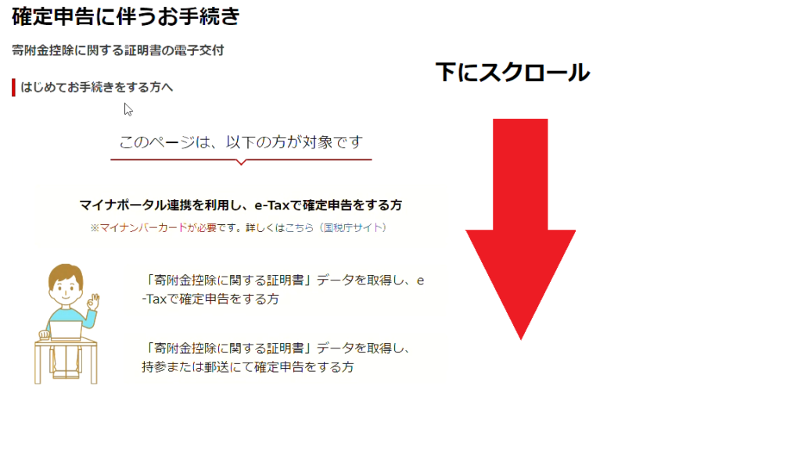
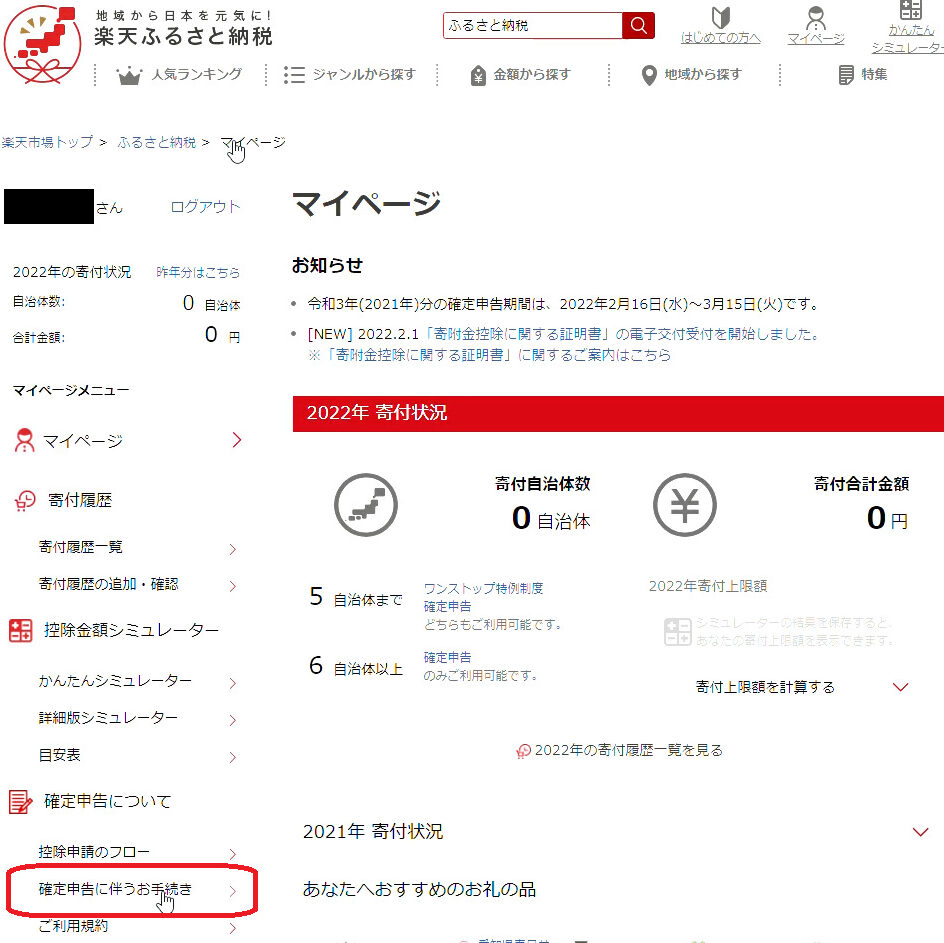

import ProblemBox from '../../../components/ProblemBox.astro';
import ConclusionBox from '../../../components/ConclusionBox.astro';

<ProblemBox>
- ふるさと納税で6つ以上の自治体に寄附してしまい、ワンストップ特例が使えなくなった
- 自治体から送られてくる大量の「寄附金受領証明書」を1枚ずつ手入力するのが面倒
- 楽天ふるさと納税の「一括証明書（XMLデータ）」を使ってe-Taxで最も手軽に申告を終わらせたい
</ProblemBox>

実質2,000円の自己負担で全国の特産品や日用品が手に入り、楽天ポイントもザクザク貯まる<b>「楽天ふるさと納税」</b>。

生活防衛や固定費削減に欠かせない最強の節税ツールですが、確定申告の時期になると<b>「大量の寄附金受領証明書の保管や入力がとにかく面倒」</b>という問題に直面します。

特に<b>「寄附先が6自治体以上になった人」</b>や、<b>「医療費控除・住宅ローン控除（1年目）で確定申告をする人」</b>は、ワンストップ特例が使えないため確定申告が必須です。

しかし現在、楽天ふるさと納税が発行する<b>「寄附金控除に関する証明書（XMLデータ）」を活用すれば、e-Taxにデータをアップロードするだけで手入力ゼロ・数分で申告が完了</b>します。

今回は、確定申告が必要になる条件の整理から、楽天の一括証明書データの取得手順、e-Tax連携のコツまで徹底解説します。

---

## あなたはどっち？ワンストップ特例と確定申告の判定基準

ふるさと納税を行った際、確定申告が必要になるかどうかは以下の基準で決まります。

| 申請方法 | ワンストップ特例制度 | 確定申告（e-Tax） |
| :--- | :--- | :--- |
| <b>寄附先自治体数</b> | <b>5自治体以内</b> | <b>6自治体以上</b> |
| <b>確定申告の有無</b> | 医療費控除や副業等の申告がない人 | <b>自営業、医療費控除、住宅ローン控除（初年度）等を行う人</b> |
| <b>申請期日</b> | 寄附した翌年の1月10日必着 | 寄附した翌年の2月16日〜3月15日頃 |
| <b>控除のされ方</b> | 翌年度の住民税から全額減額 | 今年の所得税還付 ＋ 翌年度の住民税減額 |

> [!WARNING]
> **ワンストップ特例を出した後に確定申告をする場合**は要注意です。確定申告書を提出した時点で、過去に郵送したワンストップ特例の申請は<b>すべて無効</b>になります。確定申告書側でふるさと納税の寄附金控除を改めて含めて申告しないと、控除が受けられなくなるので必ず再入力しましょう。

---

## 従来の紙証明書 vs 楽天「一括XML証明書」の劇的進化

以前の確定申告では、寄附した自治体からバラバラに届く紙の「寄附金受領証明書」を1枚ずつ封筒から出し、自治体名や寄附金額を手作業で入力する必要がありました。

<figure>

<figcaption>楽天ふるさと納税なら年間すべての寄附履歴を1つのデータに集約可能</figcaption>
</figure>

現在利用できる<b>「寄附金控除に関する証明書（電子データ・XML）」</b>を使うと、以下のように作業負荷が激変します。

- 自治体ごとの紙の証明書を保管・提出する必要が一切ない
- 楽天マイページからダウンロードしたXMLファイルをe-Taxに取り込むだけで、<b>すべての寄附情報が一括で自動反映</b>される
- 入力ミスや計算間違いのリスクがゼロになる

---

## 楽天ふるさと納税で「一括XMLデータ」を取得する3ステップ

確定申告の時期（毎年1月下旬頃〜）になると、楽天マイページから年間の証明書発行手続きが可能になります。

<figure>

<figcaption>マイページの確定申告メニューから数クリックで申請可能</figcaption>
</figure>

<ol>
  <li><b>楽天ふるさと納税のマイページへアクセス</b> メニューの「確定申告について」＞「確定申告に伴うお手続き」を選択します。</li>
  <li><b>交付申請を行う</b> 対象となる寄附年（例：令和〇年分）を選択し、「交付手続きへ」をクリックします。</li>
  <li><b>電子証明書（XMLファイル）をダウンロード</b> 申請完了後、通常翌日〜数日程度でマイページ上にダウンロードボタンが表示されます。ダウンロードした「.xml」ファイルは、開かずにそのままパソコンやスマホに保存しておきます（開くとデータが破損する恐れがあります）。</li>
</ol>

---

## 国税庁「確定申告書作成コーナー（e-Tax）」での取り込み手順

スマホまたはPCで国税庁の「確定申告書等作成コーナー」を開きます。

1. マイナンバーカードをスマホで読み取り、ログインします。
2. 収入金額・所得金額の入力後、<b>「寄附金控除」</b>の入力画面へ進みます。
3. 証明書等の入力方法で<b>「XMLファイルを読み込む」</b>を選択します。
4. 楽天からダウンロードしておいたXMLファイルを指定します。
5. <b>瞬時に全自治体名・寄附日・寄附金額が自動展開</b>され、控除額が自動計算されます。

紙の受領証をめくりながら電卓を叩いていた時代に比べ、所要時間が1時間からわずか3分程度に短縮されます。

---

## 【生活改善目線】ふるさと納税を最大効率で回す3つのポイント

### ① 返礼品は「生活必需品・消耗品」を中心に選ぶ
高級肉やスイーツも魅力的ですが、家計の固定費を劇的に下げるなら<b>「トイレットペーパー」「ボックスティッシュ」「米」「オリーブオイル」</b>などの日用品・常備食料を選ぶのが最強の生活防衛策です。買い出しの重い荷物を運ぶ手間もゼロになります。

### ② 「お買い物マラソン」「0と5のつく日」に集中決済
楽天ふるさと納税は、楽天市場の通常商品と同様にポイントアップキャンペーンの対象です。「楽天スーパーセール」「お買い物マラソン」に合わせて複数自治体へ寄附することで、<b>実質負担2,000円を遥かに超える数千〜数万ポイントの還元</b>をノーリスクで獲得できます。

### ③ 限度額シミュレーションを事前に行う
年収や家族構成によって控除上限額が決まっています。上限を超えて寄附した分は純粋な自己負担（寄附）になってしまうため、楽天の「かんたんシミュレーター」や「詳細シミュレーター」で事前に寄附上限を厳密に把握しておきましょう。

---

## まとめ

楽天ふるさと納税の一括XML証明書を使えば、確定申告のハードルは劇的に下がります。

<ConclusionBox>
- <b>6自治体以上や確定申告組は必須</b>: ワンストップ特例が使えない場合でも慌てる必要なし
- <b>XMLデータで手入力ゼロ</b>: 楽天マイページからダウンロードしてe-Taxに読み込ませるだけ
- <b>日用品返礼品で家計防衛</b>: 米やトイレットペーパーを選んで毎月の生活コストを削減
- <b>ポイント還元で実質プラス</b>: セール時期を狙って寄附し、負担額以上の還元を受け取る
</ConclusionBox>

「確定申告が面倒だから」とふるさと納税を躊躇していた方は、ぜひ楽天の一括証明書サービスを活用して、手軽でお得な生活防衛を実践してみてください。
