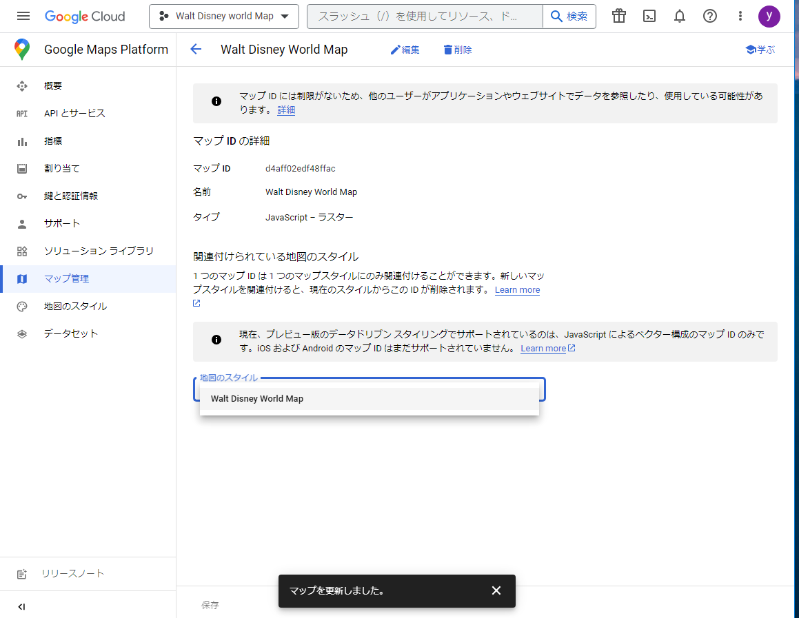
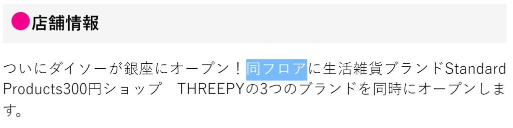
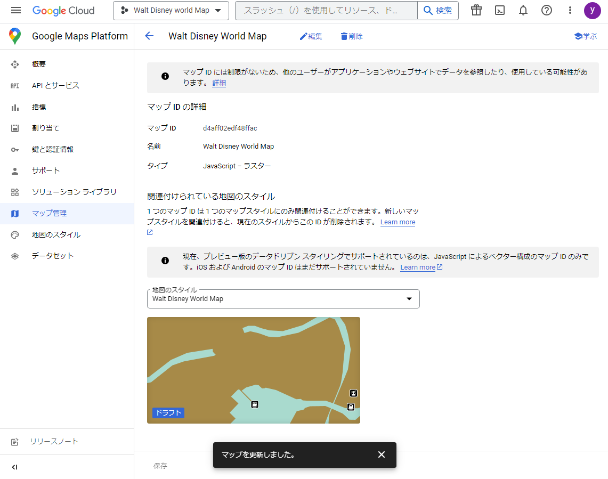
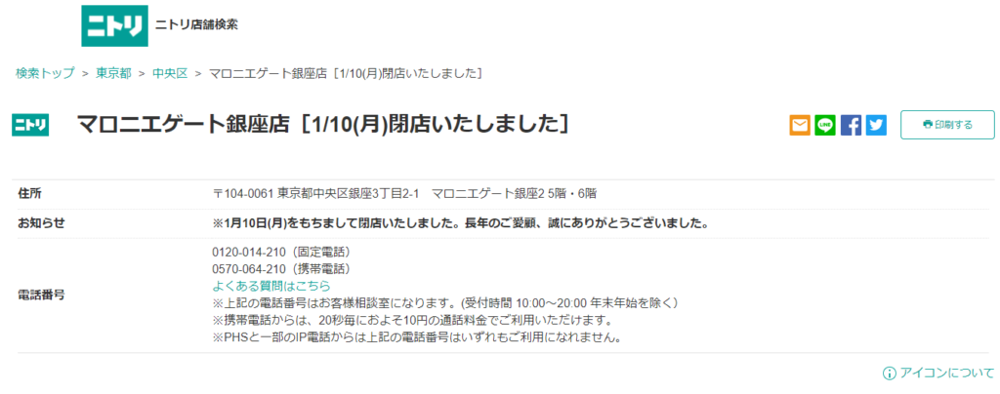

100円ショップのダイソーを運営する大創産業の新ブランドStandard Products  
現在は、渋谷マークシティ・新宿アルタの2店舗が営業しています。  
2022年4月　待望の**Standard Products**3号店がマロニエゲート銀座２にオープンするようです。  

## マロニエゲート銀座に4中旬OPEN

よぴりん

Standard Productsの運営会社ダイソーの求人サイトにこんな募集が！

<figure>

<figcaption>

[ダイソー求人サイト](https://recruit-daiso.com/jobfind-pc/job/All/48663)より

</figcaption>

</figure>

よぴりん

生活雑貨のStandard Productsが  
マロニエゲート銀座2の6Fにオープンするようです。

## Standard Productsとは

100円ショップのダイソーを運営する大創産業の新ブランドStandard Products  
現在は、渋谷マークシティ・新宿アルタの2店舗が営業しています。

渋谷マークシティー店

> [
> 
> この投稿をInstagramで見る
> 
> ](https://www.instagram.com/p/CM1aUEQs27o/?utm_source=ig_embed&utm_campaign=loading)
> 
> [Standard Products(@standardproducts\_official)がシェアした投稿](https://www.instagram.com/p/CM1aUEQs27o/?utm_source=ig_embed&utm_campaign=loading)

新宿アルタ店

> [
> 
> この投稿をInstagramで見る
> 
> ](https://www.instagram.com/p/CVUzcCFL2KU/?utm_source=ig_embed&utm_campaign=loading)
> 
> [Standard Products(@standardproducts\_official)がシェアした投稿](https://www.instagram.com/p/CVUzcCFL2KU/?utm_source=ig_embed&utm_campaign=loading)

コンセプトは  
「ちょっといいのが、ずっといい。」  
普段の生活で使う、日用品をちょっと楽しく。

価格は300円がメインと、ダイソー譲りの低価格！

## ダイソー・THREEPPYも併設

同じマロニエゲート銀座2 6階に  
・100円ショップのダイソー  
・300円ショップのTHREEPY  
も同時オープンするようです。

よぴりん

ダイソー・THREEPPY・Standard Productsの三店舗が

同じテナントに入ることは初めてのことです！

## OPEN予想は4月15日！

Standard Products1号店は3/26**(金)**、2号店は10/22**(金)**オープンでした!

マロニエゲート銀座店でも**金曜日**オープンと予想されます。

4月中旬OPEN予定とされているので、**4月15日(金)**が候補となります

  

## マロニエゲート銀座の詳細

マロニエゲート銀座はJR線有楽町駅、有楽町線「銀座一丁目」駅 丸の内線・銀座線・日比谷線「銀座」

首都高速を挟んで、交通会館の向かいにあります

<iframe src="https://www.google.com/maps/embed?pb=!1m18!1m12!1m3!1d1927.193724591542!2d139.76424559810258!3d35.67354012624306!2m3!1f0!2f0!3f0!3m2!1i1024!2i768!4f13.1!3m3!1m2!1s0x60188be5ac7d445f%3A0xc5648ddbd06fea89!2z44Oe44Ot44OL44Ko44Ky44O844OI6YqA5bqnMg!5e0!3m2!1sja!2sjp!4v1644200705241!5m2!1sja!2sjp" width="600" height="450" style="border:0;" allowfullscreen loading="lazy"></iframe>

<iframe src="https://www.google.com/maps/embed?pb=!4v1644199290268!6m8!1m7!1s51MV2ifR5pUwJ5FSipme_w!2m2!1d35.67429399802614!2d139.7648363715264!3f136.01923802129932!4f11.116505254366302!5f0.7863603796667287" width="600" height="450" style="border:0;" allowfullscreen loading="lazy"></iframe>

<figure>

<figcaption>

[マロニエゲート](https://www.marronniergate.com/shop/floor/mg2/206)より

</figcaption>

</figure>

6F売り場面積は約1500平方メートル約450坪です。（[参考資料](https://news.yahoo.co.jp/articles/e2fe5d27f91cafbf824aec0f5b8858222faec3d9)）

Standard Productsの他の店舗の売り場面積は  
渋谷マークシティ店（1号店）が261平方メートル  
新宿アルタ店（2号店）が550.4平方メートル  
ですので、マロニエゲート銀座のStandardProductsはかなり大きいといえます。

マロニエゲート銀座の6Fには、今年1月まで家具大手のニトリが店舗を構えていました。

<figure>

<figcaption>

[ニトリ](https://shop.nitori-net.jp/nitori/spot/detail?code=0000000547)より

</figcaption>

</figure>

また、マロニエゲート銀座2には他にUNIQLO TOKYOや石井スポーツなどが営業しています。

## まとめ

以上、ダイソーのオシャレ雑貨店StandardProductsの三号店が銀座にオープンという情報についてまとめました

Standard Products三号店がマロニエゲート銀座2にオープンする  
ダイソー・THERRPPYも同時オープン  
オープン日予想は2022年4月15日  
売り場面積は三店舗合計で約1,500平方メートルと巨大

よぴお

どんな空間ができあがるのか、ワクワクします！  
オープンしたらレポートしたいと思います。

## 関連リンク

[https://standardproducts.jp/](https://standardproducts.jp/)

[https://www.daiso-sangyo.co.jp/](https://www.daiso-sangyo.co.jp/)

[https://www.threeppy.jp/](https://www.threeppy.jp/)
