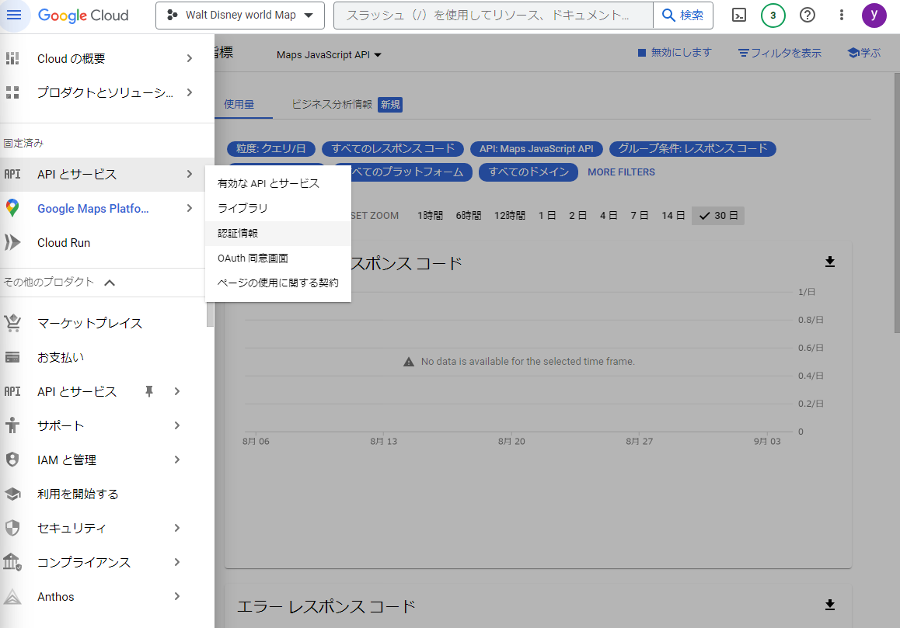
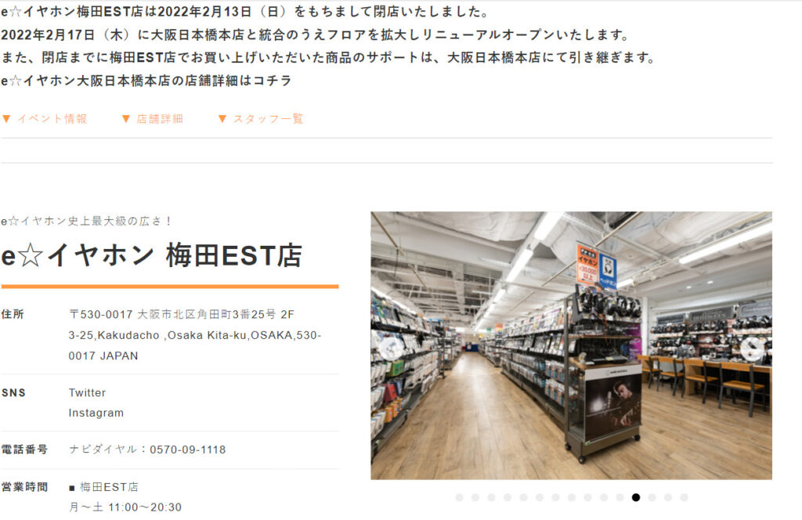

100円ショップのダイソーを運営する大創産業の新ブランドStandard Products  
現在は、渋谷マークシティ・新宿アルタの2店舗が営業しています。  
2022年4月にはマロニエゲート銀座２も開店し、東京に3店舗体制となります。

👉 関連記事：[【開店日予想】ダイソー新業態Standard Productsがマロニエゲート銀座に4月中旬オープン！](/blog/standard-products-open-marronniergate-ginza/)

## 梅田ESTにOPEN予定

### e☆イヤホン梅田エスト店跡にオープン

e☆イヤホン 梅田EST店が2022年2月13日に閉店しました。  
梅田ESTの2Fフロアは一つしかないため、間違いないでしょう。

<figure>

<figcaption>

[e☆イヤホン梅田EST店HP](https://www.e-earphone.jp/user_data/shop_umd/)

</figcaption>

</figure>

店舗面積も約190坪と過去のStandard Products店舗と比較して広いです。  
ワンフロアすべてStandard Productsになった場合は最も広い店舗になります。

<iframe src="https://www.google.com/maps/embed?pb=!4v1645525451634!6m8!1m7!1sCAoSLEFGMVFpcE1Ea1FuNlpsQ0U4LTZlbkZtcHpCS1dqSGo1N1JaSmlIM3dpZmhr!2m2!1d34.70502004064261!2d135.5009740607566!3f35.122333464597844!4f-11.134808404317738!5f0.7820865974627469" width="100%" style="border:0; aspect-ratio: 16 / 10; height: auto;" allowfullscreen loading="lazy" referrerpolicy="no-referrer-when-downgrade"></iframe>

## Standard Productsとは

100円ショップのダイソーを運営する大創産業の新ブランドStandard Products  
現在は、渋谷マークシティ・新宿アルタの2店舗が営業しています。

コンセプトは  
「ちょっといいのが、ずっといい。」  
普段の生活で使う、日用品をちょっと楽しく。

価格は300円がメインと、ダイソー譲りの低価格！

## OPEN日は不明

公式に開店日は発表されていません。

三店舗の実績から開店日を予想していきたいと思います！

### 5月中旬~6月上旬にオープンか

3店舗目のマロニエゲート銀座店では、前テナント退去から3か月でのオープンでした。  
その通りいけば、5月中旬のオープンになると思います。  
しかし、マロニエゲート銀座店と準備期間が重なっていることから、少し遅れる可能もあると思います。

マロニエゲート銀座店の詳細については、以下の記事で解説しています。

👉 関連記事：[【開店日予想】ダイソー新業態Standard Productsがマロニエゲート銀座に4月中旬オープン！](/blog/standard-products-open-marronniergate-ginza/)

### 金曜日が有力候補

Standard Products1号店は3/26<strong>(金)</strong>、2号店は10/22<strong>(金)</strong>オープンでした！  
EST梅田店でも金曜日オープンだと思われます。

## 梅田ESTの詳細

<iframe data-src="https://www.google.com/maps/embed?pb=!1m18!1m12!1m3!1d4013.4727916044535!2d135.49915912668777!3d34.70428306225365!2m3!1f0!2f0!3f0!3m2!1i1024!2i768!4f13.1!3m3!1m2!1s0x6000e6939149a243%3A0x7d86e33e607a9a0!2z5qKF55Sw44Ko44K544OI!5e0!3m2!1sja!2sjp!4v1645527067520!5m2!1sja!2sjp" src="about:blank" width="100%" style="border:0; aspect-ratio: 16 / 10; height: auto;" allowfullscreen loading="lazy" referrerpolicy="no-referrer-when-downgrade"></iframe>

## まとめ

## 関連リンク

[Standard Products「ちょっといいのが、ずっといい。」膨⼤な数のアイテムを扱ってきたダイソーが新しいスタンダードのあり⽅を提案します。300円の価格帯を中心とした、リビング用品・テーブルウエア・雑貨などの日用品のお店です。standardproducts.jp](https://standardproducts.jp/)

[ダイソーDAISO（ダイソー）を全国に店舗展開する株式会社大創産業の公式ホームページです。ワンコインの力で、買いものを、暮らしを、世の中を、もっともっとワクワクさせていきます。www.daiso-sangyo.co.jp](https://www.daiso-sangyo.co.jp/)
