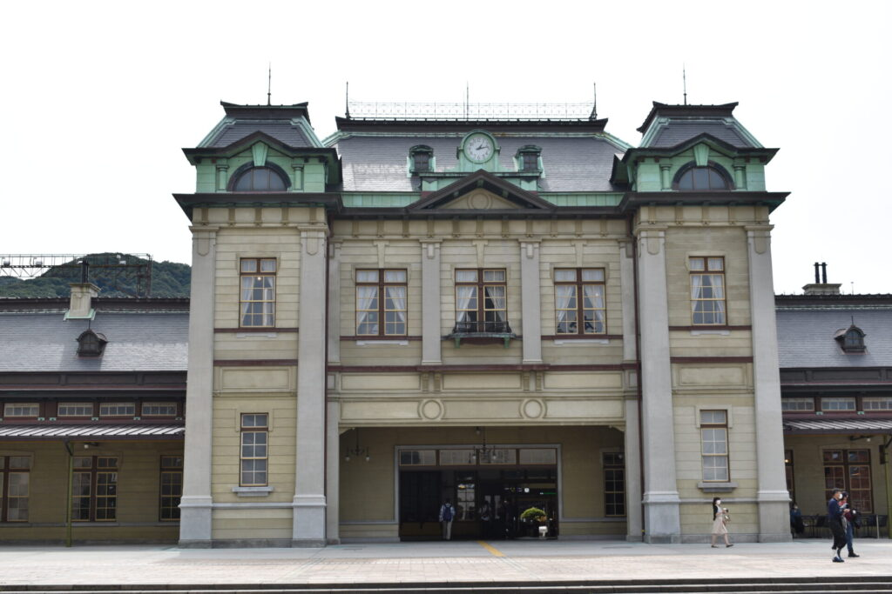
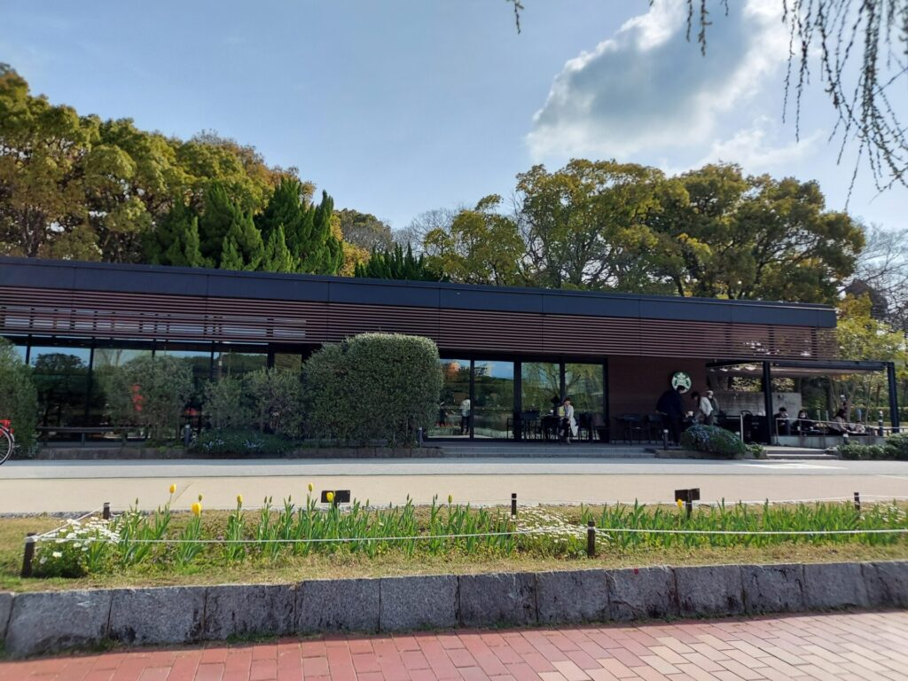
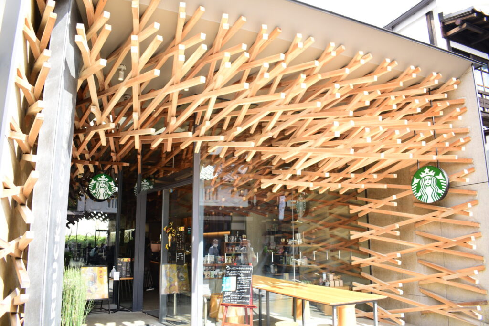
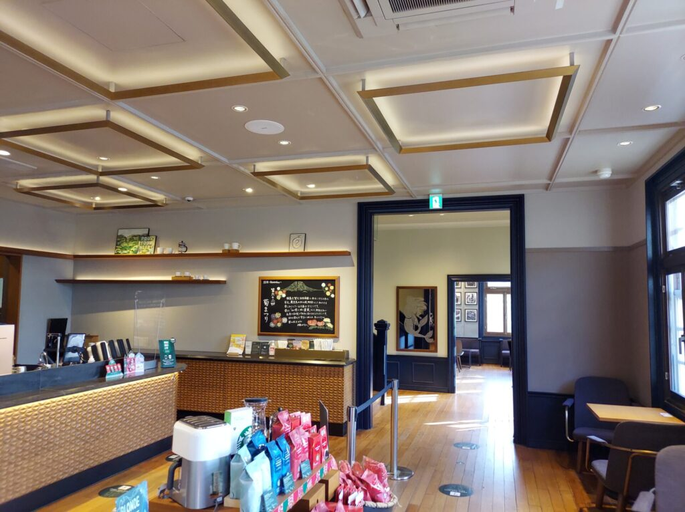

import ProblemBox from '../../../components/ProblemBox.astro';
import ConclusionBox from '../../../components/ConclusionBox.astro';

<ProblemBox>
- 九州・沖縄旅行やドライブの途中で、特別な空間体験ができるおしゃれなカフェを探している
- 有名建築家が手掛けた店舗や、国の重要文化財・登録有形文化財に入居するスタバを巡りたい
- 海や湖、日本庭園など、圧倒的な借景・絶景を眺めながら優雅にコーヒーを楽しみたい
</ProblemBox>

街の至る所で日常を彩ってくれるスターバックスコーヒー。

その中でも、地域の歴史・伝統文化・自然景観と融合した「リージョナル ランドマーク ストア」をはじめとする特別店舗は、<b>「その場所を訪れること自体が旅の目的になる」</b>ほどの圧倒的な空間美を誇ります。

特に九州・沖縄エリアは、大正時代の歴史的駅舎、隈研吾氏による木組み建築、水辺の自然と調和した環境配慮店舗、そして大名庭園や南国のエメラルドグリーンの海を望むロケーションまで、全国屈指の個性的な名店が集結しています。

今回は、建築美・絶景・居心地のすべてを兼ね備えた<b>九州・沖縄エリアのおしゃれスタバ厳選11店舗</b>を旅の動線とあわせて徹底解説します。

---

## 九州・沖縄の特別感あふれる厳選スタバ11選一覧

| 都道府県 | 店舗名 | コンセプト・最大の見どころ |
| :--- | :--- | :--- |
| <b>福岡県</b> | ① 門司港駅店 | 国指定重要文化財の駅舎内。大正ロマン薫るレトロモダン空間 |
| | ② 到津の森公園店 | 動物園に隣接。ファミリーや散策途中に嬉しい自然派店舗 |
| | ③ 福岡大濠公園店 | 池のほとりで水辺を望む。環境配慮型グリーンスター店舗 |
| | ④ 太宰府天満宮表参道店 | 建築家・隈研吾氏設計。伝統的な木組み構造が圧巻の参道店 |
| | ⑤ 九大伊都 蔦屋書店 | 18万冊の書籍に囲まれた郊外型ブック＆カフェ |
| <b>熊本県</b> | ⑥ サクラマチ熊本店 | 熊本城のお膝元。緑あふれる空中庭園と一体化した商業空間 |
| | ⑦ 不知火美術館・図書館店 | 名建築・北川原温設計。アートと読書に没頭できる至高の文化拠点 |
| <b>佐賀県</b> | ⑧ 武雄市図書館店 | グッドデザイン賞受賞。開放的な大空間で本とコーヒーを愉しむ |
| <b>宮崎県</b> | ⑨ 蔦屋書店 延岡エンクロス店 | 建築美を誇る駅前複合施設。市民の憩いの場に溶け込むカフェ |
| <b>鹿児島県</b> | ⑩ 鹿児島仙巌園店 | 薩摩藩主・島津家の登録有形文化財洋館。桜島を望む特等席 |
| <b>沖縄県</b> | ⑪ 沖縄本部町店 | やんばるの森とエメラルドの東シナ海を一望できるリゾートスタバ |

---

## 1. 歴史的建築とアートが息づく福岡の名店

### ① 門司港駅店（福岡県北九州市）
1914年（大正3年）に開業し、駅舎として日本で初めて国の重要文化財に指定された「門司港駅」の1階旧三等待合室に入居する奇跡の店舗。
大正ロマン漂う高い天井、歴代の駅舎写真、白い漆喰壁とダークウッドのカウンターが美しく調和し、タイムスリップしたかのような贅沢な時間を過ごせます。

<figure>

<figcaption>重要文化財の駅舎空間をそのまま活かした大正ロマンのインテリア</figcaption>
</figure>

### ② 福岡大濠公園店（福岡県福岡市）
市民の憩いのオアシス・大濠公園の池のほとりに位置する環境配慮型店舗。
大きなガラス窓からは水辺のきらめきが広がり、テラス席では心地よい風を感じながら過ごせます。家具にはコーヒー豆の粕（かす）を再利用した素材が使われるなど、サステナブルな思想が息づいています。

<figure>

<figcaption>公園の自然景観に溶け込むウッド調の外観デザイン</figcaption>
</figure>

### ③ 太宰府天満宮表参道店（福岡県太宰府市）
世界的な建築家・隈研吾氏が設計を手掛けた、日本で最も有名なスタバの一つ。
「自然素材を用いた伝統と現代の融合」をテーマに、釘を1本も使わずに組み上げられた約2,000本のスギ材の木組み構造が、エントランスから店内奥の庭までダイナミックに連続しています。

<figure>

<figcaption>木組みの格子が奥へと引き込むような奥行き感を演出</figcaption>
</figure>

---

## 2. 知性と癒やしが共鳴する図書館・文化複合店

### ④ 不知火美術館・図書館店（熊本県宇城市）
建築家・北川原温氏の設計により日本建築学会作品選奨を受賞した美しい近代建築内に位置します。
美術展示を鑑賞した後に、ガラス張りの明るい館内でコーヒーを片手に読書に没頭できる、感性を刺激する文化的な隠れ家です。

### ⑤ 武雄市図書館店（佐賀県武雄市）
公立図書館の概念を覆し、全国的な話題となった「武雄市図書館」内のスタバ。
天井まで届く圧巻の木製本棚と吹き抜けの開放感の中、館内の本を自由に持ち込んで読書とカフェタイムを楽しめます。

---

## 3. 桜島と美ら海を望む南国の絶景店

### ⑥ 鹿児島仙巌園店（鹿児島県鹿児島市）
島津家ゆかりの国の登録有形文化財「旧芹ケ野島津家金山鉱業事務所」をリノベーションした店舗。
2階の窓際席からは、錦江湾（鹿児島湾）と雄大な<b>桜島</b>のパノラマビューを一望できます。薩摩切子や大島紬をイメージした工芸的ディテールも必見です。

<figure>

<figcaption>大正モダンな白壁の洋館で桜島を望みながら優雅な一杯を味わえる</figcaption>
</figure>

### ⑦ 沖縄本部町店（沖縄県本部町）
美ら海水族館から車で約5分、やんばるの緑豊かなドライブウェイ沿いに佇むロードサイド店。
コンクリート打ち放しの洗練された2階テラス席からは、亜熱帯の原生林越しに青く輝く東シナ海を望むことができます。夕暮れ時のサンセットは息をのむ美しさです。

---

## まとめ：移動の合間のコーヒーを「最高の体験」に変える

旅先でのカフェ選びは、単なる水分補給や休憩ではなく、<b>「その土地の歴史・文化・絶景を五感で味わうアクティビティ」</b>です。

<ConclusionBox>
- <b>建築と歴史を堪能</b>: 門司港駅や太宰府、仙巌園で文化財×モダンデザインの調和を体感
- <b>本と自然に浸る</b>: 大濠公園や武雄市図書館で、日常を忘れる読書＆水辺のひととき
- <b>ドライブ動線に組み込む</b>: 観光スポットや空港・高速道路の経由地に賢く配置
- <b>朝の時間帯が狙い目</b>: 人気のコンセプトストアは午前中早い時間に訪れると静けさを満喫できる
</ConclusionBox>

九州・沖縄へ旅行や出張で訪れる際は、ぜひこれらの特別なスターバックスを旅のルートに組み込んでみてください。
