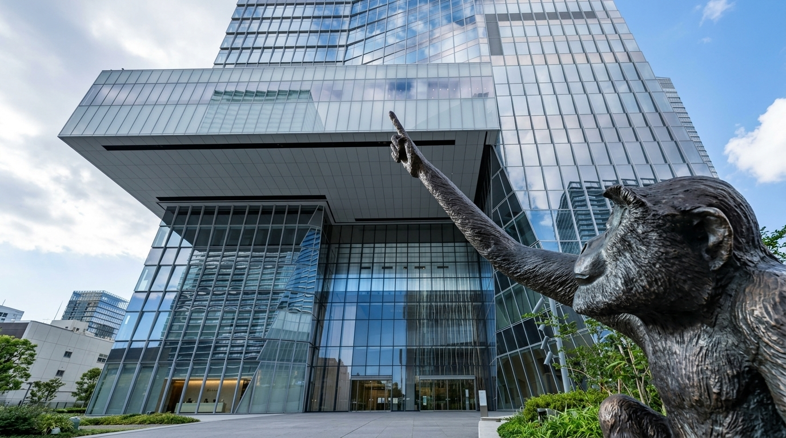
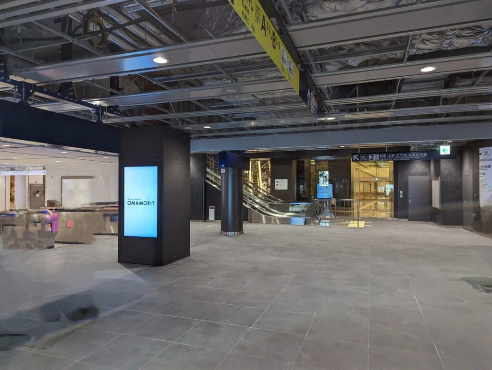
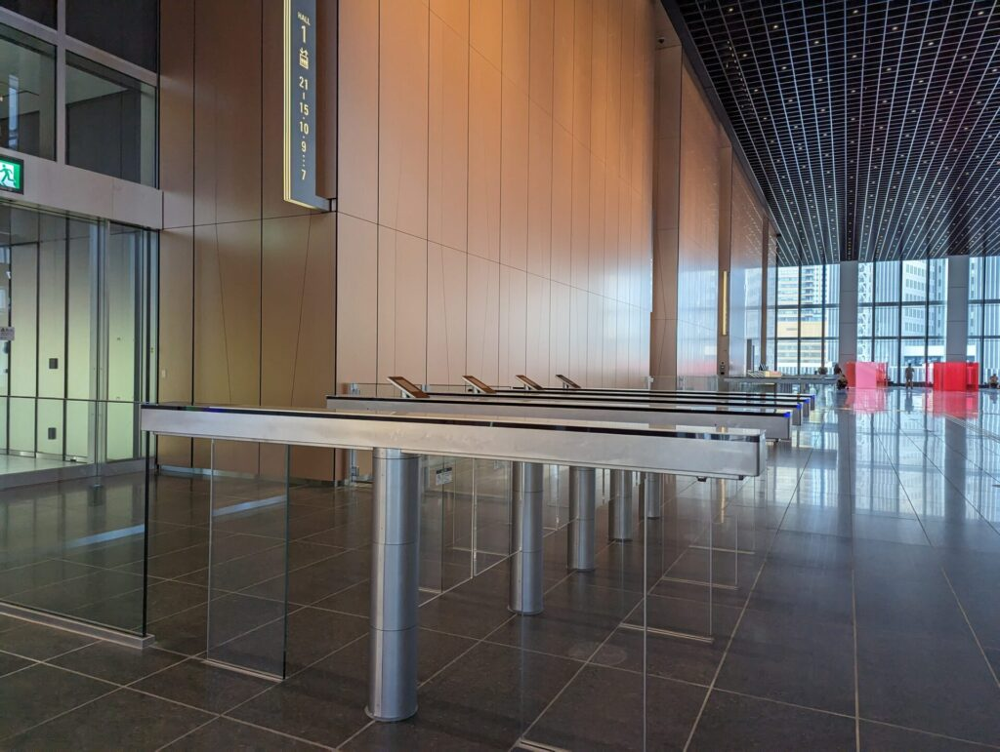
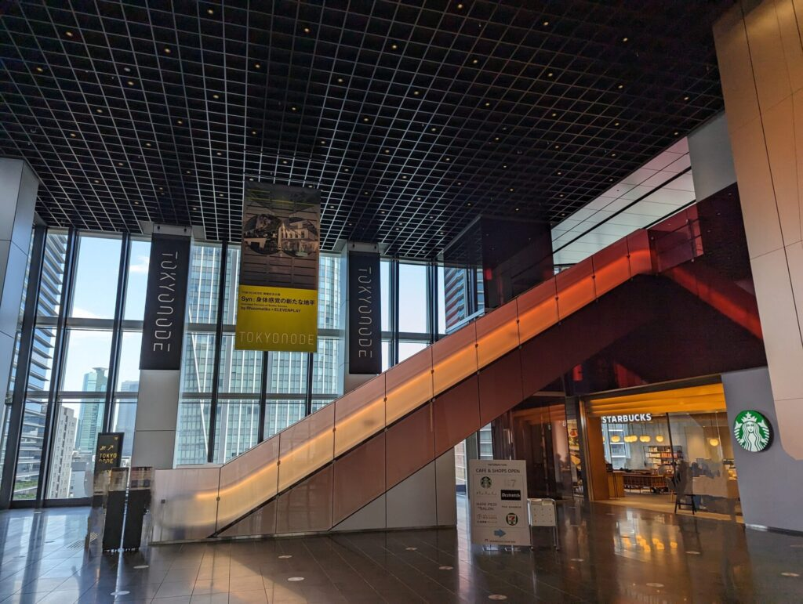
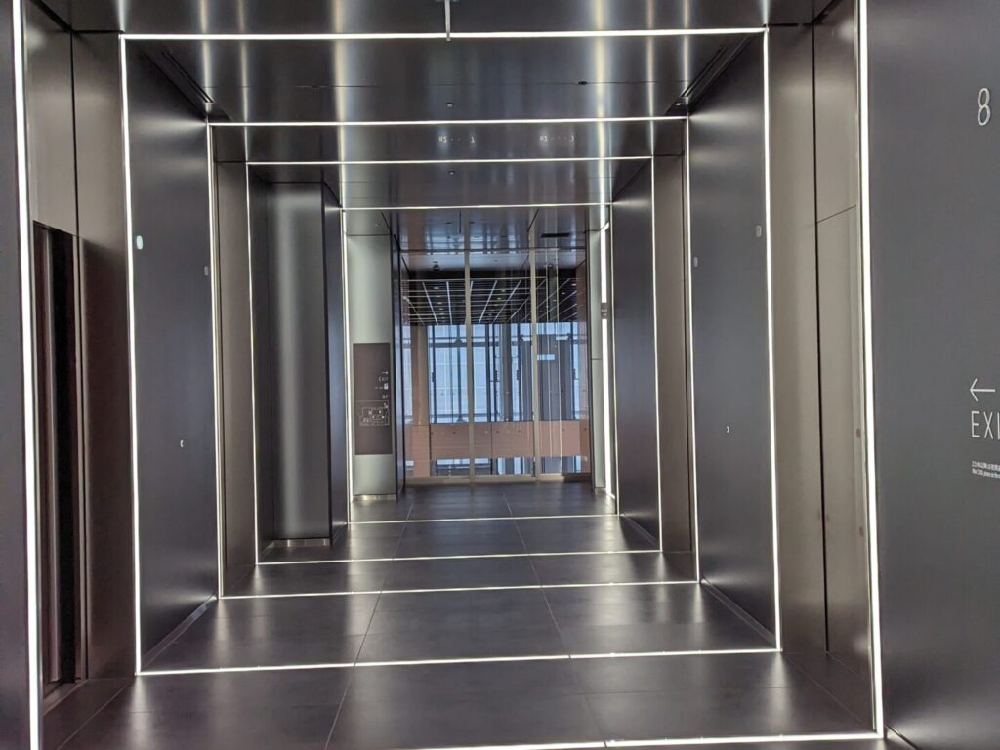
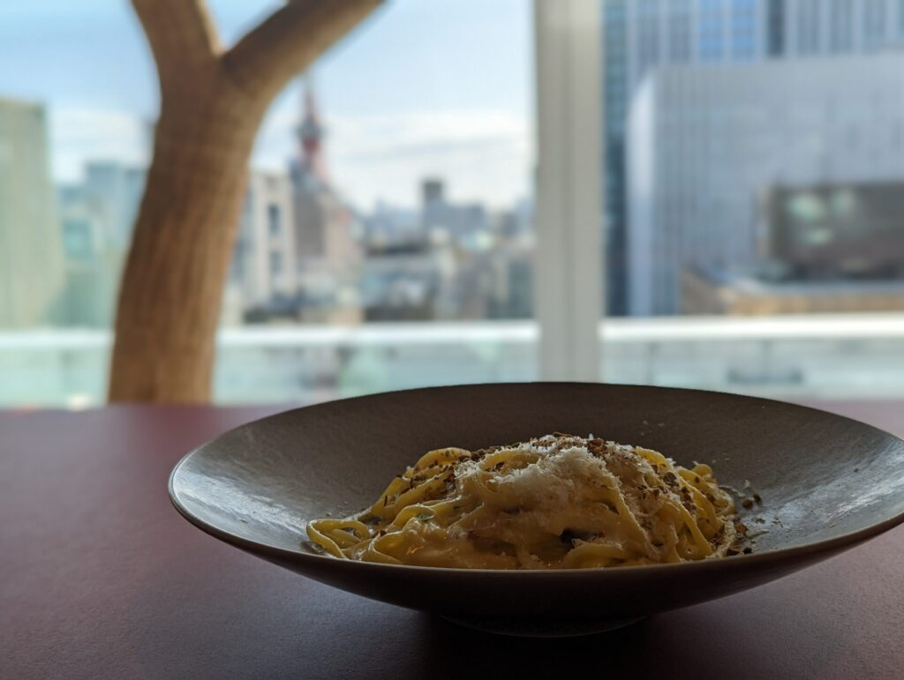
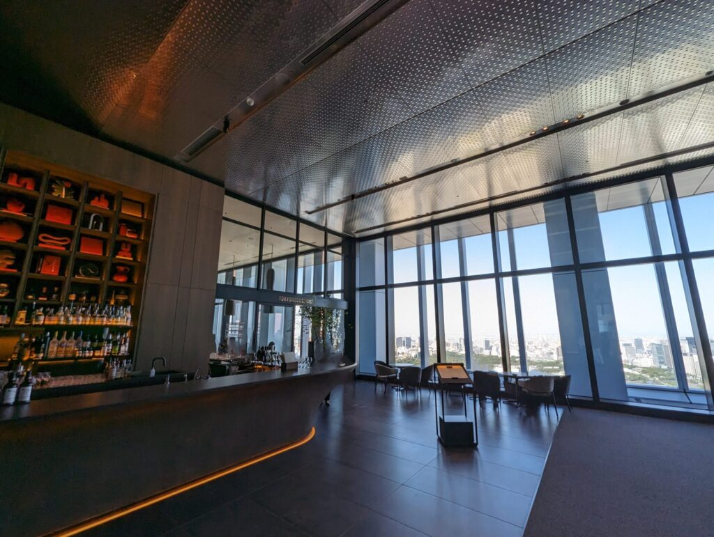
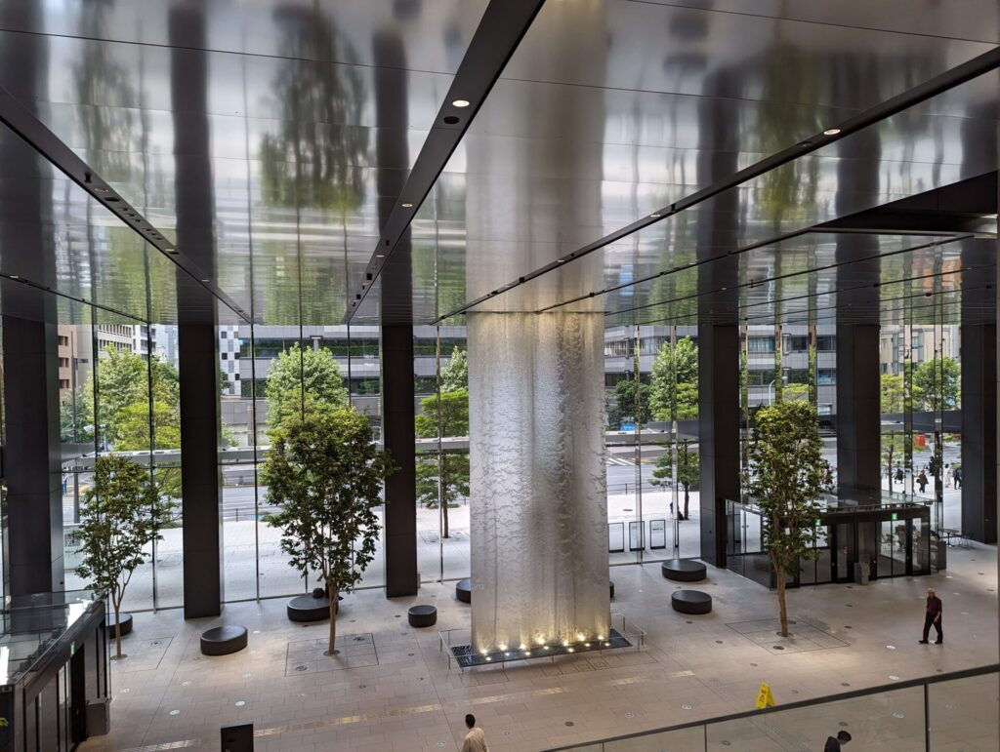
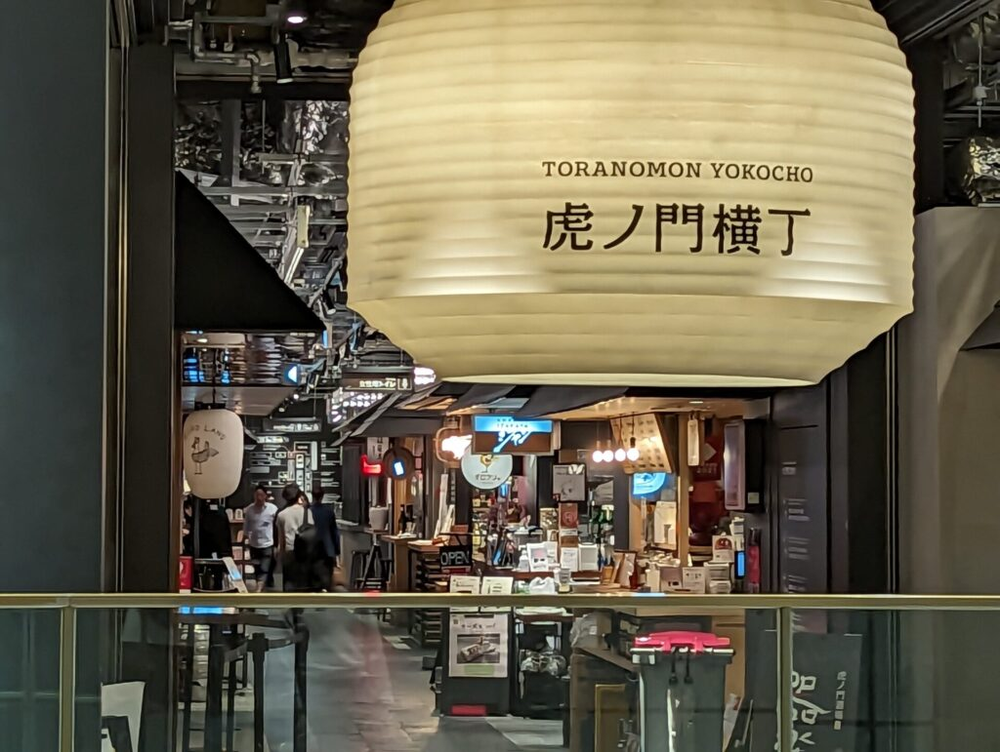
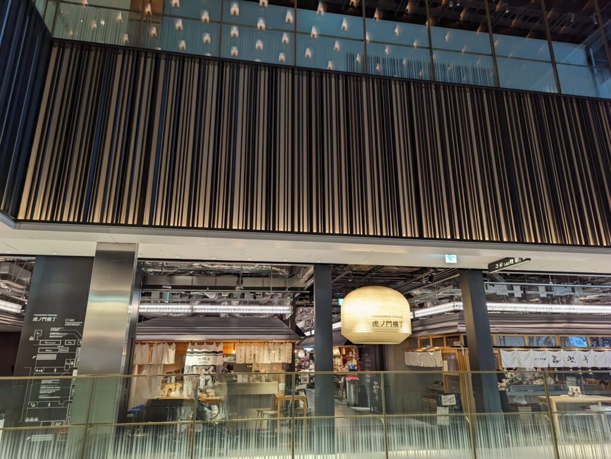

import ProblemBox from '../../../components/ProblemBox.astro';
import ConclusionBox from '../../../components/ConclusionBox.astro';
import AdviceBox from '../../../components/AdviceBox.astro';

2023年10月6日、東京・虎ノ門の街に新たなランドマーク「<b>虎ノ門ヒルズ ステーションタワー</b>」が誕生しました。

東京メトロ日比谷線「虎ノ門ヒルズ駅」と一体開発された本タワーは、地下2階から地上49階まで、従来のオフィスビルや商業施設の枠を超えた先進的な空間が広がっています。

<ProblemBox>
- 虎ノ門ヒルズ ステーションタワーって実際どんな場所？主な見どころは？
- 日比谷線の駅から迷わず行ける？地下の開放感や駅直結の利便性は？
- 話題の「T-MARKET」の利用システムやランチ・カフェの混雑状況を知りたい！
</ProblemBox>

本記事では、開業直後の現地を実際に歩き回り、駅直結のステーションアトリウムから地下2階「T-MARKET」、8階の絶景カフェ「NODE CAFE」、45階の情報発信拠点「TOKYO NODE」、さらにはTデッキで繋がるビジネスタワーや「虎ノ門横丁」まで、その全貌を豊富な写真とともにレポートします。

<figure>
  
  <figcaption>ステーションタワーを見上げるダイナミックな外観とパブリックアート</figcaption>
</figure>

虎ノ門ヒルズエリアは、主に以下の4つのタワーで構成されています。

| タワー名称 | 主な特徴・用途 |
| :--- | :--- |
| <b>ステーションタワー</b> | 日比谷線直結。商業施設「T-MARKET」や情報発信拠点「TOKYO NODE」を擁する最新棟 |
| <b>森タワー</b> | 虎ノ門ヒルズの原点。広大な芝生の「オーバル広場」やアンダーズ東京が入居 |
| <b>ビジネスタワー</b> | 商業フロアや名店が集結した「虎ノ門横丁」、大規模バスターミナルを併設 |
| <b>レジデンシャルタワー</b> | 最高水準のレジデンスと落ち着いた住環境を提供するタワー |

今回は、街の中核として新しく加わった<b>ステーションタワー</b>を中心に探索していきます。

## 日比谷線「虎ノ門ヒルズ駅」直結！地下とは思えない開放感のアトリウム

東京メトロ日比谷線「虎ノ門ヒルズ駅」に降り立つと、これまでの地下鉄駅のイメージを覆す光景が目に飛び込んできます。

ホームからガラス越しに広大なエントランスが見渡せ、駅に降りた瞬間から特別な空間に足を踏み入れた高揚感に包まれます。

<figure>
  
  <figcaption>虎ノ門ヒルズ駅ホーム。ガラス越しにモダンなエントランスが広がる</figcaption>
</figure>

ホームからエスカレーターを下ると、ブラックを基調とした落ち着きのあるモダンなコンコースが広がります。

<figure>
  
  <figcaption>落ち着いた照明と上質なマテリアルで統一された地下コンコース</figcaption>
</figure>

地下2階の改札を抜けると、大型デジタルサイネージと配管をあえて露出させたスケルトン天井が印象的な駅前広場（自由通路）へ出ます。

<figure>
  
  <figcaption>大型サイネージが並ぶ開放的な地下自由通路</figcaption>
</figure>

<figure>
  
  <figcaption>地下とは思えない高い天井とゆとりのある改札前空間</figcaption>
</figure>

改札を出て右へ進むと、ステーションタワーのエントランスへと直結しています。

### 巨大吹き抜け「ステーションアトリウム」

ステーションタワーの地下玄関口となるのが、この「<b>ステーションアトリウム</b>」です。

地下2階から地上階へと続く巨大な吹き抜け構造になっており、天窓から自然光がたっぷりと降り注ぎます。

<figure>
  
  <figcaption>ステーションアトリウムのエントランス。地下を感じさせない明るい空間</figcaption>
</figure>

<figure>
  
  <figcaption>幾何学的なガラス天井と、2階レベルを横断するブルーガラスの空中ブリッジ</figcaption>
</figure>

イベントスペース、商業ゾーン、オフィスロビーへのエレベーター、そして地下鉄駅が交差する、まさに街のハブとして機能しています。

<figure>
  
  <figcaption>地上階へとダイナミックにつながるガラス張りのシースルーエスカレーター</figcaption>
</figure>

<figure>
  
  <figcaption>洗練されたライティングと幾何学的な壁面デザイン</figcaption>
</figure>

## 地下2階「T-MARKET」多彩な名店が集うフードコート

ステーションタワー地下2階の目玉施設が、食の複合エリア「<b>T-MARKET</b>」です。

約3,000平方メートルの広大なフロアに、ミシュランシェフが手がける新業態やクラフトビールバー、カフェ、スイーツ、ベーカリーなど多彩な27店舗が集結しています。

<figure>
  
  <figcaption>緑とアートが調和する上質なフードコート空間「T-MARKET」</figcaption>
</figure>

一般的なフードコートの枠組みを遥かに超えた、大人が日常使いしたくなる上質な空間デザインが特徴です。

緑、光、音、アートがエリアごとに計算されており、歩いて回るだけでも好奇心が刺激されます。

<figure>
  
  <figcaption>バルやカフェ、デリが並び、思い思いのスタイルで飲食を楽しめる</figcaption>
</figure>

<figure>
  
  <figcaption>和食、中華、イタリアン、ビストロ、スイーツまで厳選された店舗ラインナップ</figcaption>
</figure>

### 昼と夜で変わる利用スタイル
T-MARKETは時間帯によって利用方法が変化する点もユニークです。

- <b>ランチタイム（昼）：</b> 好きな店舗で自由にテイクアウトやイートイン購入し、共用席で気軽にシェア可能。
- <b>ディナータイム（夜）：</b> 約140席の共用席エリアが座席予約制に対応。席に座ったままモバイルオーダーで各店舗の料理を注文すると、スタッフがテーブルまで配膳してくれます。

仕事帰りの一杯から休日のグループ利用まで、シーンを選ばず楽しめる設計です。

## 7・8階「オフィスロビー＆カフェ」木漏れ日のような上質空間

エスカレーターやエレベーターで7階へ上がると、オフィスロビーのゲートフロアへと到着します。

<figure>
  
  <figcaption>7階のオフィスエントランス。ガラスと木目の調和が心地よい</figcaption>
</figure>

ここにはセキュリティゲートの手前に「スターバックス コーヒー」や「セブン-イレブン」が併設されており、一般の来館者でも気軽に利用できます。

<figure>
  
  <figcaption>オフィスフロアの一角にあるスターバックス。広々とした木調カウンターが落ち着く</figcaption>
</figure>

木目調のルーバーと高い天井が開放的で、従来の無機質なオフィスビルのロビーとは一線を画すリラックスした空気が漂っています。

### 8階「NODE CAFE」東京タワーを望む絶景ランチ

さらにエスカレーターを1フロア上がり8階へ進むと、エレベーターホール脇に洗練されたカフェ「<b>NODE CAFE</b>」があります。

<figure>
  
  <figcaption>8階エレベーターホール。間接照明と大理石調のフロアが上質</figcaption>
</figure>

この日はランチタイムにNODE CAFEへ立ち寄り、特製パスタをいただきました。

<figure>
  
  <figcaption>NODE CAFEのパスタ。たっぷりのチーズとハーブの香りが効いた本格派</figcaption>
</figure>

大きな窓際の席からは、目の前に東京タワーを望む抜群のロケーションが広がります。

<figure>
  
  <figcaption>窓の外には東京タワー。都会のパノラマを眺めながらゆったりとランチが味わえる</figcaption>
</figure>

カジュアルなカフェ価格帯でありながら、ホテルのラウンジに匹敵する景観と落ち着きを兼ね備えた隠れた名スポットです。

## 45〜49階「TOKYO NODE」地上250mの情報発信拠点とパノラマビュー

ステーションタワーの最上層（45階〜49階）に位置するのが、新たな情報発信拠点「<b>TOKYO NODE</b>」です。

イベントホール、ギャラリー、スタジオ、研究開発拠点（TOKYO NODE LAB）、そしてレストランやルーフトップガーデンが一体となった複合施設です。

45階ロビーに降り立つと、窓の外には息をのむような絶景が広がります。

<figure>
  
  <figcaption>45階からの北側眺望。遮るもののないパノラマで皇居や丸の内、上野方面を一望</figcaption>
</figure>

北側方面にはステーションタワー以上の高層建築物が周辺にないため、皇居の広大な緑や丸の内・大手町のスカイラインまで遠くまで見渡すことができます。

### 最上階を彩るレストラン群
45階にはオールデイダイニングの「<b>TOKYO NODE DINING</b>」、49階のルーフトップにはミシュラン星付きシェフによる「<b>KEI COLLECTION PARIS</b>」やガストロノミー「<b>apothéose（アポテオーズ）</b>」がオープンしています。

<figure>
  
  <figcaption>45階「TOKYO NODE DINING」のエントランス。開放感あふれるハイエンド空間</figcaption>
</figure>

お昼時のTOKYO NODE DININGはすでに満席の人気ぶりでした。高層階でのランチやディナーを計画される際は、事前のオンライン予約が必須です。

## 歩行者デッキ「T-デッキ」〜ビジネスタワーと「虎ノ門横丁」へ

ステーションタワーを満喫した後は、幅約20mの大規模歩行者デッキ「<b>T-デッキ</b>」を通って、隣接する森タワーやビジネスタワーへ足を伸ばしました。

道路を渡ることなく、地上2階レベルでヒルズ各棟がシームレスに接続されています。

<figure>
  
  <figcaption>デッキ広場に設置されたパブリックアート。空を指差す姿が印象的</figcaption>
</figure>

T-デッキを渡って森タワー前へ出ると、緑豊かな芝生が広がる「<b>オーバル広場</b>」が広がっています。

<figure>
  
  <figcaption>オーバル広場。ジャウメ・プレンサの巨大彫刻「ルーツ」と青空に映える森タワー</figcaption>
</figure>

パラソル付きのテーブルベンチが並び、家族連れやカップルがピクニックのように心地よく過ごしていました。

### ビジネスタワーのアトリウムと名所「虎ノ門横丁」

さらに東側の「<b>ビジネスタワー</b>」へと進みます。

ビジネスタワーの1階エントランスには、天井から壮大に水が流れ落ちる巨大なウォーターアートが設置されており、圧倒的な存在感を放っています。

<figure>
  
  <figcaption>ビジネスタワー1階アトリウム。天井から光と水が降り注ぐウォーターフォール</figcaption>
</figure>

そしてビジネスタワー3階には、東京中の人気酒場・名店26店舗が一堂に会する名所「<b>虎ノ門横丁</b>」があります。

<figure>
  
  <figcaption>虎ノ門横丁の入口に掲げられた大きな白提灯</figcaption>
</figure>

<figure>
  
  <figcaption>のれんが連なり、活気あふれる横丁文化をモダンに再現した空間</figcaption>
</figure>

焼き鳥、クラフトジン、割烹、ビストロなど、普段は予約が取りにくい名店の味をハシゴ酒スタイルで堪能できるスポットです。

ステーションタワーの「T-MARKET」とはまた異なる、下町情緒と大人の社交場が融合した熱気を感じられます。

## 虎ノ門ヒルズ訪問のまとめ＆攻略ポイント

虎ノ門ヒルズ各タワーのおすすめスポットと利用シーンを整理しました。

| エリア / スポット | 主な魅力・見どころ | おすすめ利用シーン |
| :--- | :--- | :--- |
| <b>ステーションタワー B2（T-MARKET）</b> | 27店舗が集う最新フードコート。夜はモバイルオーダー対応 | カジュアルランチ、仕事帰りの一杯、複数人でのシェア |
| <b>ステーションタワー 8F（NODE CAFE）</b> | 東京タワーを眺めながら手頃なパスタやカフェが楽しめる穴場 | 落ち着いたカフェ休憩、ひとりランチ、軽めの打合せ |
| <b>ステーションタワー 45-49F（TOKYO NODE）</b> | 皇居方面を見下ろす大パノラマビューと先端アート展示 | デート、展示鑑賞、特別な日の記念日ディナー（要予約） |
| <b>森タワー 2F（オーバル広場）</b> | 芝生とパブリックアートが広がる緑豊かなオープンスペース | 天気の良い日の散策、テイクアウトピクニック |
| <b>ビジネスタワー 3F（虎ノ門横丁）</b> | 東京の名店26店舗が集結するモダンな横丁フロア | ディナー、ハシゴ酒、美食巡り |

<AdviceBox title="虎ノ門ヒルズ訪問のワンポイントアドバイス">
  
<b>1. レストランは事前予約を活用する：</b>

  
TOKYO NODE DININGなどの高層階レストランやT-MARKETのディナー席は非常に混雑します。事前に公式Webサイトからのオンライン予約がスムーズです。

  
<b>2. 移動は地上2階「T-デッキ」が最短＆快適：</b>

  
各棟間の移動は信号待ちのない地上2階デッキが便利です。屋根付きエリアも多く、雨天時でも地下通路と合わせて快適に回遊できます。

</AdviceBox>

<ConclusionBox>
結論：虎ノ門ヒルズ ステーションタワーは、地下直結の圧倒的な開放感と「T-MARKET」の絶品グルメ、そして地上250mの絶景「TOKYO NODE」まで、一日中東京の最前線カルチャーを体感できる最高のお出かけスポットです！
</ConclusionBox>
