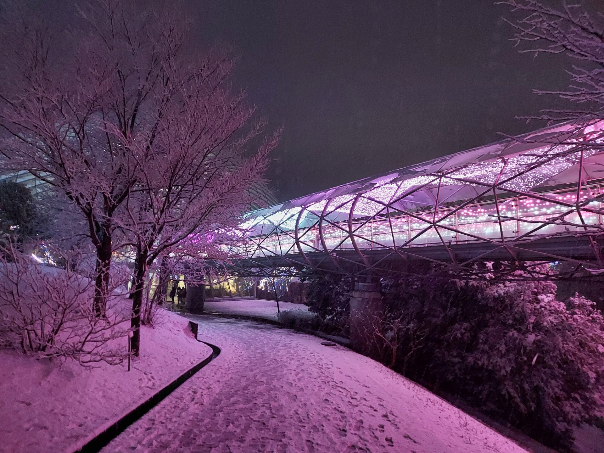

import ProblemBox from '../../../components/ProblemBox.astro';
import ConclusionBox from '../../../components/ConclusionBox.astro';

<ProblemBox>
- 山陰・鳥取エリアで、冬の夜に楽しめるロマンチックなイルミネーションを探している
- 「とっとり花回廊」の冬のイルミネーションの見どころや花火の開催時間を知りたい
- 雪が降る極寒の夜でも快適に鑑賞するための防寒対策や、米子駅からのアクセス動線を把握したい
</ProblemBox>

冬の山陰・鳥取といえば、松葉がにや温泉、雪景色を思い浮かべる方が多いはず。

そんな冬の鳥取旅行で絶対に立ち寄ってほしい屈指の絶景スポットが、南部町にある日本最大級のフラワーパーク<b>「とっとり花回廊」</b>です。

毎年冬に開催される「フラワーイルミネーション」は中国地方トップクラスの規模を誇り、タイミングが合えば<b>「100万球のイルミネーション × 冬の洋ラン × 白銀の雪景色 × 冬の澄んだ夜空を彩る花火」</b>という奇跡のような4重のコラボレーションに出会えます。

今回は、ホワイトクリスマスの日に実際に訪れた体験をもとに、見どころ、温かい屋根付き回廊の歩き方、冬花火の鑑賞ポイント、そして米子駅からのアクセス動線まで徹底解説します。

---

## とっとり花回廊とは？大山を望む日本最大級の植物園

霊峰・大山（だいせん）の裾野に広がる「とっとり花回廊」は、<b>敷地面積約50ヘクタール（東京ドーム約11個分）</b>を誇る国内最大級のフラワーパークです。

<figure>

<figcaption>広大な敷地全体が100万球の光で包まれる冬のメインイベント</figcaption>
</figure>

四季折々の花が咲く園内ですが、冬の夜は雰囲気が一変。雪化粧した庭園とまばゆい光が反射し合い、おとぎ話のような幻想的な光の世界へと変貌します。

---

## 冬のハイライト：光と雪が織りなす絶景ポイント

### ① 1km続く「屋根付き展望回廊」から見下ろす光の海
とっとり花回廊の最大の特徴は、<b>園内をぐるりと一周する周囲1kmの屋根付き展望回廊</b>です。
雨や雪が降っていても傘を差さずに歩くことができ、冷たい風を遮りながら360度の大パノラマイルミネーションを見下ろせます。

<figure>

<figcaption>未来都市のような光のリングが雪景色の中に浮かび上がる</figcaption>
</figure>

### ② 熱帯植物と洋ランが咲き誇る「巨大フラワードーム」
中央にそびえ立つ直径50mのガラス温室「フラワードーム」の中は、<b>冬でも室温約20度の温かい別世界</b>。
何千株もの洋ランやヤシの木が美しくライトアップされており、寒さで冷えた体をポカポカに温めながら優雅な花と光の競演を鑑賞できます。

<figure>

<figcaption>真冬でも温かいガラス温室内で色鮮やかな洋ランとイルミを楽しめる</figcaption>
</figure>

### ③ 澄んだ冬空に打ち上がる「冬花火」
イルミネーション期間中の特定日（週末やクリスマス等）には、<b>19:00から約400発の冬花火</b>が打ち上がります。
夏と違って空気が澄み渡っているため、花火の光がくっきりと夜空を照らし、足元のイルミネーションと雪景色と一体化する光景は圧巻の一言です。

<figure>

<figcaption>イルミネーションの光の海の上に花火が開く奇跡の瞬間</figcaption>
</figure>

---

## 【生活改善・快適動線】訪問時の3大アドバイス

### 1. 「米子駅発着の無料シャトルバス」が最強の足
JR米子駅からとっとり花回廊まで、<b>所要時間約25分の無料シャトルバス</b>が運行されています。
冬の鳥取は道路の積雪や路面凍結が多いため、雪道運転に慣れていない観光客でも、シャトルバスを利用すればノーマルタイヤやレンタカーの不安なく安全に往復できます。

### 2. 極暖の防寒装備（足元対策）を怠らない
標高が高く、夜間は氷点下まで冷え込みます。
ダウンコートはもちろん、<b>「厚手の靴下＋防水防寒ブーツ＋貼るカイロ」</b>を装備しておきましょう。特に足元の冷え対策をしておくことで、長時間の屋外撮影でも集中して楽しめます。

---

## まとめ

冬のとっとり花回廊は、<b>「光・花・雪・花火が共鳴する、山陰屈指のロマンチックな冬の風物詩」</b>です。

<ConclusionBox>
- <b>100万球と雪の絶景</b>: 雪化粧した庭園に光が反射し幻想的な世界が広がる
- <b>天候を気にせず回れる</b>: 1kmの屋根付き展望回廊と温かいフラワードームを完備
- <b>冬花火との競演</b>: 週末19:00の打ち上げに合わせてスケジュールを組もう
- <b>無料シャトルバスで安心</b>: 米子駅から直行バスを利用して雪道の運転リスクを回避
</ConclusionBox>

鳥取・皆生温泉や大山への旅行の際には、ぜひ防寒を万全にして、心に残る光の絶景を体験してみてください。
