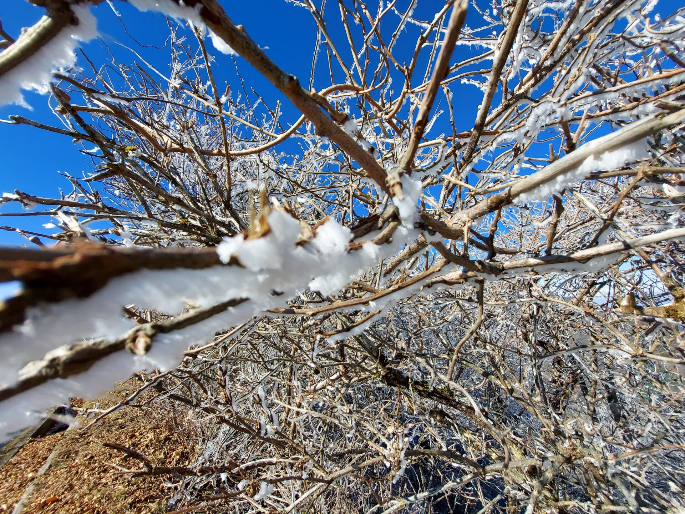
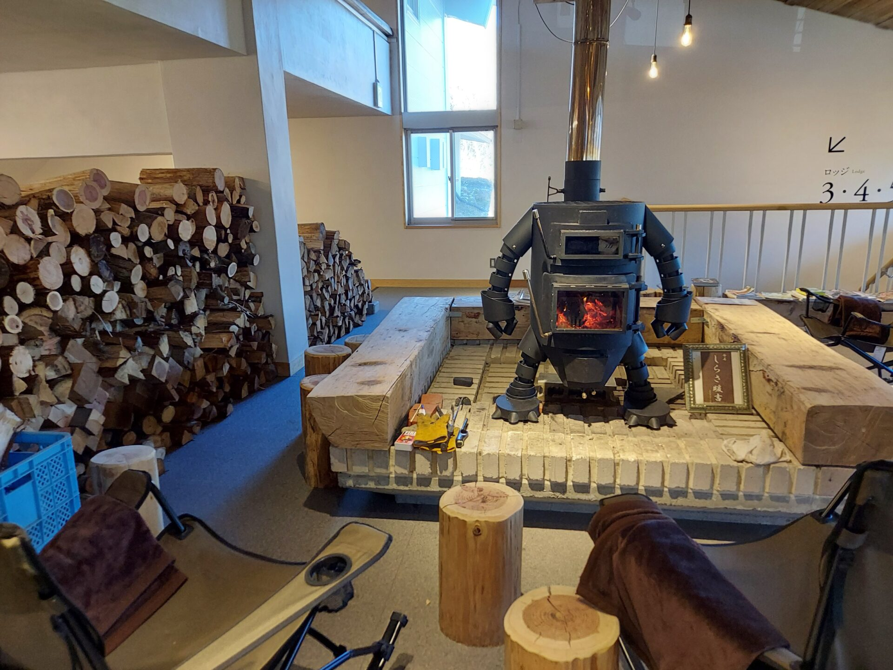
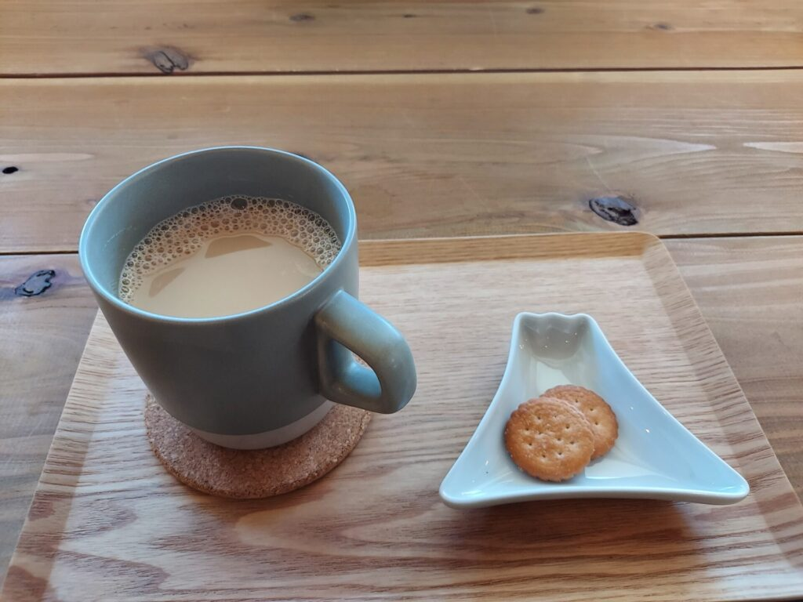

UFOラインは愛媛県と高知県の県境付近にある尾根道です。  
某クルマメーカーのテレビCMに起用されてから大人気のスポット！  
休日にはドライブ・サイクリング・登山に観光客が多く訪れます。

春はつつじ、夏は新緑、秋は紅葉、と季節ならではの景色を堪能できます。  
今回は冬のUFOラインについてご紹介します

## UFOラインとは

2018年にトヨタカローラのCMで話題になったUFOライン

その時のCMメイキング映像です。（[oricon公式YouTubeチャンネル](https://www.youtube.com/channel/UCbZvkG2uAgr6Oiva4FytscQ)より）

<iframe width="560" height="315" src="https://www.youtube.com/embed/_dWKLytb86c?start=1" title="YouTube video player" frameborder="0" allow="accelerometer; autoplay; clipboard-write; encrypted-media; gyroscope; picture-in-picture" allowfullscreen></iframe>

空からの映像は反則級に美しい

## 冬のUFOラインの魅力

私が訪れたのは2021年11月28日。  
麓の西条市の当日の天気は晴れ。最低気温2.8度、最高気温12.9度でした。

### 霧氷と緑のコントラスト

UFOラインは標高が高く気温が低いことから、霧氷を見ることができます。  
愛媛県側が霧氷で白く、高知県側は緑とコントラストを楽しめます。

写真は東黒森周辺です。

霧氷とは空気中の水分が冷却され、風により樹木などと衝突して凍り付く現象です。

雪が積もるのとは違い、樹木の下側に氷が付着しています。

### 道中の景色

道中には壁から浸み出した水滴が凍り付いた、壁一面のつららが見られました

### 山荘しらさでの薪ストーブでまったり

瓶ヶ森から石鎚山方面へ30分ほど走ると、山の中にポツンと山荘しらさが現れます。

2021年4月にリニューアルオープンした

館内には、ロボットの形をした、薪ストーブがあります。しらさ暖吉と言うそうです。  

オリジナルチーズケーキとカフェラテを頂きました。

疲れて凍えた身体に  
濃厚なチーズと温かい室内での冬アイスが沁みます

他にもスープカレーやソフトクリームなど自慢の食事やスイーツを楽しめます。

  
山荘しらさには、ロッジを併設しており宿泊することもできます。

## 注意事項

UFOラインは山岳道路であるため、

### 狭隘

### 冬タイヤは必須

UFOラインは標高と高く、平地に比べ気温が度低いです。

### 霧氷には午前中がオススメ

日が出てくると、

### 冬季閉鎖に注意

UFOラインは、例年11月末から冬季閉鎖に入ります。  
4月上旬には開通します。

## アクセス

### UFOライン（瓶ヶ森）

松山道　いよ西条ICより　車で約1時間20分  
高知道　伊野ICより　　　車で約1時間30分

<iframe src="https://www.google.com/maps/embed?pb=!1m18!1m12!1m3!1d504565.0312834574!2d133.22006763711263!3d33.81898057260032!2m3!1f0!2f0!3f0!3m2!1i1024!2i768!4f13.1!3m3!1m2!1s0x3551d6fd514327c1%3A0x412031b9eb1af4a1!2zVUZP44Op44Kk44OzKOOBhOOBrueUuumBkyDnk7bjgrHmo67nt5op!5e0!3m2!1sja!2sjp!4v1644027658281!5m2!1sja!2sjp" width="600" height="450" style="border:0;" allowfullscreen loading="lazy"></iframe>

### 山荘らしさ

住所　〒781-2605 高知県吾川郡いの町寺川１７５  
ホームページ：[https://sansoshirasa.com/](https://sansoshirasa.com/)

<iframe src="https://www.google.com/maps/embed?pb=!1m14!1m8!1m3!1d75035.26309451651!2d133.16423433926016!3d33.78336150282161!3m2!1i1024!2i768!4f13.1!3m3!1m2!1s0x354e2acfe1bc8c6b%3A0xbaedd1b36ce53568!2z5bGx6I2Y44GX44KJ44GV!5e0!3m2!1sja!2sjp!4v1644031885148!5m2!1sja!2sjp" width="600" height="450" style="border:0;" allowfullscreen loading="lazy"></iframe>
