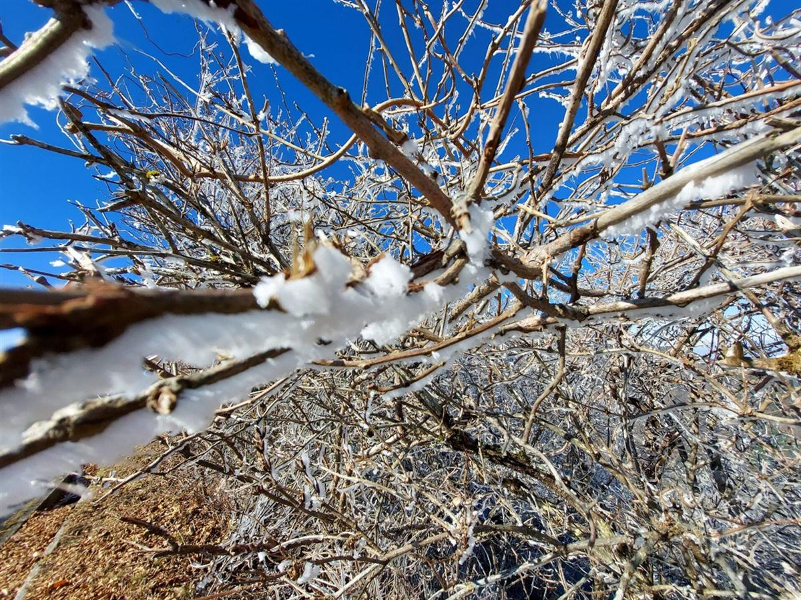
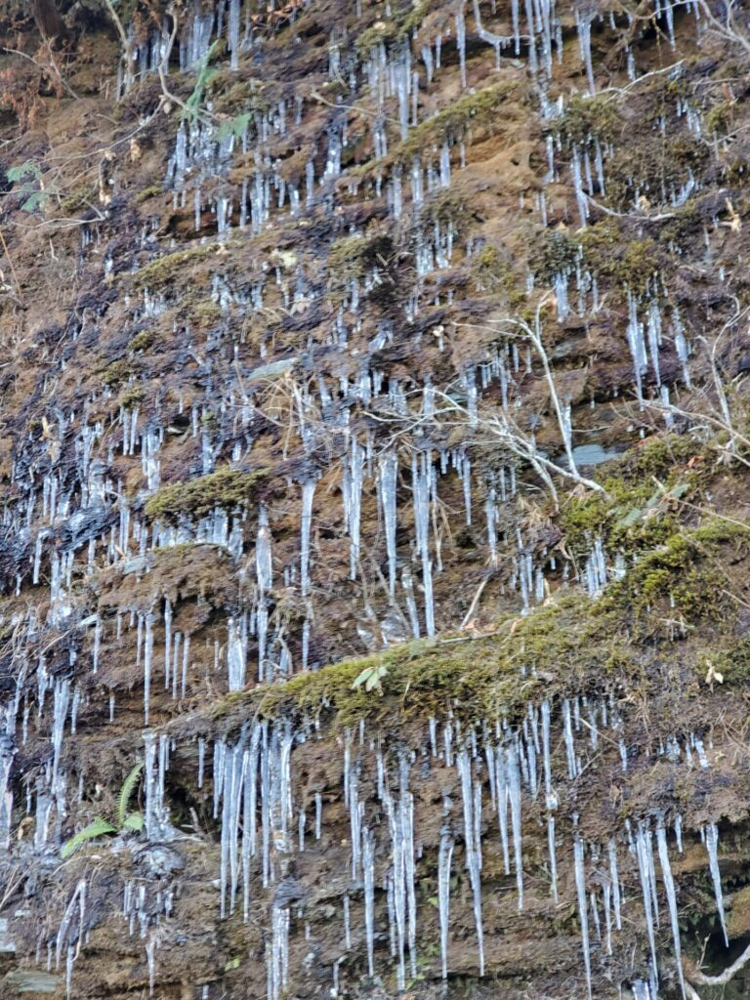
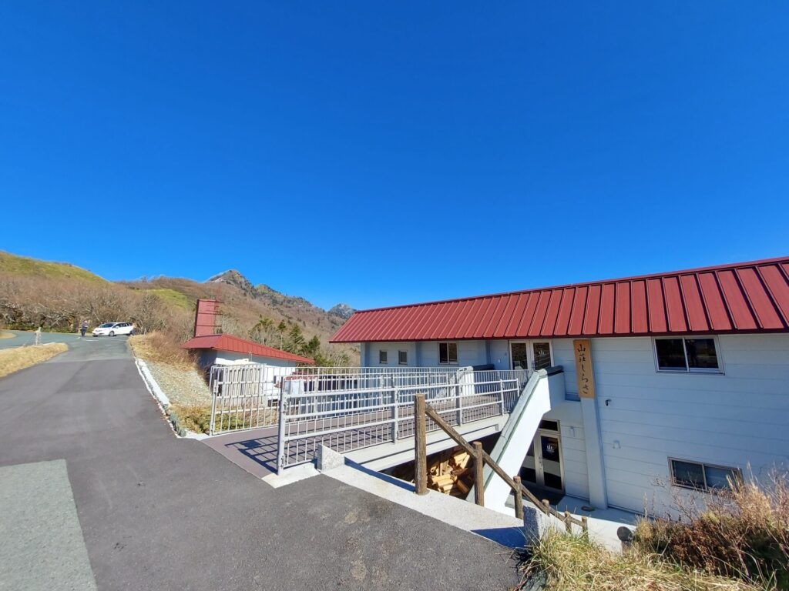
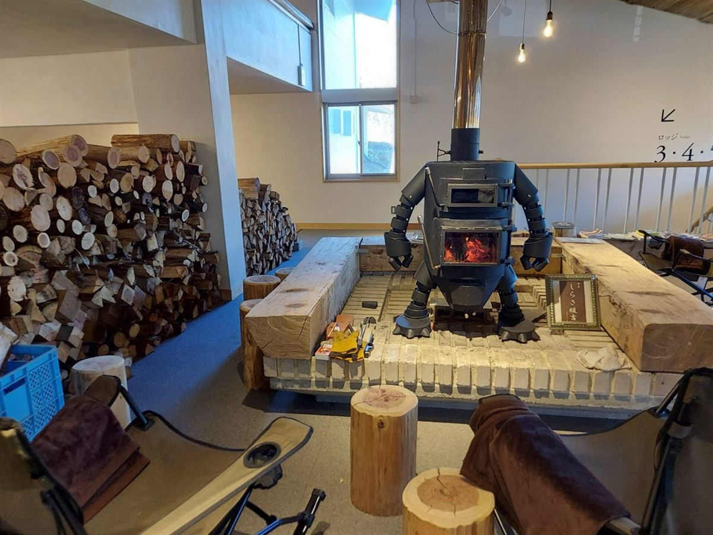

四国の屋根と呼ばれる西日本最高峰・石鎚山系を縫うように走る絶景ロード<strong>「UFOライン（町道瓶ヶ森線）」</strong>。  
某自動車メーカーのテレビCMに起用されて一躍全国区の観光名所となり、現在ではドライブやツーリング、登山客が絶えない人気スポットです。

春の新緑、初夏のアケボノツツジ、秋の燃えるような紅葉と、四季折々にドラマチックな表情を見せてくれますが、<strong>実は「初冬（11月下旬）」の限られたタイミングにしか見られない特別な絶景</strong>があることをご存知でしょうか？

今回は、冬季閉鎖に入る直前の11月下旬に訪れた、<strong>「純白の霧氷と常緑のササ原が織りなす神秘的なUFOライン」</strong>のドライブレポートをお届けします。

---

## UFOライン（町道瓶ヶ森線）とは？

UFOラインの正式名称は「町道瓶ヶ森（かめがもり）線」。愛媛県西条市と高知県いの町の県境付近、標高1,300m〜1,700mの尾根沿いを全長約27kmにわたって貫く山岳観光道路です。

「雄峰（ゆうほう）」の連なる景観からUFOラインと呼ばれるようになり、まるで雲の上を走っているかのような圧倒的な開放感が魅力です。

2018年には菅田将暉さんと中条あやみさんが出演した「トヨタ・カローラスポーツ」のCMロケ地となり、その息をのむ大パノラマが一気に注目を集めました。

当時のCMメイキング映像（[oricon公式YouTubeチャンネル](https://www.youtube.com/channel/UCbZvkG2uAgr6Oiva4FytscQ)より）：

<iframe width="560" height="315" src="https://www.youtube.com/embed/_dWKLytb86c" title="YouTube video player" frameborder="0" allow="accelerometer; autoplay; clipboard-write; encrypted-media; gyroscope; picture-in-picture; web-share" referrerpolicy="strict-origin-when-cross-origin" allowfullscreen loading="lazy" style="max-width: 100%; aspect-ratio: 16 / 9; height: auto; margin: 1.5rem auto; display: block; border-radius: 8px;"></iframe>

空から見下ろす緑の稜線と一本の道路のコントラストは、まさに反則級の美しさです。

---

## 初冬のUFOラインの見どころ：白と緑の奇跡のコントラスト

私が訪れたのは、冬季閉鎖の直前となる<strong>2021年11月28日</strong>。  
麓の愛媛県西条市の天気は快晴で、最低気温2.8度、最高気温12.9度という小春日和でしたが、標高1,500mを超える山上は氷点下の別世界でした。

### 1. 霧氷（むひょう）とササ原のツートンカラー

山頂付近に近づくと、息をのむような光景が広がっていました。  
冷たい風が吹きつける愛媛県側（北面）の木々には純白の「霧氷」がビッシリと付着し、風の当たらない高知県側（南面）には青々としたササ原の緑が残る、見事なツートンカラーのコントラストです。

写真は東黒森（ひがしくろもり）周辺の稜線です。

「霧氷」とは、空気中の過冷却された水滴が、強風によって氷点下の樹木などに衝突し、急速に凍りついてできる氷の結晶のこと。

雪が積もるのとは異なり、風上に向かってエビの尻尾のように氷が成長していくため、木々がまるでガラス細工のように輝いて見えます。

### 2. 岩肌を埋め尽くす大迫力の「つらら」

稜線に向かう道中、岩壁の日陰部分では岩肌からしみ出た湧き水が凍りつき、見上げるほどの巨大な「つららの壁」が出現していました。

平地ではまだ冬の気配が薄い11月下旬に、これほどの本格的な冬の造形美に出会えるのは、高標高の山岳道路ならではの醍醐味です。

---

## 絶景の山小屋カフェ「山荘しらさ」で薪ストーブとスイーツ

瓶ヶ森から石鎚山方面へ車を30分ほど走らせると、大自然の中に佇むモダンな山小屋<strong>「山荘しらさ」</strong>が現れます。

2021年4月に全面リニューアルオープンしたばかりの館内は、木の温もりあふれる洗練された空間。宿泊施設としてのロッジだけでなく、ドライブ途中に立ち寄れる素敵なカフェが併設されています。

### ロボット型薪ストーブ「しらさ暖吉」

カフェの中央には、ユーモラスなロボットの形をした薪ストーブ「しらさ暖吉（だんきち）」が鎮座。パチパチと心地よい音を立てて燃える炎が、冷え切った身体をじんわりと温めてくれます。

### 自家製チーズケーキと至福のカフェラテ

寒風吹きすさぶ中を歩いたあとにいただいたのは、自家製オリジナルチーズケーキと温かいカフェラテ。

濃厚でなめらかなチーズケーキと、薪ストーブの暖かさの中で食べる贅沢。身体の芯まで染み渡る美味しさでした。

カフェではスイーツのほかにも、名物のスープカレーや軽食、ソフトクリームなども楽しめます。UFOラインをドライブする際は絶対に立ち寄りたいオアシスです。

---

## 初冬にUFOラインを訪れる際の「4つの注意点」

晩秋〜初冬のUFOラインは息をのむ絶景に出会える一方、本格的な冬山に足を踏み入れることになります。安全に楽しむために、以下の点には十分注意してください。

### ① 道幅が狭くすれ違いが困難（離合に注意）
UFOラインは全線舗装されていますが、大半の区間が<strong>「車1台分の幅しかない1車線道路（狭隘路）」</strong>です。  
カーブミラーをしっかり確認し、対向車が見えたら早めに待避所（広くなっている場所）で待ちましょう。バック運転に自信がない方は慎重な運転が必要です。

### ② 冬用タイヤ（スタッドレス）の装着が必須
UFOラインの最高標高は約1,700m。平地が10℃以上あっても、山上は氷点下に達し、日陰やトンネル出入口はカチカチに凍結していることがあります。ノーマルタイヤでの走行はスリップ事故の危険があるため、必ずスタッドレスタイヤやチェーンを準備して向かいましょう。

### ③ 霧氷を見るなら「午前中の早い時間帯」が勝負
霧氷は非常に繊細な氷の結晶です。日差しが高くなり気温が上がると、午前11時〜正午頃には風でハラハラと吹き飛ばされ、溶けて消えてしまいます。「青空に映える純白の霧氷」を狙うなら、午前9時〜10時台には現地稜線に到着しておくのがベストです。

### ④ 11月末からの「冬季閉鎖（全面通行止め）」に注意
UFOライン（町道瓶ヶ森線）は、例年<strong>11月下旬〜12月上旬から翌年4月上旬まで</strong>、積雪と凍結のためゲートが閉じられ完全通行止めとなります。年によって閉鎖の開始日は前後するため、出発前には必ずいの町観光協会の道路情報などで最新の通行規制情報を確認してください。

---

## UFOライン・山荘しらさのアクセス情報

### UFOライン（瓶ヶ森）
* <strong>アクセス:</strong>
  - 松山自動車道「いよ西条IC」より車で約1時間20分（寒風山トンネル経由）
  - 高知自動車道「伊野IC」より車で約1時間30分（国道194号経由）

<iframe data-src="https://www.google.com/maps/embed?pb=!1m18!1m12!1m3!1d504565.0312834574!2d133.22006763711263!3d33.81898057260032!2m3!1f0!2f0!3f0!3m2!1i1024!2i768!4f13.1!3m3!1m2!1s0x3551d6fd514327c1%3A0x412031b9eb1af4a1!2zVUZP44Op44Kk44OzKOOBhOOBrueUuumBkyDnk7bjgrHmo67nt5op!5e0!3m2!1sja!2sjp!4v1644027658281!5m2!1sja!2sjp" src="about:blank" width="100%" style="border:0; aspect-ratio: 16 / 10; height: auto;" allowfullscreen loading="lazy" referrerpolicy="no-referrer-when-downgrade"></iframe>

### 山荘しらさ
* <strong>住所:</strong> 〒781-2605 高知県吾川郡いの町寺川175  
* <strong>営業期間:</strong> 4月中旬〜11月下旬（冬季休業あり）  
* <strong>公式HP:</strong> [https://sansoshirasa.com/](https://sansoshirasa.com/)

<iframe data-src="https://www.google.com/maps/embed?pb=!1m14!1m8!1m3!1d75035.26309451651!2d133.16423433926016!3d33.78336150282161!3m2!1i1024!2i768!4f13.1!3m3!1m2!1s0x354e2acfe1bc8c6b%3A0xbaedd1b36ce53568!2z5bGx6I2Y44GX44KJ44GV!5e0!3m2!1sja!2sjp!4v1644031885148!5m2!1sja!2sjp" src="about:blank" width="100%" style="border:0; aspect-ratio: 16 / 10; height: auto;" allowfullscreen loading="lazy" referrerpolicy="no-referrer-when-downgrade"></iframe>

---

## まとめ：初冬の澄んだ空気の中でしか出会えない四国の奇跡

夏の爽快な高原ドライブとして有名なUFOラインですが、観光シーズンがひと段落した<strong>「初冬の静けさと霧氷の絶景」</strong>は、言葉を失うほどの感動がありました。

厳しい寒さの中、山荘しらさの温かい薪ストーブとスイーツでほっと一息つく時間は、まさに大人のドライブ旅の醍醐味です。

しっかりとした防寒装備と冬用タイヤを準備して、ぜひこの季節だけの「天空の白い奇跡」を体感してみてください。
