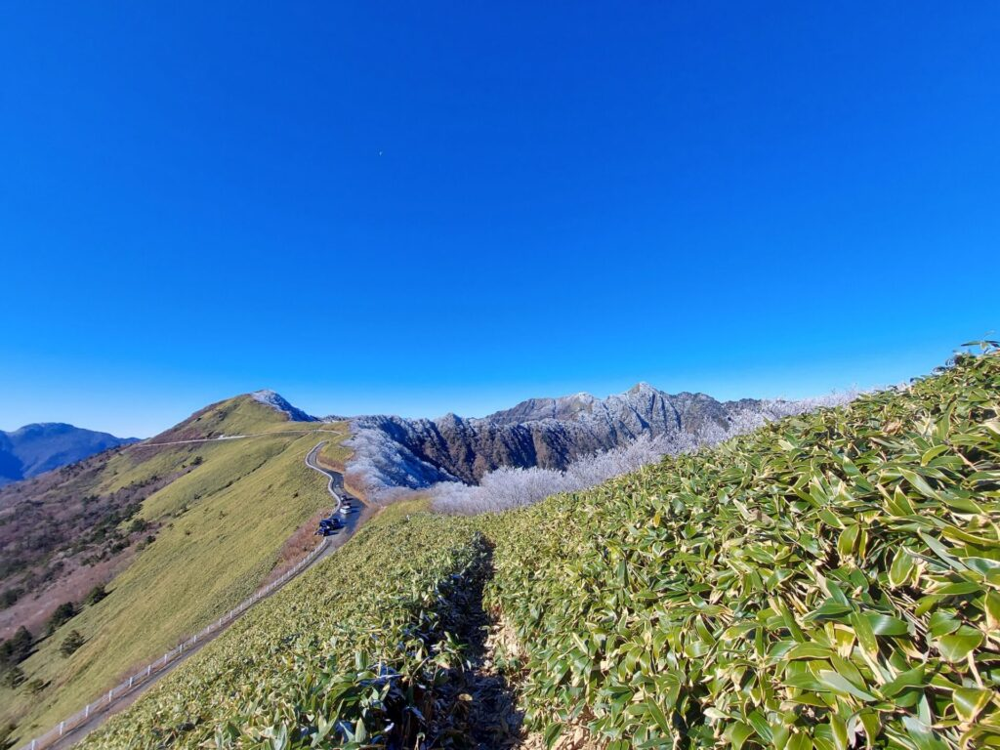
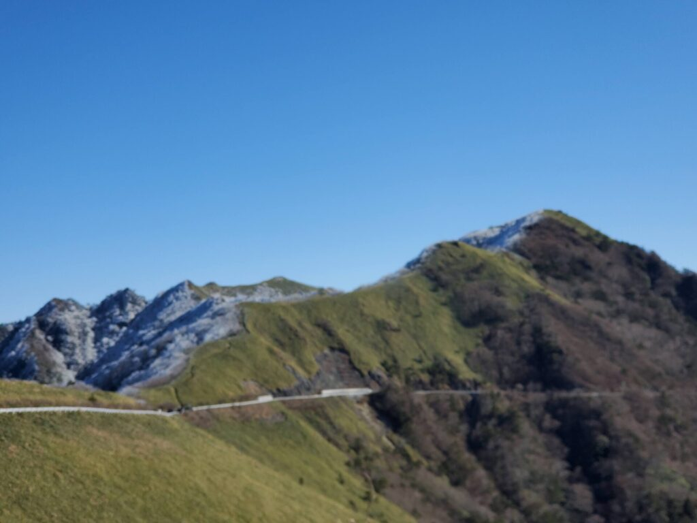
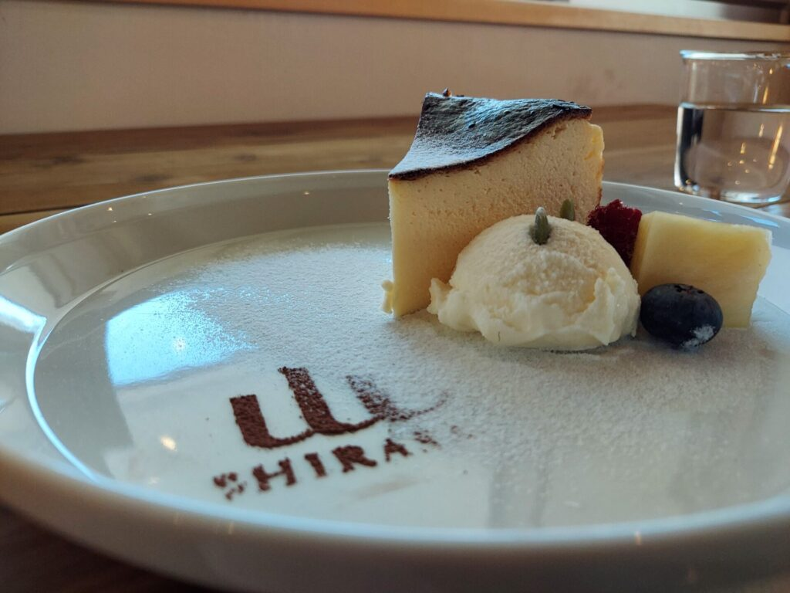

import ProblemBox from '../../../components/ProblemBox.astro';
import ConclusionBox from '../../../components/ConclusionBox.astro';

<ProblemBox>
- 四国の絶景ドライブルート「UFOライン（町道瓶ヶ森線）」のベストシーズンや見どころを知りたい
- 冬季閉鎖（11月末〜4月上旬）直前の道路状況や、標高1,500m級の気温・凍結リスクが心配
- 途中で立ち寄れる山小屋カフェ「山荘しらさ」の雰囲気や、安全に走るための運転動線を把握したい
</ProblemBox>

四国の屋根と呼ばれる西日本最高峰・石鎚山系の険しい尾根沿いを縫うように走る山岳道路<b>「UFOライン（町道瓶ヶ森線）」</b>。

自動車メーカーのCMロケ地として起用されたことで全国的に有名になり、まるで雲の上を突き抜けるような圧倒的なパノラマビューは「四国の天空ロード」と称されています。

新緑の春や紅葉の秋が人気ですが、実は<b>「11月下旬の冬季閉鎖直前」にしか見られない幻の絶景</b>が存在します。

それが、氷点下の寒風が生み出す<b>「純白の霧氷（むひょう）」と、笹原の「鮮やかな緑」が織りなす奇跡のツートンカラー</b>です。

今回は、冬季閉鎖直前のUFOラインを実際にドライブし、神秘的な霧氷の景色、リニューアルした「山荘しらさ」での薪ストーブカフェ体験、そして安全に走破するための必須注意点を詳しくレポートします。

---

## UFOライン（町道瓶ヶ森線）の概要とアクセス

UFOラインは、愛媛県西条市と高知県いの町の県境、<b>標高1,300m〜1,700mの稜線沿いを貫く全長約27kmの山岳道路</b>です。

| 項目 | 道路仕様・特徴 |
| :--- | :--- |
| <b>正式名称</b> | いの町道瓶ヶ森線（旧瓶ヶ森林道） |
| <b>通行料金</b> | <b>完全無料</b>（一般車両通行可） |
| <b>冬季閉鎖期間</b> | <b>例年11月下旬〜翌年4月上旬まで全面通行止め</b> |
| <b>道路状況</b> | 全線舗装済みだが、幅員が狭い1〜1.5車線区間が多くすれ違い注意 |

---

## 初冬のハイライト：純白の「霧氷」と常緑のササ原が描くコントラスト

麓の西条市では最高気温13度前後の小春日和でしたが、標高1,500mを超える尾根に登ると気温はマイナスに突入。
稜線に到達した瞬間、息をのむような美しい光景が目の前に広がりました。

<figure>

<figcaption>北風が吹きつける北斜面は白銀の霧氷、南斜面は緑の笹原という幻想的なツートンカラー</figcaption>
</figure>

空気中の水蒸気が氷点下の強風で樹木に吹き付けられて氷結する「霧氷」。
まるで白いサンゴ礁のように枝葉を覆い尽くし、太陽の光を浴びてキラキラと輝きます。緑の稜線と一本の舗装路、そして青空とのコントラストは、この時期の晴天日にしか拝めない究極の絶景です。

<figure>

<figcaption>空に吸い込まれるような天空のワインディングロードを走る快感</figcaption>
</figure>

---

## 絶景のオアシス「山荘しらさ」の薪ストーブカフェで温まる

冷え切った体を温めるために立ち寄ったのが、標高1,400m地点にある山小屋<b>「山荘しらさ」</b>です。

<figure>

<figcaption>モダンにリノベーションされた木の温もりあふれるカフェ空間</figcaption>
</figure>

パチパチと薪がはぜるストーブのそばでいただく淹れたてのホットコーヒーと自家製スイーツは格別の味わい。大きな窓から石鎚山の山並みを眺めながら、極上の山時間を堪能できます。

---

## 【安全運転のアドバイス】初冬ドライブの3大注意点

美しい絶景の裏側で、初冬のUFOラインは<b>「命に関わるリスク」</b>と隣り合わせです。

### 1. 朝晩の日陰は「ブラックアイスバーン」に厳重警戒
標高1,500mを超えるため、日中でも日陰やトンネル出入口は路面が凍結している危険があります。スタッドレスタイヤの装着はもちろん、急ブレーキ・急ハンドルを避けた慎重なスピードコントロールが不可欠です。

### 2. 狭路でのすれ違い（離合）マナーを守る
全線の大部分がガードレールのない崖沿いの1〜1.5車線です。対向車が来たら無理に突っ込まず、手前の待避所（広くなった路肩）で確実に停止して譲り合う余裕を持ちましょう。

### 3. ガソリン残量とトイレポイントの事前確認
山頂エリアにはガソリンスタンドが一切ありません。山道の上り坂は燃費が大幅に悪化するため、麓の街（西条市またはいの町）で<b>満タン給油</b>してから登り始める動線を徹底してください。

---

## まとめ

初冬のUFOラインは、<b>「四季の境界線でしか出会えない、大自然の奇跡を五感で味わう絶景ドライブ」</b>です。

<ConclusionBox>
- <b>白と緑の奇跡</b>: 11月下旬の閉鎖直前だけに見られる霧氷と笹原のコントラスト
- <b>完全無料の天空ロード</b>: 尾根沿いを走る約27kmの大パノラマを満喫
- <b>山荘しらさでひと息</b>: 薪ストーブの暖炉カフェで冷えた体を癒やす
- <b>凍結と狭路には細心の注意</b>: スタッドレス装着・満タン給油・対向車譲り合いを徹底
</ConclusionBox>

四国の山岳が誇る圧倒的なスケールを体感したい方は、ぜひ道路情報を確認の上、万全の防寒・安全装備で訪れてみてください。
