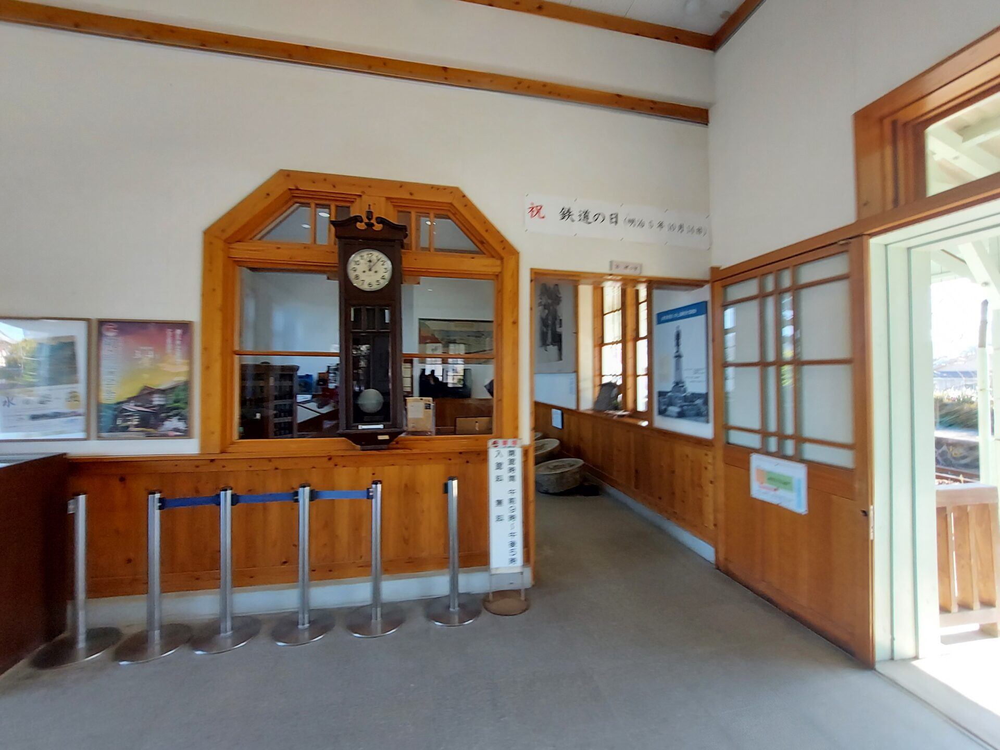
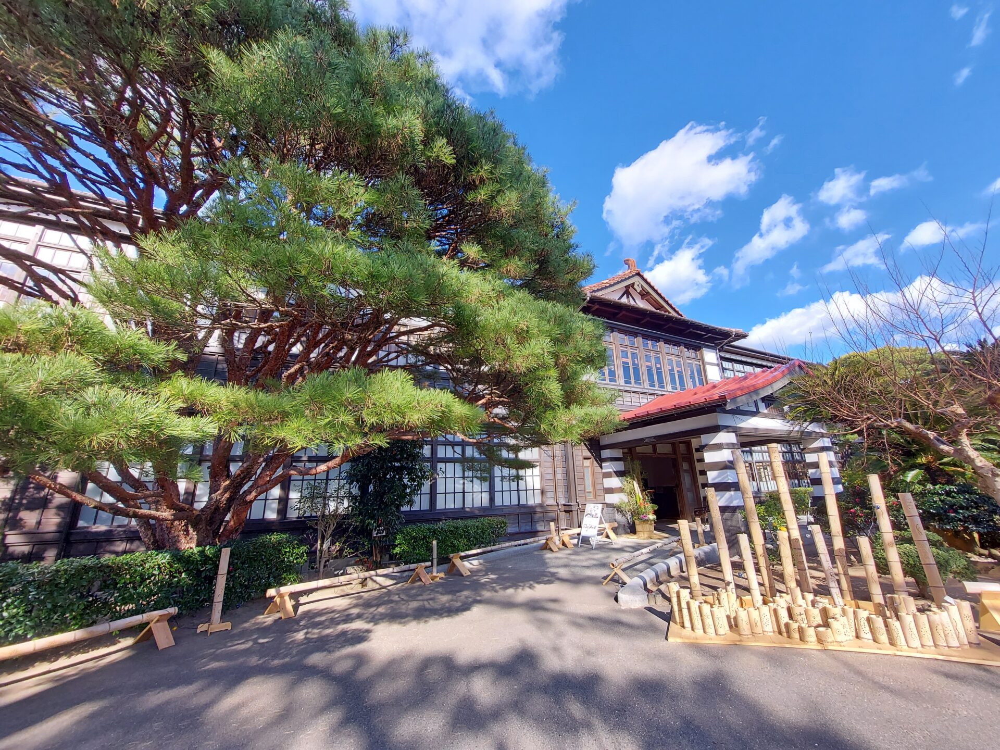
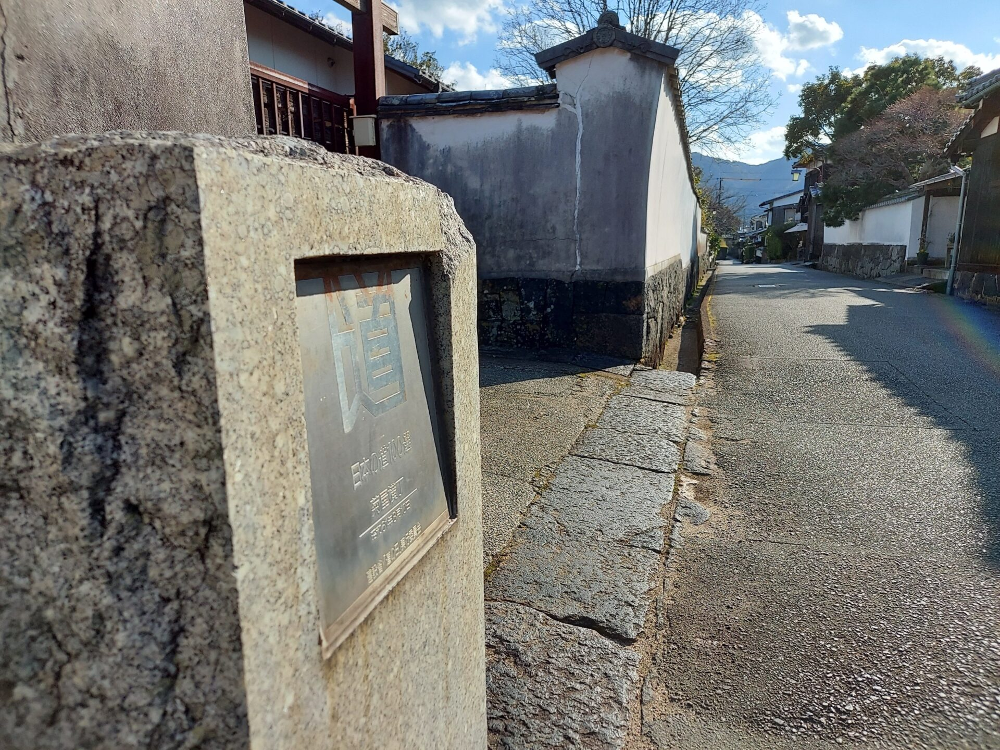
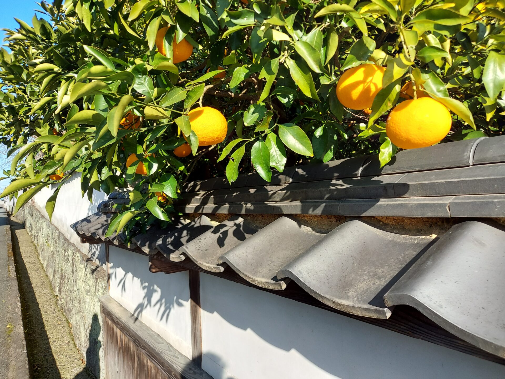
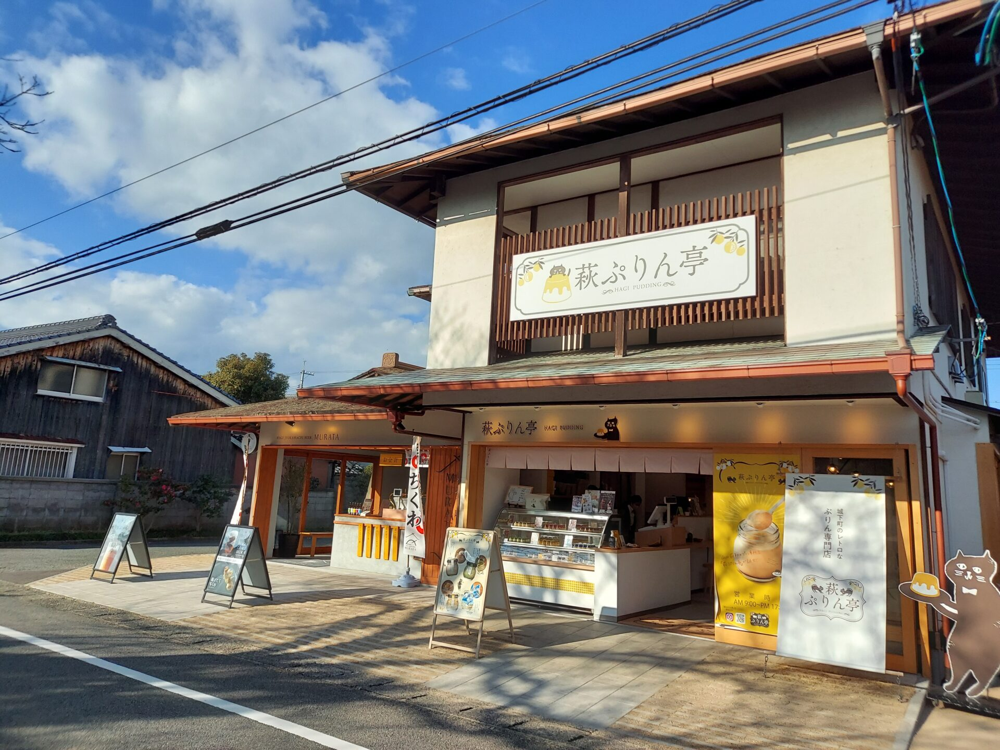
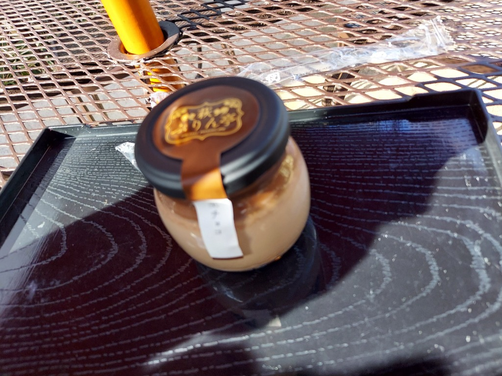
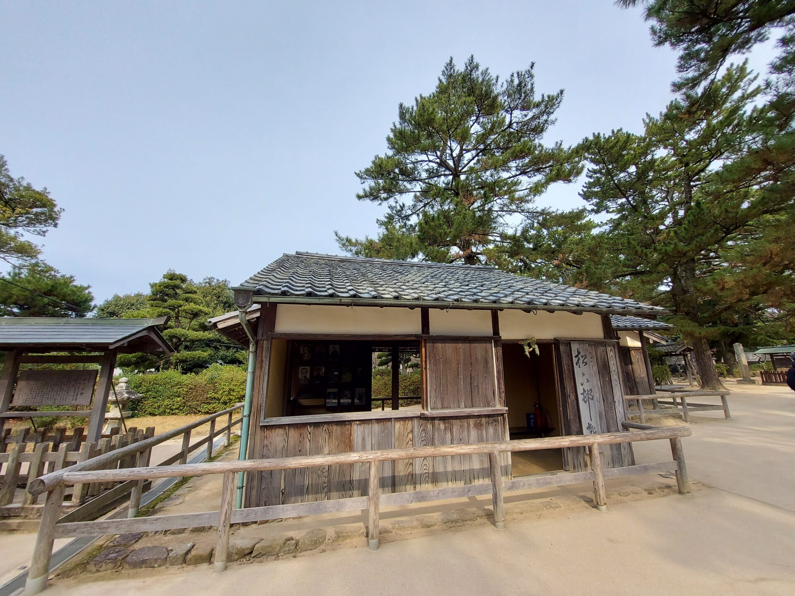
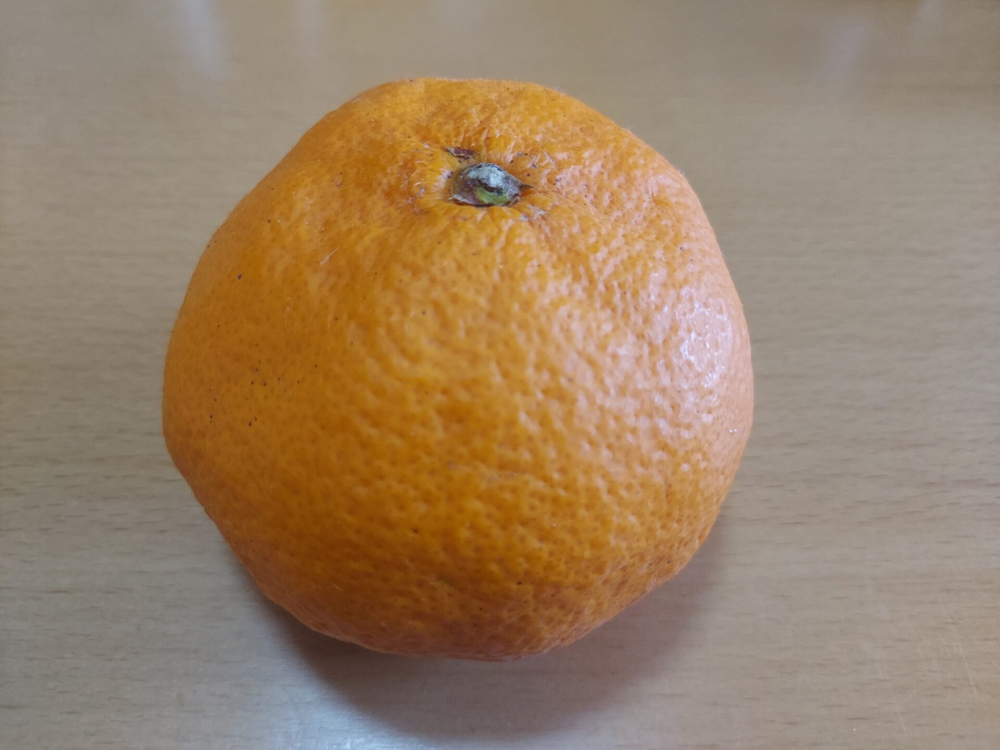
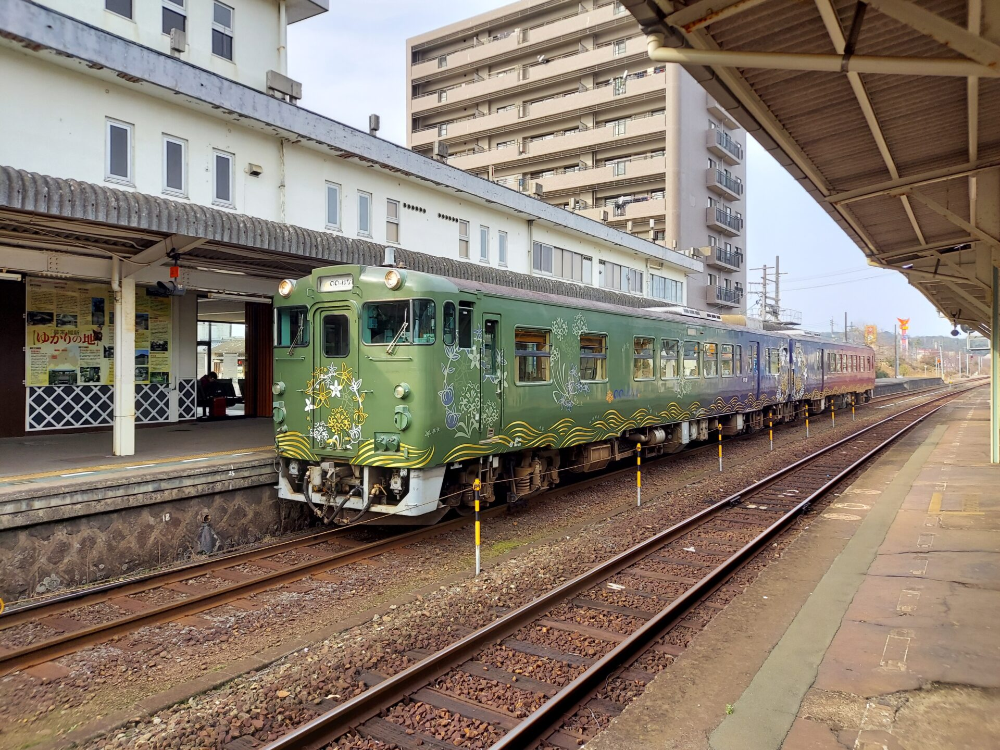

## 観光列車「○○のはなし」で萩駅に到着！

下関駅から観光列車で萩駅に到着！  
○○のはなしは一駅先の東萩駅行きですが、萩駅の駅舎を見たかったのでここでおります！

○○のはなしは、乗車券のほかに、530円の指定席券を買えば乗ることができます！  
車窓に流れる日本海を見ながら、3時間ほどの列車旅です。

👉 関連記事：[【530円で乗れる観光列車】○○のはなし乗車記（下関〜東萩）](/blog/marumarunohanashi-joushaki-2022-01-08/)

## 登録有形文化財　萩駅舎を見学

萩駅舎は1996年に国の登録有形文化財に登録されました。  
1925年（大正14年）に美祢線の終着駅として

## 市内巡回バスで、萩・明倫学舎へ

明倫学舎は木造校舎です。  
藩校明倫館の流れを汲む明倫小学校の校舎として、2014年まで授業が行われていました。

１号館は無料で見学できます。２号館は大人200円です。  
今回は時間の都合で、無料の１号館だけでしたが、充分満足できました。

校舎横の武道館です。中に入って見学することができます。  
剣道場と薙刀場が併設されています。

## 城下町観光

明倫学舎を後にし、歩くこと15分

## 萩プリン亭でおやつ

萩の城下町にある萩プリン亭

<table border="0" cellpadding="0" cellspacing="0"><tr><td>
<table><tr><td style="width:240px"></td><td style="vertical-align:top;width:248px;display: block;">
<a href="https://hb.afl.rakuten.co.jp/ichiba/579b6813.9aa06a7b.579b6814.2c99ece5/?pc=https%3A%2F%2Fitem.rakuten.co.jp%2Ff352047-hagi%2F352047000644%2F&link_type=picttext&ut=eyJwYWdlIjoiaXRlbSIsInR5cGUiOiJwaWN0dGV4dCIsInNpemUiOiIyNDB4MjQwIiwibmFtIjoxLCJuYW1wIjoicmlnaHQiLCJjb20iOjEsImNvbXAiOiJkb3duIiwicHJpY2UiOjEsImJvciI6MSwiY29sIjoxLCJiYnRuIjoxLCJwcm9kIjowLCJhbXAiOmZhbHNlfQ%3D%3D" target="_blank" rel="nofollow sponsored noopener" style="word-wrap:break-word;">【ふるさと納税】萩ぷりん亭定番セット（6個入）</a>価格：14,000円（税込、送料無料) (2026/9/17時点)

<a href="https://hb.afl.rakuten.co.jp/ichiba/579b6813.9aa06a7b.579b6814.2c99ece5/?pc=https%3A%2F%2Fitem.rakuten.co.jp%2Ff352047-hagi%2F352047000644%2F%3Fscid%3Daf_pc_bbtn&link_type=picttext&ut=eyJwYWdlIjoiaXRlbSIsInR5cGUiOiJwaWN0dGV4dCIsInNpemUiOiIyNDB4MjQwIiwibmFtIjoxLCJuYW1wIjoicmlnaHQiLCJjb20iOjEsImNvbXAiOiJkb3duIiwicHJpY2UiOjEsImJvciI6MSwiY29sIjoxLCJiYnRuIjoxLCJwcm9kIjowLCJhbXAiOmZhbHNlfQ==" target="_blank" rel="nofollow sponsored noopener" style="word-wrap:break-word;">
 楽天で購入 
</a>
</td></tr></table>
 

</td></tr></table>

## 維新の遺産　萩反射炉を見学

反射炉といえば、伊豆の反射炉を思い浮かべる人が多いかと思いますが、  
ここ萩にも反射炉があります。

## 本日の旅館「萩小町」へ！

東萩駅にお迎えに来ていただき、本日のお宿「夕景の宿 海のゆりかご萩小町」へ！  
海が見えて、比較的リーズナブルな価格であったので、こちらのお宿を選択しました。

👉 関連記事：[【宿泊レビュー】夕景の宿 海のゆりかご 萩小町](/blog/hagi-komachi-yamaguchi/)

# 二日目

## 名産 萩焼を体験

## 松陰神社でお参り

松陰神社

松下村塾として、幕末の志士たちが学んでいた

## 東萩駅からレンタサイクル

東萩駅前にあるスマイル貸自転車さんで自転車をレンタル！  
循環バスがあるとは言え、30分に1本とそれほど頻繁ではないので、予定外のサイクリング。  
電動が300円/h、ノーマルが200円/hでした。  
レンタサイクルを利用した人は、無料で手荷物を預けることができます。

## 道の駅 萩しーまーとでお買い物＆腹ごしらえ

東萩駅から10分足らずで道の駅に到着  
しーまーと内にある維新亭でお食事！ランチ定食をいただきました。

道の駅内部では、おみやげ・青果などが売っていました。  
萩の名産 夏みかんを購入しました。

実がしっかりとしていて食べ応えがありました。

## ティータイム

町のスイーツ屋さんうきしま工房でティータイム！

チーズケーキとコーヒーをいただきました。

後から気づいたのですが、○○のはなしで予約購入できるスイーツセットは、こちらのうきしま工房さんのものでした。

<table border="0" cellpadding="0" cellspacing="0"><tr><td>
<table><tr><td style="width:240px"></td><td style="vertical-align:top;width:248px;display: block;">
<a href="https://hb.afl.rakuten.co.jp/ichiba/579b64b5.23e3efd9.579b64b6.f316005c/?pc=https%3A%2F%2Fitem.rakuten.co.jp%2Fukishimahagi%2F10000001%2F&link_type=picttext&ut=eyJwYWdlIjoiaXRlbSIsInR5cGUiOiJwaWN0dGV4dCIsInNpemUiOiIyNDB4MjQwIiwibmFtIjoxLCJuYW1wIjoicmlnaHQiLCJjb20iOjEsImNvbXAiOiJkb3duIiwicHJpY2UiOjEsImJvciI6MSwiY29sIjoxLCJiYnRuIjoxLCJwcm9kIjowLCJhbXAiOmZhbHNlfQ%3D%3D" target="_blank" rel="nofollow sponsored noopener" style="word-wrap:break-word;">洋菓子セット 11個入り#だいだいカトルカール #うきしまーる(はちみつ・レモ...</a>価格：3,120円（税込、送料別) (2026/9/17時点)

<a href="https://hb.afl.rakuten.co.jp/ichiba/579b64b5.23e3efd9.579b64b6.f316005c/?pc=https%3A%2F%2Fitem.rakuten.co.jp%2Fukishimahagi%2F10000001%2F%3Fscid%3Daf_pc_bbtn&link_type=picttext&ut=eyJwYWdlIjoiaXRlbSIsInR5cGUiOiJwaWN0dGV4dCIsInNpemUiOiIyNDB4MjQwIiwibmFtIjoxLCJuYW1wIjoicmlnaHQiLCJjb20iOjEsImNvbXAiOiJkb3duIiwicHJpY2UiOjEsImJvciI6MSwiY29sIjoxLCJiYnRuIjoxLCJwcm9kIjowLCJhbXAiOmZhbHNlfQ==" target="_blank" rel="nofollow sponsored noopener" style="word-wrap:break-word;">
 楽天で購入 
</a>
</td></tr></table>
 

</td></tr></table>

## 東萩駅から「○○のはなし」で下関へ

東萩駅から再び○○のはなしに乗って下関へ！  
旅の思い出をかみしめながら、電車に揺られます。旅の余韻がいいですね。

## 今回紹介した施設一覧

| 施設名 | 住所 | ホームページ |
| --- | --- | --- |
| 萩駅 | 萩市椿 |  |
| 東萩駅 | 萩市椿東 |  |
| 萩・明倫学舎 | 萩市江向６０２ | [http://hagimeirin.jp/](http://hagimeirin.jp/) |
| 萩城下町 | 萩市呉服町１丁目 | [https://www.city.hagi.lg.jp/site/sekaiisan/h6080.html](https://www.city.hagi.lg.jp/site/sekaiisan/h6080.html) |
| 萩プリン亭 | 萩市呉服町２丁目 １０番地 | [https://hagi-purin.com/](https://hagi-purin.com/) |
| 萩しーまーと | 萩市椿東 416061 | [http://seamart.axis.or.jp/](http://seamart.axis.or.jp/) |
| 維新亭 | 萩市椿東 416061 | [http://seamart.axis.or.jp/contents/food/ishintei.html](http://seamart.axis.or.jp/contents/food/ishintei.html) |
| ○○のはなし |  | [https://www.hagishi.com/post-427/](https://www.hagishi.com/post-427/) |
| 夕景の宿 萩小町 | 萩市椿東 越ヶ浜6509 | [http://www.hagi-komachi.jp/](http://www.hagi-komachi.jp/) |
