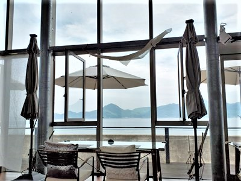
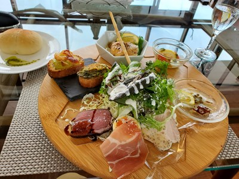
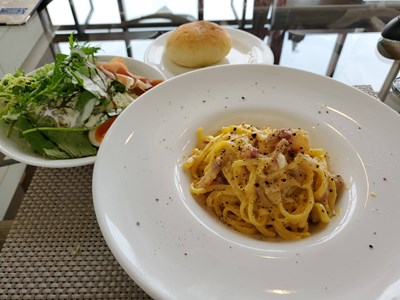

import ProblemBox from '../../../components/ProblemBox.astro';
import ConclusionBox from '../../../components/ConclusionBox.astro';

<ProblemBox>
- 広島・しまなみ海道や三原周辺で、海の景色を眺めながら優雅にランチができるお店を探している
- デートや記念日、ドライブの途中で立ち寄れるオシャレなオーシャンビューレストランを知りたい
- 「リストランテ・ゾーナ・フォルトゥナート」のランチメニューや混雑状況、料理のクオリティを把握したい
</ProblemBox>

穏やかな青い海と多島美が広がる広島県・瀬戸内海沿い。

国道185号線の海岸線沿いに佇む<b>「リストランテ・ゾーナ・フォルトゥナート（Ristorante Zona Fortunato）」</b>は、大きなガラス窓から瀬戸内海を一望できる全席オーシャンビューの絶景イタリアンです。

三原のタコや広島産の牡蠣、近郊の新鮮な野菜など、瀬戸内の恵みをぎっしり詰め込んだワンプレートランチは、見た目の美しさと本格的な味わいで地元でも高い人気を誇ります。

今回は、休日のドライブで実際に訪れたランチの様子、看板メニューの「おまかせランチプレート」の味わい、そしておすすめの訪問時間帯やドライブ動線を詳しくレポートします。

---

## 全席オーシャンビュー！海の上に浮かぶような開放的な空間

エントランスをくぐると、一面のガラス窓の向こうにキラキラと輝く瀬戸内海が広がります。

<figure>

<figcaption>どの席に座っても瀬戸内海と島々を望める贅沢なパノラマ空間</figcaption>
</figure>

白を基調とした洗練されたインテリアと高い天井が心地よく、まるでリゾート地のホテルのような特別感を味わえます。
カップルのデートや女子会、家族での記念日ランチに最適な落ち着いた雰囲気です。

---

## 瀬戸内の味覚が凝縮！名物「おまかせランチプレート」

ランチタイムには、パスタやリゾットのほか、訪れる人の半数以上が注文する看板メニュー<b>「おまかせランチ（税込約1,980円）」</b>が用意されています。

<figure>

<figcaption>三原・竹原・呉など近隣の厳選食材を使った豪華ワンプレート</figcaption>
</figure>

大きなお皿の上に、多種多様な前菜や肉・魚料理が美しく盛り付けられて登場します。

- **広島産牡蠣のトースト**: ミルキーで濃厚な牡蠣と香ばしいガーリックソースが絶品
- **三原産タコのマリネ**: プリプリの弾力と爽やかな酸味が海辺のランチにぴったり
- **自家製ローストビーフ＆熟成鶏の香草焼き**: 柔らかくジューシーで食べ応え抜群
- **新鮮な地元野菜のサラダ＆スープ**: 素材の甘みが引き立つ丁寧な仕込み

彩り豊かな小鉢が並び、女性はもちろん、しっかり食べたい男性でも大満足のボリューム感です。

<figure>

<figcaption>単品パスタも本格派。コク深いチーズとブラックペッパーのバランスが絶妙</figcaption>
</figure>

---

## 【ドライブ・生活動線】アクセスと訪問時のコツ

### 1. 13:00以降の「レイトランチ」が狙い目
人気店のため、週末の11:30〜12:30は満席になることが多いです。予約をしていない場合は、<b>少し時間をずらして13:00〜13:30頃に訪れる</b>と、待たずにスムーズに海側の特等席へ案内してもらいやすくなります。

### 2. しまなみ海道や尾道観光とのセット動線が最適
尾道市街や竹原の街並み保存地区、しまなみ海道のドライブコースから車で20〜30分圏内です。ドライブのちょうど良い中継地点としてランチ動線に組み込むのがおすすめです。

---

## まとめ

リストランテ・ゾーナ・フォルトゥナートは、<b>「瀬戸内の絶景と地産地消の絶品イタリアンを、リーズナブルに堪能できる名店」</b>です。

<ConclusionBox>
- <b>全席オーシャンビュー</b>: 目の前に広がる瀬戸内海の多島美を眺めながら優雅に食事
- <b>おまかせランチが圧倒的人気</b>: 牡蠣・タコ・ローストビーフなど旬の食材をワンプレートで
- <b>デートや女子会に最適</b>: 白を基調としたリゾート感ある空間で特別な時間を演出
- <b>ピークを外して来店</b>: 週末は13時以降を狙うとゆったり絶景シートを満喫できる
</ConclusionBox>

広島・三原方面へドライブや旅行に出かける際は、ぜひ海沿いの絶景ランチを楽しんでみてください。
