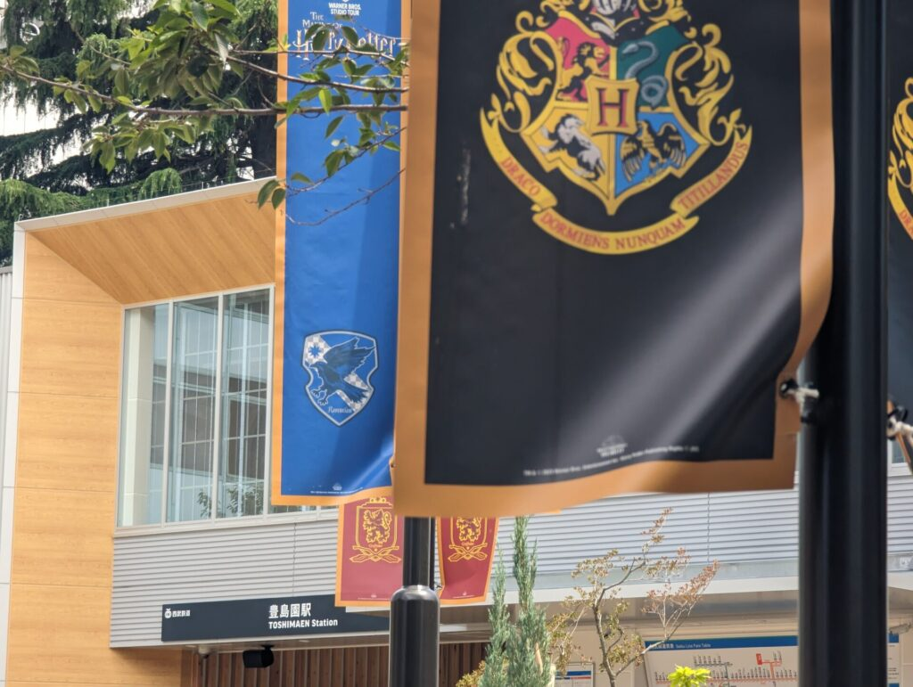
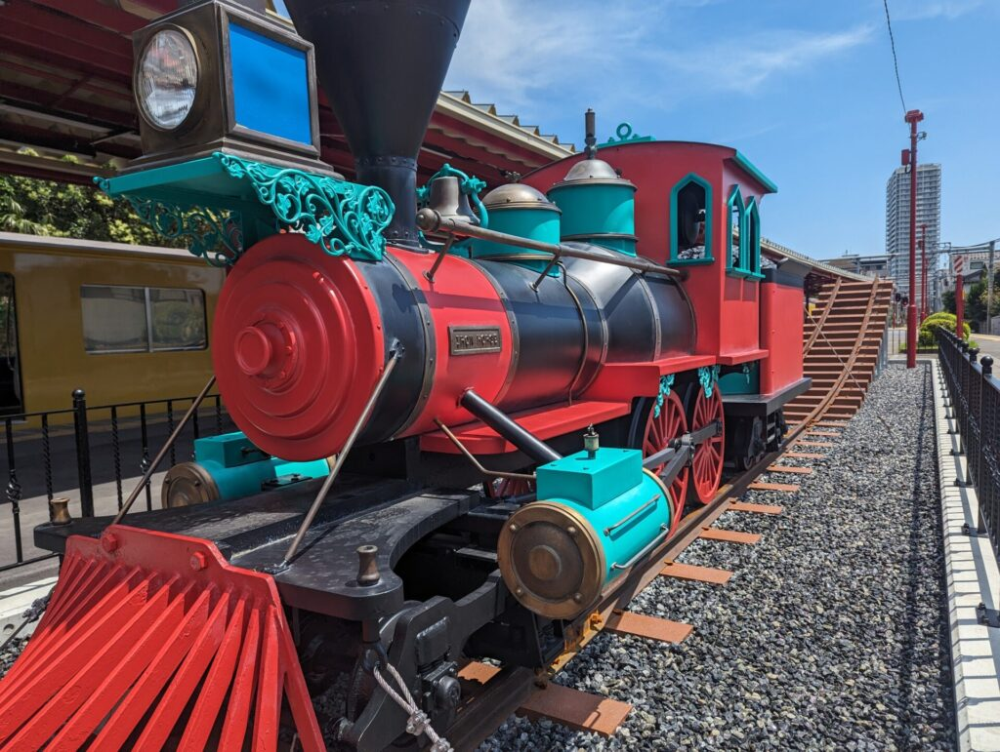
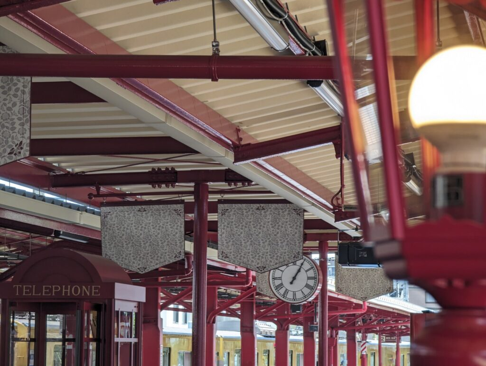
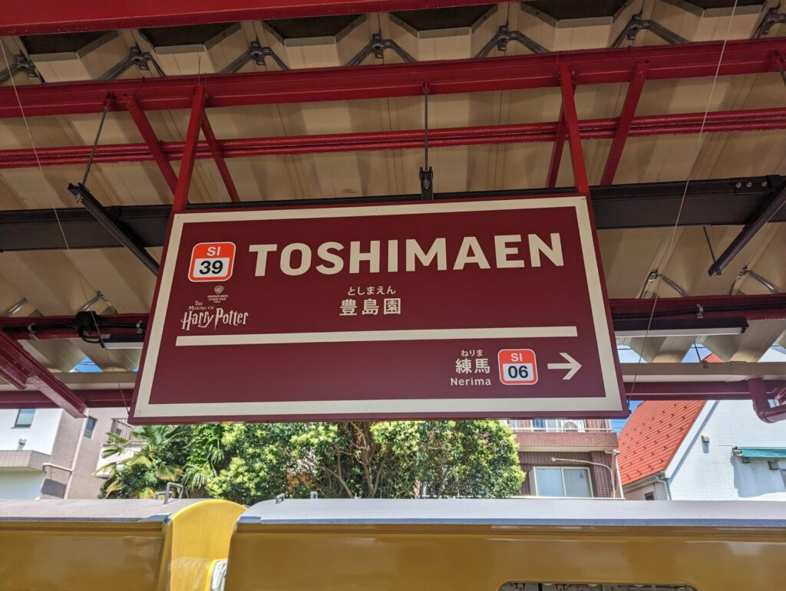
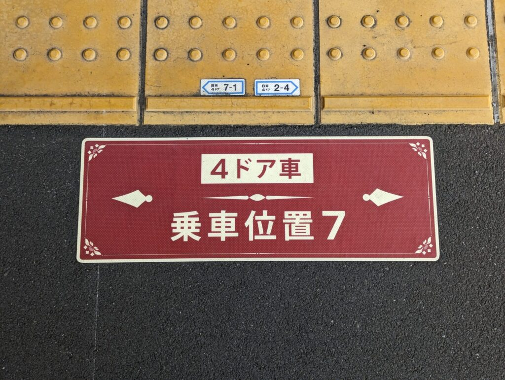
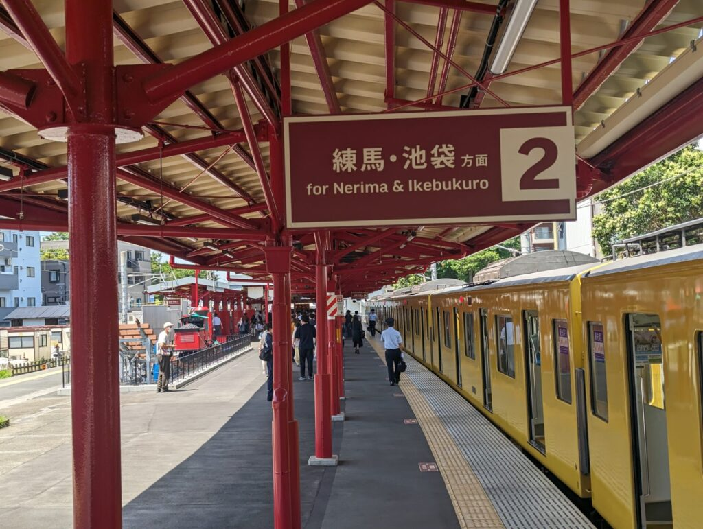
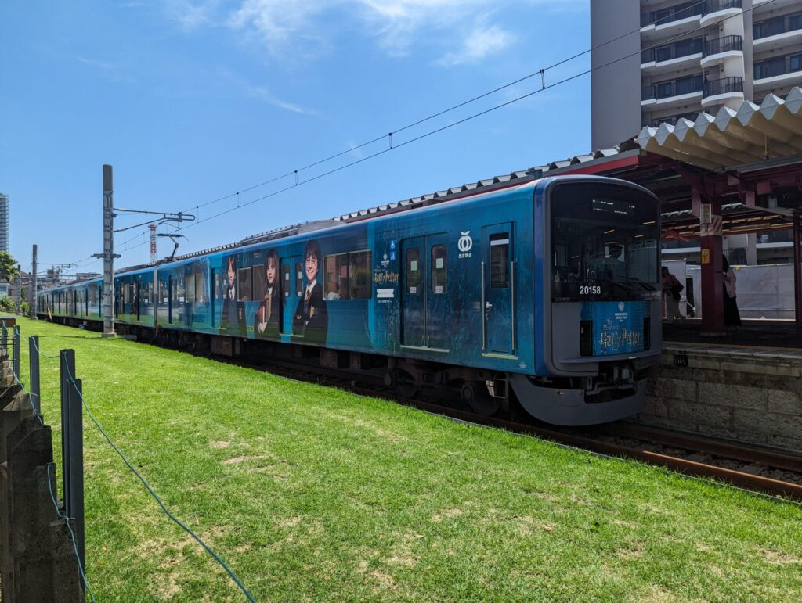
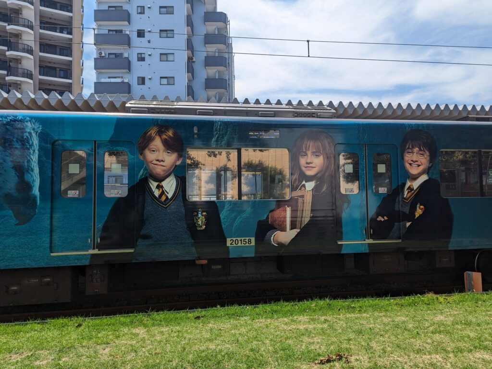
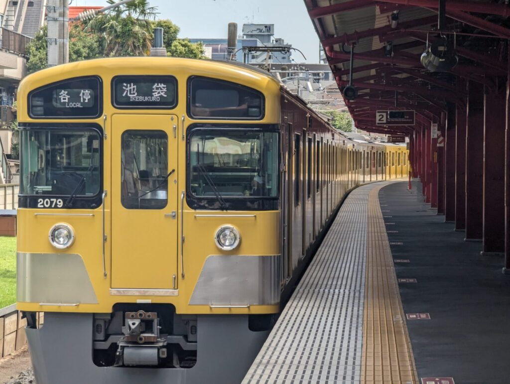

2023年6月16日、東京・としまえん跡地に世界最大の屋内型ハリー・ポッター施設<strong>「ワーナー ブラザース スタジオツアー東京 – メイキング・オブ・ハリー・ポッター」</strong>がついにグランドオープンしました。

世界中のポッターヘッズ（ハリポタファン）が熱い視線を注ぐ中、スタジオツアー本編と同じくらい注目を集めているのが、最寄り駅である<strong>西武豊島線「豊島園駅」の全面リニューアル</strong>です。

開園に合わせて駅全体が映画『ハリー・ポッター』シリーズに登場する<strong>「ホグズミード駅」</strong>をイメージしたデザインに大改装され、電車を降りた瞬間から魔法界へ足を踏み入れたかのような圧倒的な世界観が広がっています。

今回はオープン直後の豊島園駅を訪れ、駅前広場からホームの隠れ演出、運良く遭遇できたフルラッピング電車まで、写真たっぷりで現地レポートをお届けします！

---

## 豊島園駅の駅前広場：緑豊かな魔法界のプロムナード

改札を出ると、かつてのとしまえんの面影を残しつつ、美しく整備された開放的な駅前広場が広がっています。

広場の上空にはカラフルな祝祭のガーランド（旗）が風にはためき、新設された芝生エリアや舗装路がスタジオツアー東京のエントランスへと自然に導いてくれます。

駅舎の外観も落ち着いた木目調とダークトーンに統一されており、スタジオツアーへ向かう来場者のワクワク感を一気に高めてくれます。

---

## ホームに降り立った瞬間から「ホグズミード駅」！

豊島園駅の真骨頂は、なんといっても<strong>ホーム（プラットホーム）の徹底的な演出</strong>です。

西武鉄道がイギリスの歴史的な鉄道駅や映画のセットを参考に改修したホームは、赤を基調とした鉄骨の梁やアンティーク調の街灯、木製ベンチが並び、まるでスコットランドの高地にある「ホグズミード駅」に降り立ったかのような錯覚を覚えます。

### ① 魔法省へつながる「ロンドンの赤い電話ボックス」

ホーム上を歩いていると、ひときわ目を引くのが英国レトロな<strong>「真っ赤な電話ボックス」</strong>です。

ファンならピンとくるはず！映画『ハリー・ポッターと不死鳥の騎士団』で、ハリーがアーサー・ウィーズリーと一緒にロンドンにある「魔法省」へ潜入する際に使った来客用エントランスの電話ボックスを彷彿とさせます。
扉を開けて中に入って記念撮影ができる絶好のフォトスポットになっています。

### ② 壁から飛び出す「魔法列車（ホグワーツ特急）」のモニュメント

さらにホームの端へ進むと、煉瓦造りの壁から蒸気機関車が飛び出してきたかのような大迫力のモニュメントが設置されています。

深紅の車体に金色のエンブレムが輝くその姿は、まさにホグワーツ魔法魔術学校へと生徒たちを運ぶ「ホグワーツ特急」。煙室扉のディテールまで精巧に作り込まれており、電車を待つ間も退屈する暇がありません。

---

## 細部までこだわり抜かれた案内サイン＆駅名標

豊島園駅の魅力は、大きなモニュメントだけではありません。日常の鉄道設備も余すところなくハリポタ仕様にカスタマイズされています。

### ホグズミード風フォントの駅名標

ホームの柱や壁に掲げられた駅名標（駅名板）は、映画の世界観に合わせたクラシカルな専用フォントが採用されています。

ローマ字表記「Toshimaen」の下には、英語のクラシック調フォントでサブタイトルが添えられており、駅名標の前で写真を撮る人が列を作っていました。

### レトロな時計と乗車位置案内

ホーム中央の柱には、真鍮のような風合いを持つレトロなアナログ両面時計が設置されています。

足元の乗車位置案内や矢印サインも、通常の西武線とは異なる専用のカラーリングとフォントでデザインされています。

まさに「駅全体がアトラクションの一部」と言っても過言ではない完成度です。

---

## 遭遇できたら超ラッキー！「スタジオツアー東京 エクスプレス」

豊島園駅のホームで撮影を楽しんでいると、運良く特別な列車が入線してきました！

西武鉄道が運行する特別ラッピング電車<strong>「スタジオツアー東京 エクスプレス（西武20000系 3編成限定）」</strong>です。

車体全体がフルラッピングされており、ハリー、ロン、ハーマイオニーの主要キャラクターをはじめ、劇中に登場する魔法動物「ヒッポグリフ（バックビーク）」や禁じられた森のビジュアルが美しくプリントされています。

車体のベースカラーはシックなナイトブルー。ホグズミード風の豊島園駅ホームに停車している姿は、まるで映画のワンシーンを切り取ったかのような圧倒的な存在感でした。

もちろん、西武線の伝統的な「黄色い電車」との並びも、日常と魔法界が交差する東京ならではのユニークな光景で味わい深いものがあります。

---

## 豊島園駅を楽しむための訪問Tips

スタジオツアー東京に行く予定がある方へ、豊島園駅を120%満喫するためのアドバイスです。

1. <strong>ツアー予約時間の「30分〜45分前」に駅へ到着するのがおすすめ</strong>  
   改札内ホームの電話ボックスやモニュメント、駅名標は人気のフォトスポットのため、時間帯によっては撮影の順番待ちができます。時間に余裕を持って向かうと、ゆっくり写真が撮れます。
2. <strong>池袋駅の「1番・2番ホーム（キングスクロス駅風）」も要チェック</strong>  
   西武池袋駅の豊島園行きが発着する1・2番ホームも、ロンドンの「キングスクロス駅」をモチーフにレンガ調にリニューアルされています。池袋駅から豊島園駅への移動そのものが「ロンドンからホグズミードへの旅」のストーリーになっています。
3. <strong>スタジオツアー東京へは駅から徒歩約2分</strong>  
   駅前広場を出て緑道をまっすぐ歩けばすぐにスタジオツアーのエントランスに到着します。道に迷う心配は一切ありません。

---

## まとめ：スタジオツアーの入場前から魔法の旅は始まっている！

豊島園駅のリニューアルは、単なる最寄り駅の改装にとどまらず、<strong>「スタジオツアーへの旅のプロローグ」</strong>として完璧に演出されていました。

赤煉瓦と街灯のホーム、魔法列車のオブジェ、魔法省への電話ボックス、そしてタイミングが合えば出会えるラッピング電車。チケットを提示してスタジオ内に入る前から、すでにハリー・ポッターの魔法の世界にどっぷりと浸ることができます。

スタジオツアー東京へお出かけの際は、ぜひ少し早めに電車に乗って、豊島園駅の魔法の世界を存分に堪能してみてください！
