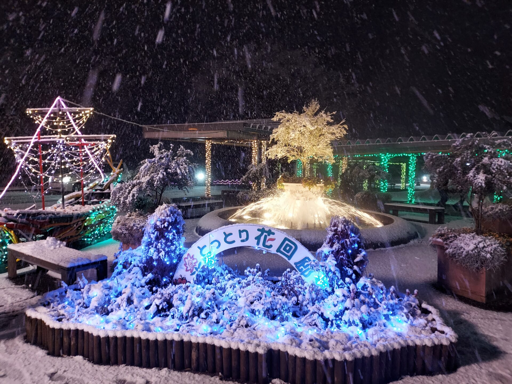
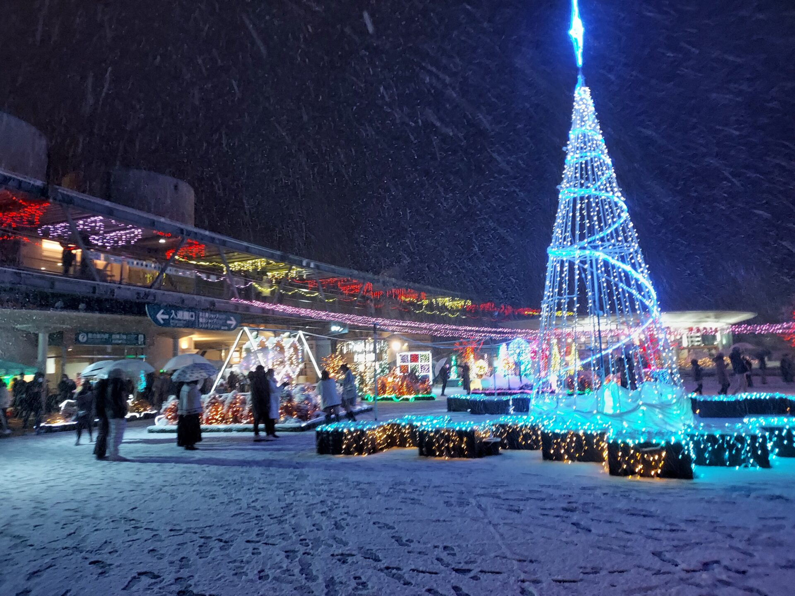
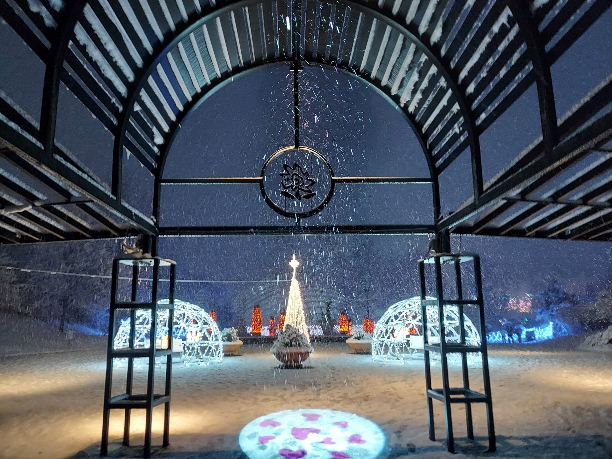
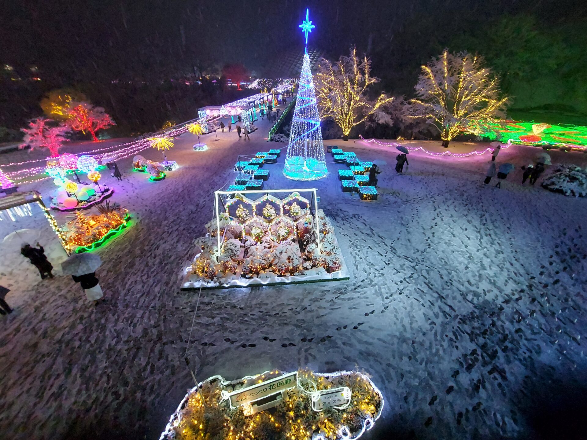

## とっとり花回廊はこんなところ

鳥取県が運営する

東京ドーム約11個分の広さを誇る国内屈指のお花畑です。

## 駐車場は混雑

駐車場は

<iframe src="https://www.google.com/maps/embed?pb=!4v1650528047935!6m8!1m7!1sUtkvVgC_ZK-Nq1CI8dLIPA!2m2!1d35.34736974668238!2d133.4231534827572!3f208.0354751096547!4f4.834193548101979!5f0.7820865974627469" width="800" height="600" style="border:0;" allowfullscreen loading="lazy" referrerpolicy="no-referrer-when-downgrade"></iframe>

## イルミネーション

約100万級のイルミネーション

## 温室で温まれる

イルミネーションは寒いですが  
温室で温まることができます

## 400発の花火

期間中の金土日祝と年末年始(12/29~1/3)

## イベント情報

記事の情報は2021年度のイベント情報です。最新情報は[ホームページ](https://www.tottorihanakairou.or.jp/schedule/event/list/event/)をご覧ください。

## アクセス

〒683-0217 鳥取県西伯郡南部町鶴田１１０

<iframe src="https://www.google.com/maps/embed?pb=!1m18!1m12!1m3!1d3254.326814053189!2d133.42189485140372!3d35.34753488017678!2m3!1f0!2f0!3f0!3m2!1i1024!2i768!4f13.1!3m3!1m2!1s0x3556f3f5a80ed25b%3A0xf01132ba0afb6d7a!2z44Go44Gj44Go44KK6Iqx5Zue5buK!5e0!3m2!1sja!2sjp!4v1650438711839!5m2!1sja!2sjp" width="600" height="450" style="border:0;" allowfullscreen loading="lazy" referrerpolicy="no-referrer-when-downgrade"></iframe>

### 公共交通機関

・JR米子駅より無料送迎バス25分

### 自家用車

米子自動車道　溝口インター、大山高原スマートインター　10分  
山陰自動車道(無料区間)　米子インター　20分
