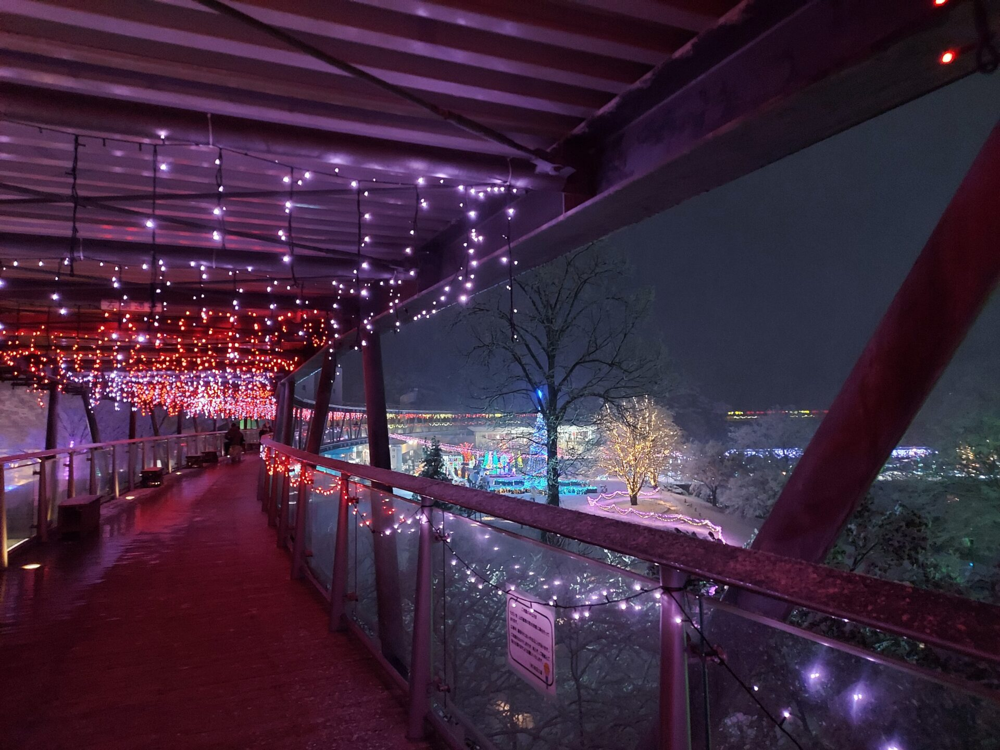
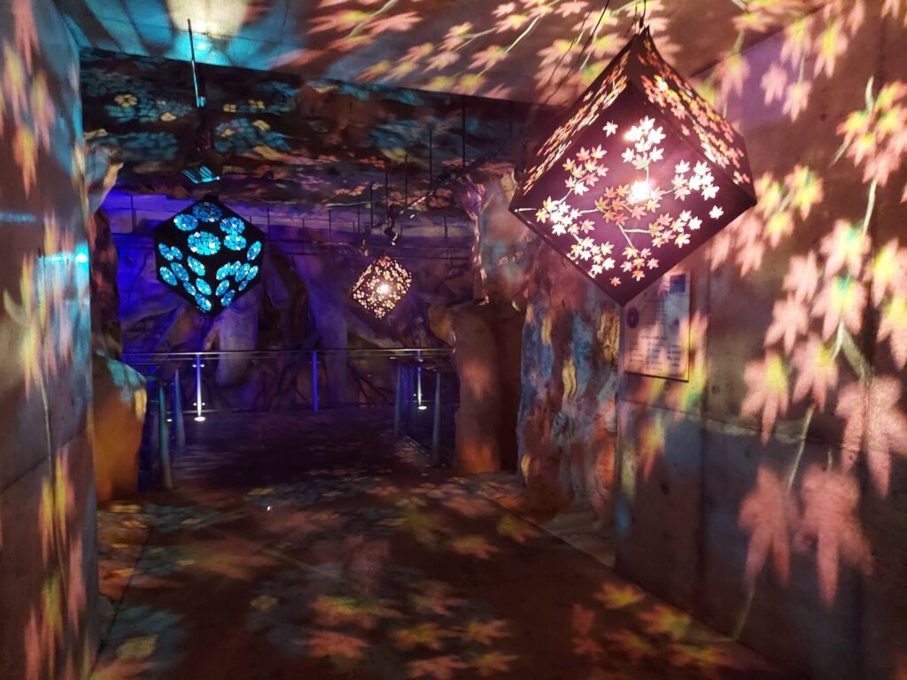
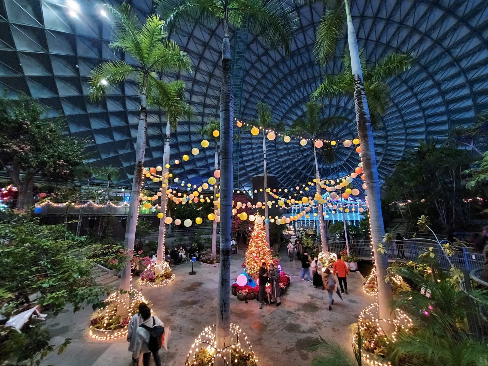
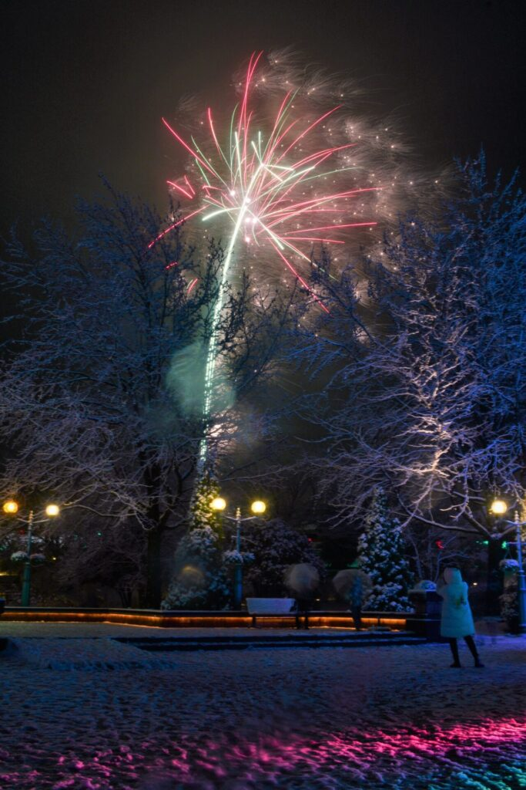

冬の山陰・鳥取といえば、松葉がにや温泉、雪景色を思い浮かべる方も多いのではないでしょうか。  
そんな冬の鳥取でぜひ訪れてほしいおすすめの絶景スポットが、南部町（なんぶちょう）にある日本最大級のフラワーパーク<strong>「とっとり花回廊」</strong>です。

毎年冬に開催される「フラワーイルミネーション」は、中国地方トップクラスの規模を誇る大人気イベント。  
100万球の光が広大な園内を彩るだけでなく、タイミングが合えば**「イルミネーション × 冬の花々 × 白銀の雪 × 夜空を彩る花火」**という、奇跡のような4重のコラボレーションに出会えます。

今回は、ホワイトクリスマスに訪れた体験をもとに、とっとり花回廊の冬の魅力、見どころ、寒さ対策やアクセス情報を詳しくレポートします！

---

## とっとり花回廊とは？大山を望む日本最大級のフラワーパーク

「とっとり花回廊」は、鳥取県西伯郡南部町にある国内屈指の規模を誇るフラワーパークです。  
その敷地面積はなんと**約50ヘクタール（東京ドーム約11個分）**！

霊峰・大山（だいせん）の雄大な姿を間近に望む絶好のロケーションに位置し、園内には1周1kmの屋根付き展望回廊や、シンボルとなる直径50mの巨大ガラス温室「フラワードーム」などがあります。

四季折々の花々が咲き誇る花回廊ですが、冬の夜には雰囲気が一変。園内全体がまばゆい光に包まれる幻想的なイルミネーションの世界へと変貌します。

---

## 100万球の光が雪景色に輝く！冬のフラワーイルミネーション

エントランスを抜けると、目の前に広がるのは一面の光の世界。  
訪れた日はちょうど雪が降るホワイトクリスマス。しんしんと降り積もる雪とイルミネーションが反射し合い、言葉を失うほどの美しさでした。

西館テラス前広場には、ブルーとホワイトの光で輝く巨大なメインツリーが登場。足元には雪を踏みしめる音、見上げれば夜空から舞い落ちる雪と光のツリーが重なり、クリスマスムードを最高潮に盛り上げてくれます。

### 屋根付き展望回廊から見下ろす360度の大パノラマ

とっとり花回廊の大きな特徴が、園内をぐるりと囲む**周囲1kmの「屋根付き展望回廊」**です。

外から見ると、未来的なチューブ状の回廊自体がパープルやピンクに美しくライトアップされており、雪景色の中に浮かび上がる光のリングのよう。

この回廊の中に入ると、天井や手すりにもイルミネーションが施されており、まるで光のトンネルを歩いているかのような気分に浸れます。  
高さのある展望デッキや回廊からは、園内のイルミネーションを一望するパノラマビューが広がります。

雪化粧をまとった木々や光の幾何学模様、広場に描かれたアートが、上空からの視点で見事に浮かび上がります。  
**屋根があるため、雨や雪の日でも傘をささずに快適に鑑賞・撮影ができる**のも、冬のお出かけにはとても嬉しいポイントです。

### 幻想的な光のアート演出

園内を巡っていると、細部まで工夫された様々な光のアートに出会えます。

フレームのアーチの奥には光のドームやツリーが並び、足元にはハートのイルミネーションがプロジェクションマッピングのように投影されていました。カップルや家族連れの絶好のフォトスポットになっています。

また、通路や屋内展示スペースには、繊細な切り絵細工が施された和風のランタン照明が吊るされ、壁や天井一面に美しい紅葉や花の文様が映し出されていました。温かみのある灯りが冷えた心をほっこり癒してくれます。

---

## 寒い夜の救世主！暖かな「フラワードーム（大温室）」

冬の屋外イルミネーションは本当に寒いですが、とっとり花回廊には強い味方があります。それが園内中央にそびえる大温室**「フラワードーム」**です。

外は氷点下の雪景色ですが、直径50m・高さ21mのドーム内に入ると、一転してふんわりと暖かな空気に包まれます。

温室内にはパームツリー（ヤシの木）や洋ランなどの熱帯・亜熱帯植物が生い茂り、中央にはポインセチアとランで彩られた華やかなフラワーツリーが飾られていました。天井から吊るされた優しい光のバルーンランタンも相まって、南国のリゾートに迷い込んだような温もりあふれる空間です。

冷え切った身体を温めながら、色鮮やかな生花を鑑賞できるこの温室の存在は、冬のとっとり花回廊ならではの大きな魅力です。

---

## 冬の夜空に咲く大輪！約400発の打ち上げ花火

そして、フラワーイルミネーションのハイライトが、澄み切った冬の夜空を彩る**打ち上げ花火**です！

冬の花火は空気が澄んでいるため、夏の花火以上に光がくっきりと鮮やかに輝きます。  
雪を被った木々のシルエット越しに、クリスマスカラーの赤や緑、金色の大輪が次々と打ち上がり、園内からは大きな歓声が上がっていました。

100万球のイルミネーションの光、雪景色、そして頭上に咲く花火の共演は、まさに息をのむ美しさ。心に残る特別な冬の夜を演出してくれます。

> **花火の開催情報について**  
> イルミネーション期間中の**金・土・日・祝日および年末年始**を中心に、約400発の花火が打ち上げられます（天候状況等により変更・中止の場合あり）。詳しい日程は事前に公式ホームページをご確認ください。

---

## 訪問時の注意点・混雑対策

実際に冬のとっとり花回廊を訪れて感じた注意点をまとめました。

### 1. 駐車場の混雑とアクセス
イルミネーション期間中、特にクリスマス前後や年末年始、土日祝日の夕方以降は多くの来場者で賑わい、駐車場が混雑します。
- 花火の打ち上げ時間直前は周辺道路も含めて混み合うため、点灯開始（17:30頃）に合わせて早めに到着するのがおすすめです。
- JR米子駅からは**無料シャトルバス（所要時間約25分）**も運行されていますので、雪道の運転が不安な方は公共交通機関の利用もぜひご検討ください。

### 2. 万全の防寒対策・足元への注意
山陰の冬、特に大山の麓に位置する南部町は冷え込みが厳しく、積雪や路面凍結が発生します。
- ダウンジャケット、マフラー、手袋、ニット帽、使い捨てカイロなどの防寒具は必須です。
- 屋根のない屋外エリアを歩く際は足元が滑りやすいため、滑り止め付きのブーツやスノーシューズでの来園を強くおすすめします。

---

## とっとり花回廊の基本情報・アクセス

最新の営業時間、イルミネーションの点灯スケジュール、イベント情報は[とっとり花回廊 公式サイト](https://www.tottorihanakairou.or.jp/)をご確認ください。

- **所在地**: 〒683-0217 鳥取県西伯郡南部町鶴田110
- **駐車場**: 無料（約2,000台完備）

### アクセスマップ

<iframe src="https://www.google.com/maps/embed?pb=!1m18!1m12!1m3!1d3254.326814053189!2d133.42189485140372!3d35.34753488017678!2m3!1f0!2f0!3f0!3m2!1i1024!2i768!4f13.1!3m3!1m2!1s0x3556f3f5a80ed25b%3A0xf01132ba0afb6d7a!2z44Go44Gj44Go44KK6Iqx5Zue5buK!5e0!3m2!1sja!2sjp!4v1650438711839!5m2!1sja!2sjp" width="100%" style="border:0; aspect-ratio: 16 / 10; height: auto;" allowfullscreen loading="lazy" referrerpolicy="no-referrer-when-downgrade"></iframe>

### 交通アクセス
- **公共交通機関**: JR米子駅より無料シャトルバスで約25分
- **車でのアクセス**:
  - 米子自動車道「溝口IC」または「大山高原スマートIC」より約10分
  - 山陰自動車道（無料区間）「米子IC」より約20分

---

## まとめ

白銀の雪景色の中に浮かび上がる100万球のイルミネーション、暖かな温室のフラワー演出、そして夜空に咲く美しい花火。  
冬のとっとり花回廊は、この季節にしか味わえないロマンチックで贅沢な体験が詰まった最高のスポットでした。

冬の山陰・鳥取旅行を計画中の方は、ぜひ旅の行程に加えてみてくださいね！
